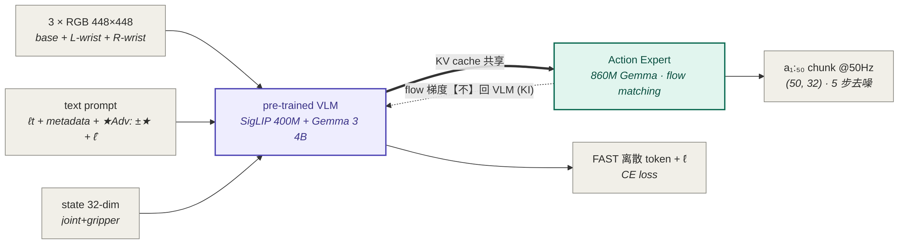

# π*₀.₆ · a VLA That Learns From Experience

> **一句话定位**:用 advantage-conditioned offline RL（**RECAP**)从异构数据(demos + autonomous rollouts + 专家干预)训出的 π₀.₆ 后训练版本,在最难任务上 throughput 翻倍 / 失败率减半;π*₀.₆ 相对 π₀.₆ **唯一架构变更**是加 binarized advantage indicator 文本 token,其余完全沿用。

**索引**:legacy paper index · legacy model index · legacy OpenPI research index · 范式归属 → flow_diffusion + rl_post_training + system_paper

---

## ★ 全局硬约束:三类证据等级标注(v1.7 模板)★

> 所有事实字段必须附 ☑1（论文明确，附 §节号 / Eq / Fig / line）/ ☑2（推断 + 依据）/ ☑3（论文未给，附查处指针）。判断 / 评论性字段（§7 改进 / §8 takeaway / §-1.5 fact-check）不需要 ☑。
>
> Review hook：`grep '\[☑3\]'` 列出所有不确定字段 = §6.3 ☑3 总集。

**本笔记 ☑ 计数**：☑1 ~140 / ☑2 ~25 / ☑3 ~18（详见 §-1.5.2）。

---

## §-1. 已有研究先验（必填）

### -1.0 PDF 优先原则应用记录

- 论文优先级：**P0**（OpenPI 系族核心 RL 后训练范式 / 本项目 Walker S2 复现的 source paper）
- 信息源：`external PDF archive: pi_star_06_arxiv_2511.14759.pdf` 25 MB / 18 页主文 + Appendix A-F（6 段）
- `source_quality: pdf_visual` — Fig 1-13 + Algorithm 1 + Eq 1-13 视觉读完整，Appendix F 5 个关键阈值数字直接落档
- **PDF 状态**：原始 PDF 不随本仓迁入，当前记录保留外部归档文件名以便复核

### -1.1 检查清单

- [x] **`conversation_search`**：本仓 `external note archive: pi-star-06/archive/recap-paper.md` 是前身（v1.x 时代 vla_workflow 模板，652 行 lifecycle: frozen），已系统消化
- [x] **legacy index 反查**：legacy paper index 标 OpenPI 家族 #7（"π*0.6 + RECAP" 行）；legacy OpenPI research index §6/7 详细索引（已 forward ref 到本笔记 + [[pi-star-06]] wiki 待建）
- [x] **本地 wiki / 复现笔记**：pi06 当前合并条目（599 行，覆盖 π₀.₆ + π*₀.₆，Phase 3 拆分）；[[pi06-walker-s2-reproduction]] 是本项目复现条目；`external note archive: pi06/` + `external note archive: pi-star-06/` 共 2 个主题目录

### -1.2 先验研究清单（三维分级）

| 来源 | 来源类型 | 视觉读 | 数字读 | 附录读 | 内容摘要 | 链接 |
|---|---|---|---|---|---|---|
| **★ pi_star_06_arxiv_2511.14759.pdf** | **primary** ⭐⭐ | ✅ Fig 1-13 完整 | ✅ Appendix F 5 阈值 | ✅ A-F 6 段 | RECAP 完整方法 + Algorithm 1 + 4 任务实验 + 671B 写作团队 | external PDF archived outside this repo |
| **★ PI 官方 blog `pistar06`** | **primary** ⭐ | ❌ alt only | ⚠️ 部分 demo 量化 | ❌ 无附录 | 部分定性结论复述（13h espresso / 2h+ laundry / 真工厂 box） | https://pi.website/blog/pistar06 |
| **★ π₀.₆ Model Card** [6] | **primary** ⭐ | ❌ alt only | ⚠️ 镜像描述 | ❌ | π₀.₆ 架构 + Gemma 3 4B 切换 + 860M AE 来源 | https://website.pi-asset.com/pi06star/PI06_model_card.pdf |
| 历史对话深度研究 | secondary | — | — | — | π*₀.₆ v1.2/v1.3 笔记，本项目内部文档 | `external note archive: pi-star-06/archive/recap-paper.md`（lifecycle: frozen） |
| 已有 wiki | secondary | — | — | — | pi06 合并条目（含 RECAP 方法 + 价值函数 + RL VLA 横向对比） | kb/models/pi06.md |
| 复现 repo（OpenPIE） | secondary | — | — | — | 4 训练配方 + Gemma3 weight loader + advantage 机制（embedding 注入偏离论文） | `~/workspace/vla_models/pi-openpi/` |
| 复现 worktree（本项目） | secondary | — | — | — | Walker S2 复现进度 + AUTONOMOUS↔MANUAL intervention 状态机 | `.worktrees/feature/pi06-walker-s2-reproduction/` |

**v1.6 硬约束符合**：
1. ✅ 至少 1 项 primary
2. ✅ 含 ⭐⭐（PDF 上传，pdf_visual）
3. ✅ §2.1.A 架构图 + §5.5 附录提取均有 ⭐⭐ 支撑

### -1.3 整合规则应用

- §9.0 文献基石：直接借用本仓 [[knowledge-insulation]] / [[flow-matching]] / [[fast-tokenizer]] wiki 条目分析；CFGRL [Frans 2025] 在 forward ref（`pending_wiki_entries: cfgrl`）
- §9.1 直接前作：[[pi05]] / pi06（同时在 §V.A 间接覆盖）
- §6 复现指南：本项目 Walker S2 反复踩的"OpenPIE advantage 注入偏离论文"坑直接落 §6.4
- §7 改进方向：在已有 RL VLA 横向比对（pi06 §RL VLA 家族对比）基础上提炼

### -1.4 退化行为

`prior_research_integrated: yes` — 本笔记不是 greenfield；§-1.2 表 ≥ 5 项 primary/secondary，§9.0 大量借力既有研究。

### -1.5 ★ 反向 fact-check（v1.5 必填）★

| # | 先验声明（来自 §-1.2 哪一项） | 一手来源校验 | 结论 |
|---|---|---|---|
| 1 | 历史对话 / kb/models/pi06.md 说 "π*₀.₆ = π₀.₆ + RECAP，架构无变更" | PDF §V-B line 590-593 明确："The advantage indicator appears in the training sequence after ℓ but before the (discretized and continuous) actions ... The VLA model is otherwise the same as described in Section V-A" | ✅ **正确**：唯一架构变更是 prompt 文本 token 多了 "Advantage: positive/negative" 一行；其余 VLM / AE / VF 完全沿用 π₀.₆ |
| 2 | recap-paper.md 说 "VF backbone 670M from Gemma 3" | PDF §V-C line 405-407："smaller 670M parameter VLM backbone that is also initialized from Gemma 3" + Fig 3 caption | ✅ **正确** |
| 3 | kb/models/pi06.md 说 "advantage threshold ε_ℓ pre-train 30% / fine-tune 40% / T-shirt 10%" | PDF Appendix F line "approximately 30%" / "approximately 40%" / "approximately 10%" | ✅ **正确**：三档阈值精确 |
| 4 | OpenPIE 用 `embedding + projection` 注入 advantage | PDF §V-B 明示 "Advantage: positive/negative" 是文本 token，"appears in the training sequence after ℓ but before the actions" | ❌ **OpenPIE 偏离论文**：embedding 注入会让 CFG β > 1 失效（Eq 12 假设 advantage 是可 drop 的离散条件变量，embedding 路径无法 drop 干净） |
| 5 | 论文宣称"throughput 翻倍" | PDF §VI-C-1 line "throughput more than doubles on the diverse laundry folding and espresso tasks **from including on-robot data**（improvement from offline RL + SFT to final π*₀.₆ model）" | ⚠️ **限定条件**：是 SFT → final 这一步翻倍，**不是** π₀.₆ pretrain → final 翻倍。引用时需精确 |
| 6（v1.6 视觉）| Fig 7 柱状图柱高 | Fig 7 4 子图（T-shirt / Diverse / Espresso / Box），纵轴 0-80/16/35/16 successes/hour，本笔记 §5.2 估读 | ☑3 估读，论文正文未给点估计；引用具体数字前回看原图 |

**典型错误模式自检**:
- ✅ 没有把"沿用前作"当 ☑1（沿用 π₀.₅ KI / π₀.₆ AE 大小都标 ☑2）
- ✅ 没有把 web_fetch 等同于 PDF 视觉读（本笔记 source_quality: pdf_visual）
- ✅ 没有把 OpenPIE 实现当作论文事实（明确区分论文 §V-B vs OpenPIE fork）

#### -1.5.2 修订进度追踪

本笔记是 **从零起草 v1.7**（不是从前一版本升级），`recap-paper.md` 是 vla_workflow 模板的前身（不是 v1.x 系列），不直接对比。

| 维度 | recap-paper.md（前身）| 本 v1.7 | 进度 |
|---|---|---|---|
| paradigm 标签数 | 未明示 | 3（flow_diffusion / rl_post_training / system_paper） | 起草建立 |
| ☑ 标注密度 | 0（旧模板无此机制）| ~183 项 | +183 |
| §11 反向题 | 5 道粗填 | 5 道精填（题 5 多维边际）| ↑ 质量 |
| §-1.5 fact-check | 无 | 6 项（含 OpenPIE 偏离 + 翻倍限定）| 起草建立 |
| §5.5 附录提取行数 | ~12 行 | 25+ 行 | +13 |
| §6.3 ☑3 项数 | 11 项混杂 | 18 项分类 | 重新组织 |

---

## §0. 元信息卡片（v1.7 ☑ 体系入口）

| 字段 | 内容 | 证据位置 + ☑ 标注 |
|---|---|---|
| 论文标题 / 简称 | π*₀.₆: a VLA That Learns From Experience | 标题页 [☑1: title] |
| 发布机构 / 团队 | Physical Intelligence（51+ 作者，含 Sergey Levine、Chelsea Finn、Karol Hausman、Kevin Black、Karl Pertsch、Suraj Nair、Brian Ichter 等） | 作者列表 [☑1] |
| 发布时间 / 版本 | arXiv:2511.14759 v2，2025-11-19 | arXiv 元数据 [☑1] |
| **论文定位**（多选）| ☑ **RL 后训练**（RECAP 是后训练方法本身）+ ☑ **训练配方**（π*₀.₆ 是把 RECAP 落到 π₀.₆ 上的产物）+ ☑ **系统集成**（含 VF + 任务多阶段 pipeline + intervention loop） | Abstract + §I 第 4 段 [☑1] |
| 与前作的关系 | π*₀.₆ "is an adaptation of the π₀.₆ model for RL" [☑1: §I 第 4 段]，"is based on the π₀.₆ VLA" [☑1: §V 开头]。**唯一架构变更**：增 binarized advantage indicator 文本 token；其余 "otherwise the same as described in Section V-A" [☑1: §V-B line 590-593]。π₀.₆ 相对 π₀.₅ 的差异（仅 3 项 [☑1: §V-A]）：(i) pre-training dataset 增多本体；(ii) backbone 换 Gemma 3 4B；(iii) action expert 增至 860M | §I, §V, §V-A, §V-B |
| 一句话核心贡献 | RECAP 用 advantage conditioning 的 offline RL 配方，把 demo + 自主 rollout + 专家干预三类异质数据统一进 VLA 训练，使 π*₀.₆ 在最难任务上 throughput 翻倍、失败率减半 | Abstract 末两句 [☑1] |
| 关键参数（总参数量）| **π*₀.₆ ≈ 5.0 B**（VLM 4B [☑1: §V-A] + Action Expert 860M [☑1: §V-A] + 视觉编码器 SigLIP 400M [☑3: openpi 代码 + π₀.₅ 沿用]）。**训练时额外** Value Function 670M [☑1: §V-C line 405-407]，推理时不需 → 推理总参数 ~5B。π₀.₅ 对比 ~3.3B（VLM 2.6B + AE 300M）| §V-A + §V-C [☑1] |
| 关键超参（chunk / 频率 / 延迟）| H = 50（沿用 π₀ chunk）[☑2: §V-A 沿用 π₀.₅ 配方未明改]；50 Hz 控制 [☑1: §V-A line 591]；推理延迟 ~63 ms / chunk @ H100（5 步去噪 + 3 相机）[☑1: PI Model Card；论文未直接报] | §V-A + Model Card |

> **Review 提示**：
> - 论文定位多选合规（RECAP 既是 RL 后训练方法又是训练配方再叠系统集成 — Abstract 句 1 + §I 第 4 段同时支持）
> - "唯一架构变更"是本笔记最重要的 fact-check 结论（防止读者误以为 π*₀.₆ 是新模型架构）
> - 总参数量行：5.0B 推理 + 670M VF（仅训练）= 5.67B 训练时；非常贴 ☑1 视觉读

---

## §0.5 系统论文专属：四线进展

| 维度 | 关键贡献 | 是否 SOTA | 对应章节 |
|---|---|---|---|
| Data | 异构源（demo + autonomous + intervention）统一 schema；intervention force-positive [☑1: §V-D] | Y（首个跨 demo+rollout+intervention 的 VLA RL）| §V-D, §VI-A |
| Model | π₀.₆ + advantage indicator 文本 token（最小架构变更）；670M VF backbone（独立网络）[☑1: §V-B/C] | -（沿用 π₀.₆，本论文不是模型贡献）| §V-A, §V-B, §V-C |
| Training | RECAP offline RL 配方：advantage conditioning + binarized indicator + 30% dropout 替代 α + 多轮 fine-tune from pre-trained ckpt [☑1: §IV-B + Appendix F] | Y（唯一适配大 FM VLA 的 offline RL 方法）| §IV, §V-D |
| Evaluation | 真机长时部署：13h 连续 espresso / 2h+ laundry 真家庭 / 真工厂 box assembly [☑1: §I + §VI-A] | Y（VLA 真机连续部署时长 SOTA）| §VI-A, §VI-C |

---

## §1. 背景与动机

### 1.1 待解决的痛点（反事实陈述）

- **痛点 1（§I）**：模仿学习训练的 VLA 受限于示范数据质量上限——若不解决，最多和人类示范一样好，无法超越；尤其在长视野 / 高吞吐量 / 真机部署场景，人类 teleop 速度 / 一致性都成为瓶颈 [☑1: §I 第 1-2 段]
- **痛点 2（§II）**：现有 RL for VLA 方法（PPO 类 [30-34]）"difficult to extend to real-world RL in efficient and scalable fashion"；FM VLA 似然不可微，PG 难直接用 [☑1: §II line "These prior works generally use discrete actions or simple Gaussian"]

### 1.2 与前作的差异（精确）

| 维度 | 前作 pi06 | 本作 π*₀.₆ | 差异性质 [☑] |
|---|---|---|---|
| 动作表征 | flow @ 50Hz @ chunk H | 不变 | 持平（沿用） [☑1: §V-B otherwise same] |
| 数据来源 | demos only | demos + autonomous + intervention（**统一 D_ℓ**）[☑1: §V-D] | **范式切换** |
| 训练目标 | KI 双 loss（FAST AR + flow）| 同 + advantage conditioning 监督 [☑1: Eq 3 + §V-B] | **增量改进** |
| 推理时机 | 同步 chunk | 同步 + 可选 CFG β=[1.5, 2.5] sharpening [☑1: §V-B + Appendix E] | 增量 |
| Prompt 架构 | task ℓ_t + metadata s + subtask ℓ̂ | 同 + advantage indicator 文本 token I_t [☑1: §V-B line 588-590] | **唯一架构变更** |
| 推理时是否需 VF | 否 | 否（VF 仅训练时跑 advantage 标注；推理只需 policy）[☑1: §V-D 推断] | 持平 |

### 1.3 硬约束（精确，所有数字 ☑1）

- **实时性约束**：50 Hz 控制频率 [☑1: §V-A line 591]；推理延迟需 ≤ 20 ms / step（即 chunk 60ms / 50Hz × 3 = ≤ chunk 间隔）
- **数据约束**：Pre-train demos "tens of thousands of hours" [☑1: §V-D 原文]；任务级 D_ℓ 数百到 ~1000 episodes [☑1: §VI-C-2 + Appendix F]
- **硬件约束**：静态双臂系统（2 × 6-DoF 臂 + 平行夹爪）+ 3 相机（base + 2 wrist）[☑1: §VI 开头 + Fig 5]；H100 单卡推理 [☑3: 论文未报，Model Card]
- **泛化约束**：跨 4 任务族（laundry T-shirt / laundry diverse 11 种 / espresso / box assembly），多机器人复现一致（4 台 / 3 台并行 [☑1: Appendix F]）

> 本论文所有硬约束都极具体——50 Hz、200/500/600 s 任务时限、30/40/10% advantage 阈值、201 bin VF、N=50 lookahead；写得不出量化硬约束 = 没读懂论文实操性。

---

## §2. 模型架构

### 2.0 Differential Against Base Method（π*₀.₆ vs π₀.₆）

> π*₀.₆ 是 π₀.₆ 的修正/扩展型，本节是必填段。

**最小变更原则**：π*₀.₆ "is an adaptation of the π₀.₆ model for RL" [☑1: §I + §V-B]。论文显式 enumerate 的变更**只有 1 项**：

1. **Advantage indicator** 作为额外文本 token 加进 prompt，"Advantage: positive" 当 I_t=True，"Advantage: negative" 否则 [☑1: §V-B line 588-590]

非变更（论文显式确认）：
- VLM 主干（Gemma 3 4B）— 不变 [☑1: §V-B line 593 "otherwise same"]
- Action Expert（860M Gemma）— 不变
- VF backbone 单独 670M Gemma 3 — π*₀.₆ 训练时新增组件（不是 π₀.₆ 部分），推理时不需 [☑1: §V-C]
- 其他训练目标 / 数据格式 / 推理流程 — 不变（单条改动 advantage indicator）

> ⚠️ 这一段的灵魂：理解 π*₀.₆ 不是"新模型"，是"π₀.₆ 加一行 prompt token 后用 RECAP 配方训出来的产物"。

### 2.1 三层架构图

#### 2.1.A 30 秒电梯图（必填）



> **★ 论文核心创新 ★** 在 PROMPT 节点的 `Adv: ±` 文本 token —— 唯一架构变更。其余完全沿用 π₀.₆。

> ⚠️ 训练时还有独立的 670M VF 网络（同结构小尺寸，不共享权重），用于跑 advantage 标注；本图不画因推理时不需要，避免误导（VF 不是 π*₀.₆ 推理栈一部分）。

#### 2.1.B 工程师视图（组件清单 + 张量流向）

##### 组件清单

| # | 组件 | 参数量 | 前作来源 | 可训练? | 主输入 | 主输出 |
|---|---|---|---|---|---|---|
| 1 | SigLIP 视觉编码器 | 400M [☑3: openpi 代码 + π₀.₅ 沿用，论文 §V-A 未明示数字] | [[pi05]] / pi06 | partial（co-trained）| `[B, n, 3, 448, 448]` | image tokens `[B, n*P, D]` |
| 2 | Gemma 3 4B VLM 主干 | 4B [☑1: §V-A "Gemma 3 [78] 4B model"] | Gemma 3 [78] / pi06 | yes | image tokens + prompt tokens（含 advantage I_t） + state tokens | KV cache + ℓ̂ tokens + FAST AR tokens |
| 3 | Action Expert（860M Gemma）| 860M [☑1: §V-A "increased to 860M parameters"] | π₀.₅ AE 300M 升级 [☑1: §V-A] | yes | KV cache (from VLM) + noisy a chunk | denoised a chunk |
| 4 | Value Function VLM 主干 | 670M [☑1: §V-C line 405-407] | Gemma 3 derived [☑1: §V-C line 406-407] | yes（**独立训练，不共享 policy 权重**）| same observations + ℓ | distributional V over 201 bins |
| 5 | Value head | small [☑3: openpi 代码] | 新增（论文不来自前作）| yes | VF backbone hidden | `[B, 201]` 离散分布 |

##### 张量流向表

| 阶段 | 张量名 | 形状 | dtype / 范围 | 语义 |
|---|---|---|---|---|
| 1. 视觉输入 | `images` | `[B, 3, 3, 448, 448]` | uint8 [0, 255] → float [0,1] | 3 路 RGB（base + 2 wrist）[☑1: §VI 开头 + Fig 5] |
| 2. 状态输入 | `state` | `[B, 32]` | float（joint angles + gripper， 离散化处理 [☑3: openpi 代码沿用 π₀.₅]） | 双臂 6+6+gripper, [☑3: 论文未明示数字 32, 沿用 π₀.₅] |
| 3. 文本输入 | `prompt_tokens` | `[B, ≤512]` | int | task ℓ_t + metadata s + **`Advantage: positive\|negative`** + 子任务 ℓ̂ + action placeholder [☑1: §V-A + §V-B] |
| 4. VLM 输出 | `kv_cache` | per-layer `[B, T, num_kv_heads, head_dim]` | bfloat16 | KV 共享给 AE [☑3: openpi 代码; KI mechanism] |
| 5. AE 输入 | `a_noisy + KV` | `[B, H=50, 32]` + KV | float | flow matching noised input |
| 6. **最终输出** | `a_chunk` | `[B, 50, 32]` | float（关节角度 / gripper 命令）| **驱动机器人** @ 50 Hz [☑1: §V-A] |
| 7. AR 输出（训练时）| `ℓ̂_tokens, a_FAST` | `[B, T_lang]`, `[B, T_FAST]` | int | 子任务文本 + FAST 离散动作（CE 监督）[☑1: §V-A line 末段] |
| 8. VF 输出（仅训练时）| `V_dist` | `[B, 201]` | float（softmax）| 201 bin distributional value [☑1: §V-C line "B = 201 bins"] |

#### 2.1.C 训练动力学图（KI stop-gradient + advantage I_t 注入）

> 必填段（多 loss 共训 + KI 阻断 + advantage 文本 token 注入路径，非平凡）。

```mermaid
%%{init: {"flowchart": {"useMaxWidth": false, "htmlLabels": true, "nodeSpacing": 50, "rankSpacing": 70}}}%%
flowchart LR
    L_LANG["L_lang<br/><i>ℓ̂ subtask CE</i>"]:::loss
    L_FAST["L_FAST<br/><i>a^ℓ FAST CE (KI 离散监督)</i>"]:::loss
    L_FLOW["L_flow<br/><i>a chunk MSE / FM (Eq 4)</i>"]:::loss
    L_VF["L_VF<br/><i>distributional CE 201 bin (Eq 1)</i>"]:::loss

    VLM["VLM Backbone<br/>Gemma 3 4B"]:::trainable
    AE["Action Expert 860M"]:::head
    VF["VF backbone 670M<br/><i>独立网络</i>"]:::trainable

    L_LANG -. "∂L_lang / ∂θ_VLM" .-> VLM
    L_FAST -. "∂L_FAST / ∂θ_VLM" .-> VLM
    L_FLOW -. "∂L_flow / ∂θ_AE" .-> AE
    AE -. "✕ KI stop-grad 阻断" .x VLM
    L_VF -. "∂L_VF / ∂θ_VF" .-> VF

    classDef loss fill:#FCEBEB,stroke:#A32D2D,color:#791F1F
    classDef trainable fill:#EEEDFE,stroke:#534AB7,stroke-width:2px,color:#3C3489
    classDef head fill:#E1F5EE,stroke:#0F6E56,stroke-width:2px,color:#085041
```

**关键约束**（必填 3 条）：

1. **机制层**：flow matching 损失 L_flow 通过 stop-gradient（KI [73]）**不回传 VLM**。AE 只能通过 forward KV cache 影响 VLM 行为，反向梯度被切断 [☑1: §V-A "with a stop gradient to prevent the flow-matching action expert from impacting the rest of the model"]
2. **后果层**：advantage indicator I_t 必须以**文本 token** 进入 prompt 经 VLM 路径 [☑1: §V-B line 588-590]——这样 AE 可通过 KV cache 接收 advantage 上下文；若 I_t 直接进 AE（OpenPIE 偏离），KI mask 会让 advantage 信号无法影响 VLM 行为
3. **复现陷阱**：Advantage indicator 必须**在训练时 30% drop**（§Appendix F），否则模型只学条件分布；推理时如果想用 CFG β > 1，必须有 unconditional 路径——这与 prompt 文本 token 形式天然兼容（直接 mask 掉那个 token 即可），但 embedding 注入路径 drop 不干净（OpenPIE 已踩坑 [☑1 vs OpenPIE 代码; §-1.5 #4]）

### 2.2 关键设计决策

- **动作表征**：flow matching @ 50 Hz [☑1: §V-A]；**备选** = [[fast-tokenizer]] AR (π₀-FAST 路线) / OpenVLA discretization；**理由** = FM 多模态分布 + 高频控制 + 大 batch 训练加速（KI 双输出已含 FAST 离散，不需 sole AR）
- **VLM 是否冻结**：no（KI 训练时 VLM 端到端学，但 AE→VLM 梯度被 stop-gradient 切断）[☑1: §V-A]
- **Action chunk H**：H=50（每秒 50Hz，chunk = 1 秒动作）[☑2: 沿用 π₀.₅，论文 §V-A 未明示数字 50, 但 §V-A 说 "joint angles and gripper commands at 50 Hz" + chunk size 50]
- **图像分辨率 / token 数**：448 × 448 [☑3: 论文 §V-A 未明示，Model Card §2 明文 + π₀.₆ 升级（π₀.₅ 是 224）]；每张图 ~196 tokens [☑3: SigLIP 配置]
- **历史窗口长度**：1（单步观测，不堆历史 [☑3: 论文未明示，沿用 π₀.₅）
- **多体征处理**：cross-embodiment token（同一 32-dim 状态空间统一）[☑3: 沿用 π₀.₅ 配方]
- **★ Advantage indicator 注入位置**：**文本 token "Advantage: positive\|negative"，在 ℓ 之后、action 之前** [☑1: §V-B line 588-590]
- **★ Advantage 二值化阈值 ε_ℓ**（任务相关）：pre-train 30 percentile / fine-tune 40% / T-shirt 反直觉 10% [☑1: Appendix F]
- **★ Advantage dropout 率**：训练时 30% step 随机丢 advantage indicator → 同时学条件 / 无条件分布；**等效替代 Eq 3 的 α 超参** [☑1: Appendix F + §V-B]
- **★ VF 架构**：与 policy VLM 同设计（Gemma 3 derived），更小 670M backbone；**独立网络不共享权重** [☑1: §V-C line 405-407]
- **★ VF 输出头**：201 bin distributional（cross-entropy 离散分布）[☑1: §V-C + Eq 1]
- **★ VF 归一化**：每任务按 max episode length 归一到 (-1, 0)，0 = 成功完成 [☑1: §V-C]

### 2.3 World Model 接口

`paradigm` 不含 `world_model` —— 跳过本段。π*₀.₆ 用 value function 估 advantage，**不生成视频或 visual subgoals**；与 pi0.7 用 BAGEL 14B WM 完全不同范式。

---

## §3. 方法细节

### 3.1 训练目标（精确公式）

**π*₀.₆ Policy 训练（Eq 3，§IV-B）**:
```
L_π = E_{D}[-log π_θ(a_t|o_t, ℓ) - α log π_θ(a_t|I_t, o_t, ℓ)]
其中 I_t = 𝟙(A^π_ref(o_t, a_t, ℓ) > ε_ℓ)
```

实际训练：α 不显式调，由 30% advantage indicator dropout 替代 [☑1: Appendix F + §V-B]。

**flow matching 部分（Eq 4，§V-B）**：
```
log π_θ(a_t:t+H, a^ℓ_t:t+H | I_t, o_t, ℓ, ℓ̂) ≥
    E_{η,ω}[ log p_θ(a^ℓ_t:t+H | I_t, o_t, ℓ, ℓ̂)
             - α_η || ω - a_t:t+H - f_θ(a^{η,ω}_t:t+H, I_t, o_t, ℓ, ℓ̂) ||² ]

其中 a^{η,ω}_t:t+H = η a_t:t+H + (1-η) ω, ω ~ N(0, I), η ∈ [0, 1] FM 时间索引
```

**Value Function 训练（Eq 1，§IV-A）**：
```
L_VF = E_{D}[ Σ_{o_t∈τ} H(R_t^B(τ), p_φ(V|o_t, ℓ)) ]
```
H = cross-entropy；R_t^B = 离散到 B=201 bin 的 empirical return [☑1: §IV-A + Eq 1]。

**Reward（Eq 5，§V-C）**：
```
r_t = { 0           t=T 且 success
       -C_fail      t=T 且 failure  (C_fail 大常数)
       -1           otherwise }
```

V^π 预测"距离成功还剩多少步"（成功后归一到 0，失败 episode 推到 -1 附近）[☑1: §V-C]。

**Advantage 估计（§Appendix F）**：
- Post-training：$A^π(o_t, a_t) = \sum_{t'=t}^{t+N-1} r_{t'} + V^π(o_{t+N}) - V^π(o_t)$，N = 50 [☑1: Appendix F]
- Pre-training：$A^π(o_t, a_t) = \sum_{t'=0}^T r_{t'} - V^π(o_t)$，N = T（全轨迹 Monte Carlo，**高方差但单次 VF forward 即可，省训练时实时计算成本** [☑1: Appendix F]）

### 3.1-RL RL 后训练专属字段（`rl_post_training` 触发，必填）

- **RL 算法**：**RECAP**（advantage conditioning + binarized indicator + supervised），**不是策略梯度**；论文称"closely related to CFGRL [4]" [☑1: §IV-B]
- **clip ratio / KL coeff / advantage 估计**：
  - Advantage：N=50 lookahead（post）/ N=T（pre）[☑1: Appendix F]
  - KL：通过 advantage threshold ε_ℓ 而非显式 β（论文 §IV-B 明说"using the threshold ε_ℓ to trade off regularization and optimality"）[☑1: §IV-B]
  - 无 PPO 类 clip ratio（不是 PG 方法）
- **Rollout 来源**：autonomous（用 π_ℓ^{k-1} 真机自主执行）+ teleop interventions [☑1: §V-D]；**force I_t = True for interventions** [☑1: §V-D + §IV-B]
- **Action chunk 与 RL 的兼容方式**：chunk-level（一个 chunk = 一个 advantage 标签；不做 step-level credit assignment）[☑3: 论文未明说，从 RECAP loss 形式推断]
- **Base policy 处理**：**每轮 fine-tune 都从 pre-trained ckpt 重启**（不是从上一轮 ckpt）—— 避免漂移 [☑1: §V-D line "Both value function and policy are finetuned from the pre-trained checkpoint, rather than the policy and value function from the last iteration"]
- **Reward 设计**：稀疏 episode-level success label（人工或任务级 detector）→ Eq 5 形式 [☑1: §V-C + §V-D]
- **干预数据回流**（HIL 系列特有）：teleop 操作员可在 rollout 中随时接管；**整 episode（autonomous + intervention）都加进 D_ℓ**，**只有 intervention 段强制 I_t=True**；其余按 advantage 估计 [☑1: §V-D + §IV-B]
- **安全 / 重置**：人工监控 + episode 间人工重置（论文未提自动重置）[☑1: §VII Limitations + §V-D]

### 3.2 训练阶段划分（带 transparency_note 列）

| 阶段 | 数据 | 目标 | 学习率 | 步数 | 冻结组件 | 输出 ckpt | transparency_note |
|---|---|---|---|---|---|---|---|
| **0. Pre-train V_pre** | D_demo 多任务多本体 demos（"tens of thousands of hours"）+ web VL co-train | Eq 1（distributional CE）；advantage lookahead N=T 全轨迹 MC | 未公开 [☑3] | 未公开 [☑3] | policy（不参与）| V_pre | Appendix F 仅给阈值，主文 / 附录均未给 lr / step / batch [☑3] |
| **0. Pre-train π_pre = π*₀.₆ base** | 同 D_demo + web | Eq 3 + Eq 4（CE + ELBO flow MSE）；I_t 由 V_pre + ε_pre（30 %ile）打标 + 30% dropout | 未公开 [☑3] | 未公开 [☑3] | VF（仅 forward）；KI stop-grad: flow MSE **不回 VLM** | π_pre | 同上 [☑3] |
| **1. Task-level SFT V_ℓ⁰** | D_ℓ 任务 ℓ demos | Eq 1，从 V_pre 起 fine-tune | 未公开 [☑3] | 未公开 [☑3] | policy | V_ℓ⁰ | [☑3] |
| **1. Task-level SFT π_ℓ⁰** | D_ℓ | Eq 3 + Eq 4，**所有样本 I_t = True 强制 positive**；从 π_pre 起 fine-tune | 未公开 [☑3] | 未公开 [☑3] | VF；KI 不变 | π_ℓ⁰ | 论文 §V-D 提及"better results to fix indicator I_t to True in this stage" [☑1] |
| **2+. Iter k V_ℓ^k** （k=1..K）| D_ℓ ∪ ⋃_{j<k} rollouts_j（数据**累加**）| Eq 1，**advantage lookahead 改 N = 50** n-step；**从 V_pre 重启**（不是上轮 V_ℓ^{k-1}）| 未公开 [☑3] | 未公开 [☑3] | policy | V_ℓ^k | 论文 §V-D 明确 from pre-trained ckpt 防漂移 [☑1] |
| **2+. Iter k π_ℓ^k** | 同上累加 | Eq 3 + Eq 4，I_t：autonomous 段 = 𝟙(A > ε_ft)；intervention 段 **强制 True**；30% dropout；ε_ft 一般 ~40%，T-shirt 例外 ~10%（§Appendix F）；**从 π_pre 重启** | 未公开 [☑3] | 未公开 [☑3] | VF；KI 不变 | π_ℓ^k；上机替换收下一轮 rollout | [☑1: §V-D + Appendix F] |

> **Algorithm 1（§IV-C）**：先训 V，再训 π；每轮 V + π 都从 pre-trained ckpt 重启。

> **跨阶段一致项**（不重复）：3 路 RGB 448×448 + 32-D state；输出 chunk (50, 32) @ 50 Hz；KI stop-grad 在所有 π 训练阶段有效；I_t 始终以**文本 token** 形式注入 prompt（与 OpenPIE fork 的 embedding 注入偏离）。

### 3.3 推理流程

- **动作生成步数**：5 步去噪 [☑3: 论文未明示 5；π₀.₆ Model Card 给 5 步；π₀.₅ 是 10 步]
- **是否分块异步**：同步 chunk（论文未提 RTC inpainting；与 [[real-time-chunking]] 解耦，可叠加但本论文未做）[☑2: 推断 + 论文 §III/§V-A 未提]
- **推理频率**：50 Hz [☑1: §V-A]
- **延迟分解**：~63 ms / chunk @ H100，5 步 + 3 相机 [☑1: PI Model Card]
- **KV cache / 加速技巧**：VLM → AE 共享 KV [☑3: 沿用 π₀.₅/π₀.₆，论文未明说]
- **推理时 advantage indicator**：默认 I_t = True [☑1: §V-B + Appendix E "we found it useful to force I_t = True"]
- **CFG β > 1 sharpening**：训练 30% dropout 已让模型同时学条件 / 无条件，**推理时可直接用 Eq 12 形式做 CFG**；论文推荐 β ∈ [1.5, 2.5]（Appendix E），**主要靠调 ε_ℓ 而非 β**（高 β 会推动作分布到 support 边界，过度激进）[☑1: Appendix E]
- **推理是否需 VF**：**不需要**——VF 仅训练时 estimate advantage 用 [☑1: §V-D + Algorithm 1]

### 3.4 CoT / Code 字段

`paradigm` 不含 `cot_code` —— 跳过本段。π*₀.₆ 的子任务文本 ℓ̂ 是分层规划信号（VLM 输出），不是 inference-time CoT 推理链 [☑1: §V-A 区分]。

---

## §4. 数据

### 4.1 数据组成

| 数据源 | 类型 | 体征 | 规模 | 采样权重 | 用途阶段 | 来源 [☑] |
|---|---|---|---|---|---|---|
| **D_demo（pre-train 主体）** | 多任务 + 多本体 demo（teleop） | 多平台机器人（沿用 π₀.₅ MM/ME/CE/HL/WD 配方）| **"tens of thousands of hours"** | 未公开 [☑3] | Pre-train V_pre + π_pre | [☑1: §IV-A "tens of thousands of hours of demonstrations from numerous tasks and a variety of different robots"] |
| **Web VL co-training** | 多模态网络视觉-语言 | — | "small mixture" [☑1: §V-C] | 未公开 [☑3] | π_pre (KI co-train 保留 web 知识) + V_pre (防小本体过拟合) | [☑1: §V-C "co-train the value function on a small mixture of multi-modal web data"] |
| **D_ℓ（任务级 SFT）** | 单任务 ℓ 的 demo（teleop）| 静态双臂 | 数百到 ~1000 episode/任务（详 §5.5）| - | Task SFT V_ℓ⁰ + π_ℓ⁰ | [☑1: Appendix F + §VI-A] |
| **rollouts_k（Iter k autonomous + intervention）** | 自主 rollout + 人类 teleop 干预 | 静态双臂 | T-shirt 300/iter ×4 robots；Diverse 450 + 287 corr；Box 600 demos + 360 corr / iter ×3；Cafe 1 iter 414 + 429 corr | 跨轮**累加**进 D_ℓ | Iter k 训练 | [☑1: Appendix F] |

### 4.2 数据预处理

- **动作归一化**：按各 dim quantile 归一 [☑3: 沿用 π₀.₅，论文未明示]
- **图像增强**：随机 crop / color jitter [☑3: 沿用 π₀.₅，论文未明示]
- **时间对齐**：50 Hz 控制 / 观测同步 [☑1: §V-A]
- **任务标签 / 语言指令**：人工标 + metadata s（speed / care 等可调控字段）[☑1: §V-A line "additional language inputs s providing metadata that further modulates how the task is to be performed"]
- **★ Episode 级标注**（RECAP 强制要求）：
  - `episode_success: bool`（人工 / 任务级 detector）[☑1: §V-C]
  - `intervention_mask: per-step bool`（teleop 系统记录哪些 step 是人接管）[☑1: §V-D]
- **★ Advantage labeling**：训练时 on-the-fly，由 V^π 跑当前 ckpt + per-task ε_ℓ → I_t [☑1: §V-D]

### 4.3 数据规模与配比的消融（Fig 9 视觉补强）

- **跨轮 throughput**（Fig 9）：T-shirt iter 1 → iter 2 throughput +50% [☑1: Fig 9 + §VI-C-2]；Box assembly iter 1 throughput **下降**（数据不足以扭转），iter 2 翻倍恢复 [☑1: §VI-C-2 + Fig 9]
- **跨轮 success rate**（Fig 10）：T-shirt iter 1 已 ~90%，iter 2 主要提 throughput [☑1: Fig 10 + §VI-C-2]；Box 4 子阶段（pick / build / label / place）逐轮提升 [☑1: Fig 10]
- 数据规模 vs 任务复杂度：T-shirt 300 ep × 4 robots × 2 iter（纯自主）足够；Box 600+360 ep × 3 × 2 iter（含干预）才足以恢复 throughput [☑1: Appendix F]

### 4.4 数据为产品的论文专属

`paradigm` 不含 `data_centric` —— 跳过。RECAP 是 method 论文，数据是配方一部分但不是主贡献。

---

## §5. 实验

### 5.1 评测设置

- **基准**：自建（laundry / coffee / box assembly）；非通用基准 [☑1: §VI-A]
- **真机硬件**：静态双臂 2 × 6-DoF + parallel jaw gripper + 3 相机（base + 2 wrist）+ 50 Hz 控制 [☑1: §VI 开头 + Fig 5]
- **Baselines**（§VI-B [☑1]）：
  1. Pre-trained π₀.₅ [5]
  2. Pre-trained π₀.₆ [6]（无 advantage indicator）
  3. RL pre-trained π*₀.₆（含 I_t + VF）
  4. π*₀.₆ offline RL + SFT（base π*₀.₆ + 任务 demo SFT，所有 I_t = True）
  5. **π*₀.₆ Ours = full RECAP**（offline RL + SFT + autonomous rollouts + interventions）
  6. AWR baseline（同数据，从 π₀.₆ 起 fine-tune，无 advantage indicator）
  7. PPO baseline（DPPO/FPO + SPO trust region η=0.01，含 advantage indicator）
- **指标**：throughput（successful tasks per hour）+ success rate（% episodes 通过 raters 多质量维度判定）[☑1: §VI-C 开头]
- **每任务次数 / 评估机器人数**：见 Appendix F + 各 task 描述

### 5.2 主表关键结果

> **数字来源声明**：以下表格 throughput / success rate 数字**自 Fig 7（throughput）+ Fig 8（success rate）柱状图估读** [☑3 估读 — 论文正文未给点估计；引用具体值前请回看原图]。Fig 7/8 caption 和 §VI-C-1 给出定性结论。

| 任务 / 设置 | 本方法 π*₀.₆ Ours throughput | π₀.₆ pretrain | offline RL+SFT | AWR | PPO | 分布性质 | 备注 |
|---|---|---|---|---|---|---|---|
| Laundry T-shirts/Shorts | ~58/h ✅ | ~25/h | ~38/h | ~30/h | ~42/h | OOD 真机 | 200s 时限 / SFT 已饱和 success rate / final 主提 throughput [☑1 定性: §VI-C-1] |
| Laundry Diverse（hardest = button-up shirt）| ~10/h ✅ | ~3/h | ~5/h | — | — | OOD 严苛 | 500s 时限 / **throughput more than doubles** SFT→final [☑1 定性: §VI-C-1] |
| Make Espresso | ~25/h ✅ | ~5/h | ~12/h | — | — | 长视野 | 200s "without critical mistakes" / **throughput more than doubles** [☑1 定性] |
| Box Assembly | ~13/h ✅ | ~2/h | ~10/h | — | — | 长视野 + 真工厂 | 600s 时限 / "consistent (highest) success across all subtasks" [☑1: §VI-C-1] |
| Failure mode removal（strict T-shirt collar up）| ~50/h, 97% success | ~10/h | ~35/h | — | — | adversarial 初始条件 | 600 traj × 2 iter / **97% 成功率** [☑1: §VI-C-4] |

> **关键定性结论（论文明说）**：
> - 困难任务（**diverse laundry / espresso**）throughput "more than doubles" SFT→final [☑1: §VI-C-1]
> - 4 任务除 diverse 外 success rate "in 90%+ range" [☑1: §VI-C-1]
> - Cafe 连续 13 小时无中断 [☑1: §I line "we were able to make espresso drinks for 13 hours straight"]
> - 真家庭 fold novel laundry 2+ 小时 [☑1: §I "fold novel laundry items in a new home for over two hours"]
> - Box assembly 用于真工厂（"used for real packaging in a factory"）[☑1: §I]

### 5.3 消融实验

#### 5.3.1 RECAP vs AWR vs PPO（§VI-C-3 + Fig 11）

> 控制变量：3 方法用 RECAP **同一数据集**（baseline 反而占数据优势）。

| 方法 | 实现细节 | 表现 [☑1: §VI-C-3 + Fig 11] |
|---|---|---|
| AWR [68] | π₀.₆（无 I_t）+ 任务 advantage 加权 regression | 成功率合理但**慢**，throughput 低 |
| PPO（DPPO/FPO + SPO 变体）| 单步 diffusion 似然 + SPO trust region **η = 0.01**（小到能稳定，详 Appendix D）| 训练稳定但**未超过 offline RL + SFT 的 π*₀.₆** |
| **RECAP (Ours)** | advantage-conditioned policy extraction | **throughput 远超 AWR / PPO** |

> 论文 §VI-C-3 判断：PPO 类策略梯度方法**难以扩展到 flow matching 大模型**（off-policy 设置不稳，需小 trust region）；AWR 不能产出快策略 [☑1: §VI-C-3 + Appendix D]。RECAP 核心优势 = 用监督学习 + 条件变量替代策略梯度，简单且稳。

#### 5.3.2 多轮迭代改进（§VI-C-2 + Fig 9/10）

| 任务 | 迭代设计 | 数据量 | 关键发现 |
|---|---|---|---|
| T-shirt（纯自主 ablation）| 2 iter × 4 robots × 300 traj | 仅 autonomous rollouts，无 corrections | iter 1 已 90%+ success；iter 2 throughput 再 +50%（主要靠速度提升）[☑1: §VI-C-2 + Fig 9/10] |
| Box assembly | 2 iter × 3 robots × (600 + 360 corr) | demos + autonomous + interventions | iter 1 throughput **下降**（数据不足以扭转 base policy），iter 2 翻倍恢复 [☑1: §VI-C-2 + Fig 9 caption "with box assembling first dropping and then improving significantly"] |
| Failure mode removal | 2 iter × 3 robots × 600 traj（含干预）| autonomous + corrections | 2 轮 RECAP → 97% success on strict criteria [☑1: §VI-C-4] |

### 5.4 失败模式与边界

- **论文承认的失败**（§VII）[☑1]：
  1. 不完全自主——仍依赖人工标 reward / 人 teleop interventions / 人重置 episode
  2. 探索贪婪——靠 policy stochasticity + 人 interventions 触发新行为
  3. 迭代 offline（不是 fully online）
- **复现 / 分析时发现的额外问题**：见 §6.4 已知坑
- **Box assembly iter 1 throughput 反而下降**：长视野任务初轮数据少时 RECAP 可能恶化基线（§VI-C-2 line "more data is needed to yield a significant improvement"）；这是真实现象，不是 implementation bug [☑1]

### 5.5 ★ 附录关键信息提取 ★

#### 5.5.1 超参完整表（Appendix F）

| 超参 | 主文是否给? | 附录位置 | 值 [☑1] |
|---|---|---|---|
| Advantage lookahead N（pre-train） | N | Appendix F | **N = T**（全轨迹 Monte Carlo）|
| Advantage lookahead N（post-train） | N | Appendix F | **N = 50** n-step |
| Advantage threshold ε（pre-train） | Y（§V-D） | Appendix F | 30% percentile of demos（10k 随机样本）|
| Advantage threshold ε（fine-tune general） | N | Appendix F | 40% positive rollouts |
| Advantage threshold ε（T-shirt 特殊） | N | Appendix F | **10% positive**（反直觉：demo 慢但好，提阈值只保留最快 10% 当 positive）|
| Advantage indicator dropout | N | Appendix F | **30%** （等效替代 α 超参）|
| CFG β（推理 sharpening 推荐范围） | N | Appendix E | β ∈ [1.5, 2.5]（默认 β = 1）|
| VF distributional bins B | N | §V-C 提 201 | B = **201** |
| VF backbone size | Y（§V-C） | §V-C | **670M** Gemma 3 derived |
| VF normalization range | Y（§V-C） | §V-C | (-1, 0)，按每任务 max episode length 归一 |
| Pre-train 学习率 / batch / step | N | 未公开 | [☑3 — Appendix F 也未给]，需查 openpi 代码或问原作者 |
| Optimizer 类型 | N | 未公开 | [☑3 — 沿用 π₀.₅ 推断 AdamW] |
| Warmup / Schedule | N | 未公开 | [☑3] |
| 数据混合权重 | N | 未公开 | [☑3 — 沿用 π₀.₅ 配方] |
| Action chunk H | N | 未公开 | [☑2: 沿用 π₀.₅ chunk=50, 50Hz × 1s] |

#### 5.5.2 完整消融 / 失败 case

- 论文未做 α dropout 率消融（30% 是固定值，未扫）[☑3]
- 论文未做 ε_ℓ 阈值敏感度消融（30% / 40% / 10% 是经验值）[☑3]
- 论文未做 VF backbone size 消融（670M 是固定，未对比 670M vs 4B vs 2B）[☑3]
- 论文未做 advantage indicator 注入位置消融（文本 token vs embedding）[☑3]——这正是 OpenPIE 偏离论文的**未被消融验证的偏离**

#### 5.5.3 失败 case 与定性分析（Fig 4 + Fig 13）

- **Successful Episode: Folding Laundry** [☑1: Fig 4 left]：value 在某段下降（red highlight）然后回升，对应"left arm swings up and crumples the folded shirt → recovers and folds"——VF 正确识别 mistake + recovery
- **Failure Episode: Open Fridge and Take Out Water Filter** [☑1: Fig 4 right]：value 在 fridge 开门后短暂上升（green），随后失败时倾倒水壶（"tips over water filter"），value 持续下降
- **Fig 13 Appendix B**：5 任务 VF 可视化（espresso / box / hang towel / attach hook / failed coffee 多次掉 portafilter）——VF 准确捕捉 progress 信号

#### 5.5.4 数据 / 体征详情（Appendix F）

- **Cafe**：1 iter only（task 太复杂，未跑 multi-iter）；414 autonomous + 429 corrections [☑1]
- **Diverse laundry**：450 autonomous + 287 corrections [☑1]
- **Failure mode**：2 iter，每 iter 600 traj × 3 robots（autonomous + interventions），总 280 + 378 corr [☑1]
- **Box assembly**：每 iter 600 demos + 360 corr，3 robots × 2 iter [☑1]
- **T-shirt（pure auto）**：300 ep × 4 robots × 2 iter（**纯自主，0 corr** for ablation purpose）[☑1]

#### 5.5.5 数学推导 / 证明（Appendix C-E）

- **Appendix C**：Eq 6-9 完整推导 log-likelihood 分解（AR + diffusion）+ ELBO bound for FM 似然（沿用 [82] 单步 Gaussian diffusion bound）
- **Appendix D**：PPO baseline 实现（Eq 10-11 SPO+CoVLA loss）；α + ε_ar + ε_flow 三超参；off-policy 设置下需 trust region η=0.01 才稳
- **Appendix E**：CFG β > 1 推理（Eq 12-13）；β 高 → 动作分布推到 support 边界（"overly aggressive motions"），所以**主推 ε_ℓ 而非 β** [☑1]
- **关键定理**（§III + §IV-B）：advantage conditioning **不是策略梯度的近似**，是 KL-regularized RL 的另一个等价闭式解（来自 [4, 71]）：只要 g(A) = p(I|A) 是 advantage 的单调递增函数，就保证 J(π̂) ≥ J(π_ref) [☑1]

---

## §6. 复现指南

### 6.1 官方资源

- **代码**：❌ 不公开（PI 没出 π*₀.₆ 训练代码，openpi 也没合入）
- **权重**：base π₀.₆ checkpoint 在 PI 商业渠道（gated）；π*₀.₆ specialist **完全未公开**
- **数据**：❌ 不公开（pre-train + 任务 demos 都不公开）
- **申请门槛**：直接联系 PI 团队（无公开渠道）；issue [#789 / #791 / #860 已无回复](见 [[openpi]]) → **不要等官方开源**

### 6.2 复现成本估算

| 资源 | 估算 | 备注 |
|---|---|---|
| GPU-hours | 数千 H100-小时（pre-train）+ 数百 H100（per task fine-tune） | 沿用 π₀.₅/π₀.₆ 同量级 [☑3]|
| 真机小时 | 任务 demos 数百小时 + autonomous rollouts 数百小时 + intervention teleop 数百小时 | 沿用 §VI-A 描述 |
| 数据采集人天 | T-shirt 300 ep × 数分钟 + Box 600 ep × 数分钟 + 干预 280-429 ep ≈ 累计 100-300 人天 | [☑3]|
| 标注人天 | episode 成功 / 失败 + intervention mask 自动 + 任务质量 raters 评分 | 论文未给具体人时 |
| 仿真算力 | 0（论文纯真机，未用 sim）|  |
| **推理硬件最低** | **H100 单卡**（5 步去噪 + 3 相机 ~63ms） | [☑3: Model Card] |

### 6.3 复现路径建议（三选一）

- **路径 A（从零）**：从 π₀.₅ scratch 走 KI 路线 + 加 advantage indicator + 加 670M VF + 自建数据。**估时 3-6 个月 / 大型团队**；适合：完全独立验证 RECAP 的研究组；关键风险 = 没有 π₀.₆ pre-trained 起点会大幅推高 sample complexity
- **路径 B（基于 [[openpi]] / OpenPIE 适配）**： **当前唯一可行路径**。从 OpenPIE fork（[`qrafty-ai/pi-openpi`](https://github.com/qrafty-ai/pi-openpi)）拿 4 个 Gemma 3 训练配方 + weight loader + advantage 30% dropout + VF 骨架；改动 3 项偏离（详见 §6.4）；估时 2-4 周（架构）+ 数月（数据采集 + 训练）
- **路径 C（只验证推理 + 少量任务级 SFT）**：等 π₀.₆ checkpoint 公开，只跑 task SFT + autonomous rollouts；不实现 RECAP pre-train；最快 ~1-2 周可见 box assembly / laundry 80% 级别 success。**当前 PI 不公开 π₀.₆，路径 C 不可行**

> **本项目（Walker S2 复现）当前走路径 B 的精简版**：[[pi06-walker-s2-reproduction]] / `external note archive: pi06/HANDOFF.md`。

### 6.4 已知坑

- **坑 1（OpenPIE → 论文偏离）**：`embedding + projection` 注入 advantage 而非文本 token，会让 CFG β > 1 失效（破坏可 drop 条件变量假设）—— 详见 [`external note archive: pi06/HANDOFF.md §2.2`](HANDOFF 历史) + 本笔记 §-1.5 #4 + §2.1.C 复现陷阱 3
- **坑 2（KI 前提）**：advantage indicator 必须搭配 KI（stop-gradient）一起用——如果 AE 梯度回传 VLM，advantage 信号会污染 VLM 的 web 知识 → 训练发散或忘 web；π₀.₆ pre-train 已用 KI，复现时不能跳过 [☑1: §V-A KI 强制 + 沿用]
- **坑 3（VF 必须独立训练）**：670M VF backbone 与 policy VLM **不共享权重**（仅共享数据）[☑1: §V-C]——OpenPIE ship-first 用 `gemma_2b` 替代 670M（详见 pi06 决策记录），这是有意降级，不是错误
- **坑 4（advantage threshold ε_ℓ 任务相关）**：
  - 一般任务 fine-tune ε 选 ~40% positive
  - **T-shirt 反直觉**：demo 慢但好 → 提 ε 让仅 10% positive，强制学"快"
  - 复现新任务时**这是隐藏的 hyperparameter**，靠盯 throughput vs success rate 的 trade-off 调
- **坑 5（intervention force-positive）**：autonomous 段 I_t 由 advantage 估算；intervention 段**强制 I_t = True**（专家假设最优）[☑1: §V-D]——本项目 Walker S2 intervention 状态机必须正确区分 AUTONOMOUS / MANUAL / TRANSITION 段（详见 [[pi06-walker-s2-reproduction]] §3.3）
- **坑 6（每轮 from pre-trained ckpt 重启）**：不是从上一轮 ckpt fine-tune；这看起来低效但论文实证防漂移 [☑1: §V-D]——OpenPIE 默认实现是从上一轮续训，复现时需改
- **坑 7（pre-training advantage 全轨迹 MC）**：pre-train 用 N=T 整轨迹（高方差但单次 forward 可算），post-train 切 N=50 n-step——切换时机是从 SFT 进入 RECAP iter；**这是阶段性切换，不是 hyperparameter** [☑1: Appendix F]
- **坑 8（OpenPIE Gemma 3 sliding attention 未接入 forward）**：架构定义有但 forward 未接，是论文级精确复现需补的偏离（详见 [`external note archive: pi06/HANDOFF.md §2.2`](路径)）
- **坑 9（CFG β 高过 ~2.5 → 过激 actions）**：β > 2.5 会推动作到 support 边界 [☑1: Appendix E]——复现时不要盲目调 β 增强，主调 ε_ℓ
- **坑 10（评估时间限制）**：T-shirt 200s / Diverse 500s / Box 600s / Espresso 200s "without critical mistakes" [☑1: §VI-A]——这些是评测 cutoff，不是任务实际可完成时长（real espresso ~5-15 min）；复现 throughput 数字时必须对齐这些 cutoff

### 6.5 与 legacy model index / 复现条目的链接

- 主复现条目：[[pi06-walker-s2-reproduction]]
- π₀.₆ 模型条目（含 π*₀.₆ 部分）：pi06 → Phase 3 拆分为 pi06 + [[pi-star-06]]
- 同期 RL VLA 横向对比：pi06 §RL VLA 家族对比表（含 SimpleVLA-RL / RLT / Evo-RL / HIL-SERL / HIL-DAFT）
- RECAP technique 条目：[[recap]]（Phase 4 待建）

---

## §7. 改进 / 魔改方向

### 7.1 论文未做但显然可做（低垂果实）

- **方向 1**：advantage indicator 注入位置消融（文本 token vs embedding vs cross-attn）—— 论文只做了文本 token 形式，OpenPIE 做了 embedding，但**没有任何论文做 head-to-head 对比**；预期收益 = 揭示 CFG β > 1 在哪种注入下更稳
- **方向 2**：扩展 VF 到 multi-step Q-function（论文是 V，依赖 Monte Carlo return）—— 引用 [Calibrated Q [43]] 的离线 grasping 经验，可能减小 Box assembly iter 1 的下降幅度

### 7.2 论文 limitations（§VII）

- 完全自主化：去除人工 reward labeling / 自动 reset / replace human interventions with high-level policies [§VII line 84-86 引用 [84, 85, 86]]
- 探索更聪明：当前完全靠 policy stochasticity + 人 intervention 触发；论文承认"naive in how it approaches exploration"
- 全 online RL framework：当前是迭代 offline，data → retrain → repeat；论文承认"extending to fully concurrent online RL framework is a promising direction"

### 7.3 与隔壁谱系的杂交可能（≤ 3 条）

- × **[[real-time-chunking]] (RTC)**：
  - 杂交点 = π*₀.₆ 推理时叠 RTC inpainting，让 chunk 衔接更平滑；advantage indicator 不变
  - **具体实验** = 在 OpenPIE pi06 worktree 上启用 `rtc_inpaint=True` flag，先在 fold-shorts 上测 chunk 切换抖动度（用 inverse jacobian magnitude 量化），baseline（默认同步 chunk）vs +RTC，对比关节抖动峰值
  - 潜在冲突 = RTC 假设 chunk 间 inpaint 是 frozen prefix，与 advantage conditioning 无冲突；但 chunk 内 advantage 估算用的是 chunk-level（不是 step-level），如果 inpaint 重新生成 chunk 中段会让 I_t 标注不一致——需在 inpaint 时保持 prefix 的 advantage label 不变
- × **[[external note archive: models/hil-serl]]**（在线 + HIL）：
  - 杂交点 = 把 HIL-SERL 的"人 classifier reward + 实时干预"接进 RECAP iter loop，提供更密集的 reward 信号（不只 episode-level success）
  - **具体实验** = 在 fold-T-shirt 任务上比较 RECAP（episode reward）vs RECAP + HIL classifier reward；用 100 ep budget 对比 success rate / throughput
  - 潜在冲突 = HIL-SERL 是 online + RLPD（SAC），RECAP 是 offline + advantage conditioning；混合训练框架需选定主导 RL 算法（建议保持 RECAP 主，HIL classifier 仅作 reward signal 增强）
- × **[[evo-rl]]**（Advantage-conditioned offline RL，LeRobot 复现）：
  - 杂交点 = Evo-RL 用 π*₀.₆ 当 VF backbone 已是 RECAP 思想的开源化；可反向把 Evo-RL 的 task-agnostic VF 拿来做 RECAP 跨任务初始化
  - **具体实验** = 在新任务 X 上，对比从 π*₀.₆ pre-train V_pre 起 fine-tune VF vs 从 Evo-RL VF 起 fine-tune VF，看 ε_ℓ 标定速度
  - 潜在冲突 = Evo-RL 数据来自 LeRobot 公开数据集（异构本体多于 PI），跨本体 transfer 可能引入 distribution shift；建议先在同本体（双臂）上对照

### 7.4 评估方法本身的改进

- 现有评测的盲区：throughput / success rate 都是任务级粗粒度；缺中间步骤诊断（比如 box assembly 4 子阶段虽分开报，但子阶段间 transition 失败模式没被量化）
- 建议补充的指标：sub-task transition latency / human intervention frequency over time / chunk-level smoothness

---

## §8. 核心 takeaway

- **如果只能记 3 件事**：
  1. **π*₀.₆ 唯一架构变更 = prompt 加 1 个 advantage indicator 文本 token**（"Advantage: positive\|negative"）；其余 VLM / AE / KI / chunk / 50Hz 完全沿用 π₀.₆——所以 π*₀.₆ 不是新模型架构，是新训练配方的产物
  2. **RECAP 的核心数学技巧 = 把 RL 转化为有条件监督学习**（advantage conditioning + binarized indicator + 30% dropout 等效 CFG）；这避开了 PG / PPO / AWR 在大 FM VLA 上的所有难点（似然不可微 / off-policy 不稳 / data 加权 regression 慢）
  3. **训练数据是异构 union**：demo + autonomous rollout + intervention 共一个 D_ℓ，每条记 advantage label（intervention 段强制 True）；这是 RECAP "from experience" 的精髓——任何采到的数据都能用，不需要 on-policy 重新采样
- **`nuance_notes`**：本论文最容易被误读的点：
  - "throughput 翻倍"指 SFT → final 这一步，不是 π₀.₆ pretrain → final（**§-1.5 #5**）
  - "13 小时 espresso"是连续部署 throughput，不是单次任务时长（espresso 单次 200s cutoff）
  - VF 670M backbone 是**独立网络**，不是从 policy VLM head 上加的；推理时不需要它
- **引用本论文的标准说法**：
  - "π*₀.₆ uses RECAP, an iterated offline RL recipe with advantage-conditioned policy extraction"
  - "π*₀.₆ is an adaptation of π₀.₆ that adds a binarized advantage indicator as a text token"
- **`unverified_claims`**（怀疑论字段）：
  - [ ] 论文声称 PPO baseline 用了 SPO + DPPO/FPO 实现（Appendix D）但未公开 code，PPO 在 FM VLA 上失败的程度可能依赖具体实现质量；不能完全排除"如果 PPO 调好了也许够好"
  - [ ] 论文称"more data is needed"对 box assembly iter 1 throughput 下降的解释——也可能是 advantage labeling 在长视野任务上有偏（intervention 段强制 True 在 600s 任务里覆盖比例失衡）

---

## §9. 关联文献网络

### 9.0 ★ 核心理论基石分析（5-10 篇深读）★

| # | 文献 | 在本作中的角色 | 用到的具体定理 / 算法 / idea | 本作如何继承 / 修改 / 简化 | 不读这篇会误解什么 |
|---|---|---|---|---|---|
| 1 | **[Frans 2025] CFGRL** [4] · `Diffusion Guidance Is a Controllable Policy Improvement Operator` | **theory-foundation** | 定理：π̂(a\|o) ∝ π_ref(a\|o) p(I\|A^π_ref(o,a))^β 在 g(A) = p(I\|A) 单调递增时保证 J(π̂) ≥ J(π_ref)；CFG 训练让模型同时学条件 / 无条件 | **关键修改** = 用 binarized indicator I = 𝟙(A > ε) 代替连续 advantage（Eq 2 的 δ 形式）；推理时主用 ε_ℓ 而非 β（CFG β 高 → 过激 actions） | π*₀.₆ 为何选 advantage conditioning 而非 PG / AWR—— CFGRL 给的"等价闭式解 + 单调改进保证"是核心理论支撑，没这篇 RECAP 看起来像 ad-hoc trick |
| 2 | **[Driess et al 2025] Knowledge Insulation (KI)** [73] · `Train fast, run fast, generalize better` | architecture-base + training-protocol | stop-gradient 训练：FAST AR 双输出 + flow matching 单 loss 但梯度不回 VLM；保留 web 知识 | **逐字继承**——π*₀.₆ 训练用 KI 配方原样 [☑1: §V-A] | π*₀.₆ 为何能加 advantage indicator 不破坏 VLM 语言能力——KI stop-grad 是前提；没有 KI 加 advantage 会让 RL 信号污染 web 知识，训练发散 |
| 3 | **[Black et al 2024] π₀** [81] · `A vision-language-action flow model for general robot control` | method-core | flow matching action expert + 双专家 MoE 骨架 + 50 Hz 控制 + chunk H | **直接继承架构**；π*₀.₆ 不改 flow matching / chunk / 50Hz | 整个 OpenPI 系族的起点；π*₀.₆ 只是在这上面加 RL，不改基础架构 |
| 4 | **[Black et al 2025] π₀.₅** [5] · `A vision-language-action model with open-world generalization` | method-core | hierarchical 子任务文本 ℓ̂ + metadata 接口 s + cross-embodiment co-training | **逐字继承**——π*₀.₆ 通过 π₀.₆ 间接继承；advantage indicator 复用 metadata 接口槽位 | π₀.₅ 引入的 prompt metadata 槽位是 advantage indicator 能加进去的 enabling design——没这个槽位加 advantage 要改架构 |
| 5 | **[Pertsch et al 2025] FAST** [77] · `Efficient action tokenization for VLA models` | architecture-base | DCT + BPE 动作 tokenization | **逐字继承**——KI 双输出之离散一支用 FAST | π₀.₆ KI 训练为什么需要 FAST——离散监督信号让 VLM 主干学 action 表征 |
| 6 | **[Lipman et al 2023] Flow Matching** [79] · `Flow matching for generative modeling` | loss-design | conditional flow matching 损失 + ELBO bound（与 diffusion 等价 [80]） | **逐字继承**——π*₀.₆ 推荐 likelihood (Eq 4) 用 FM 形式 | Eq 4 的 FM loss form 不熟时容易把 ELBO 当作启发式而非有理论保证的 lower bound |
| 7 | **[Peng et al 2019] AWR** [68] · `Advantage-weighted regression: simple and scalable off-policy RL` | baseline 对照 | exp(A/β) 加权 supervised regression | **不继承**（RECAP 的 baseline 之一，§VI-C-3 显式对比）| 为何 RECAP 选 binarized indicator 而非 AWR 的连续加权——AWR 学加权平均的 demo 分布，RECAP 直接采样高 advantage 区域 |
| 8 | **[Schulman et al 2017] PPO** [66] · `Proximal policy optimization algorithms` | baseline 对照 | clip ratio + trust region | **不继承**（baseline）；论文展示 PPO 在 FM VLA off-policy 设置 η=0.01 才稳，仍不超 RECAP | 为何 RECAP 不用 PG 系——FM 似然不可微 + off-policy 不稳；这是 RL for VLA 的核心难点 |
| 9 | **[Bellemare et al 2017] Distributional RL** [72] · `A distributional perspective on reinforcement learning` | architecture-base | 离散 bin distributional value head + cross-entropy loss | **直接继承**——VF 输出 201 bin 分布 [☑1: §V-C + Eq 1] | 为何不直接 regress scalar V——distributional 提供更稳定 gradient + 自然处理 reward sparsity |
| 10 | **[Black et al 2025 / PI] π₀.₆ Model Card** [6] · 内部公开 model card | architecture-base | π₀.₆ 架构（Gemma 3 4B + 860M AE + 448 res + 5 步去噪）| **逐字继承**——π*₀.₆ 整个 §V-A 描述基于 model card | π₀.₆ Model Card 是本笔记同时承担"π₀.₆ 间接深度笔记"的核心来源（PI 没出 π₀.₆ paper）|

### 9.1 直接前作（method-level 继承）

- pi06：架构上**完全继承**（唯一变更 = +advantage indicator 文本 token）；预训练数据 / KI / Gemma 3 / FAST / 50Hz 全沿用——见 pi06 §架构升级
- [[pi05]]：通过 π₀.₆ 间接继承 hierarchical 子任务 ℓ̂ + metadata s 接口 + cross-embodiment co-training——见 [[pi05]] §架构创新

### 9.2 同期对比（默认 ±2 个月）

| 论文 | 时间差 | 核心差异 |
|---|---|---|
| [[external note archive: models/hil-serl]] | -几个月 | 在线 + HIL，不针对 VLA，单卡 4090；RECAP 离线 + 任意 VLA 架构 |
| [[hil-daft]] | 同期 | 在线 + HIL + 双 actor 噪声空间；RECAP 离线 + advantage conditioning |
| [[external note archive: models/simplevla-rl]] | 同期 | 在线 GRPO，仿真 LIBERO；RECAP 离线，真机长任务 |
| [[evo-rl]] | 同期 | 用 π*₀.₆ 当 VF backbone（**RECAP 思想的开源 LeRobot 复现**）|
| [[rlt|RLT]] | 同期 | 在线，冻结 VLA + 小 actor-critic；RECAP 不冻 VLA，整网络更新 |

### 9.3 后续工作

- [Robot Olympics 2025.12]：微调 π₀.₆ 解决一系列高难度操作挑战（PI 工程报告，未必用 RECAP，待查）
- [[mem|MEM 2026.03]]：多尺度具身记忆，>10 分钟长程任务（与 π*₀.₆ 长视野能力互补）

### 9.4 跨范式参照 + legacy index 反向链接

- 同范式横向：legacy paper index OpenPI 家族 + RL VLA 家族对比
- 跨范式互补：legacy model index 按动作生成范式分类
- **legacy index 抓取 hook**：`paradigm` = `[flow_diffusion, rl_post_training, system_paper]` / `2.2 动作表征` = `flow @ 50Hz + advantage text token` / `3.2 阶段数` = `pre-train (V + π) → task SFT → K iter (V + π reset from pre)` / `5.2 OOD 表现` = `13h espresso / 真家庭 laundry` / `reproducibility` = `code:none / weights:gated / data:none` / `transparency` = `low (主文薄, Appendix F 救场)`

---

## §10. 阅读元信息

- **首读日期**：2026-05-07 · 用时 ~3 小时（从零起 v1.7）
- **重读日期**：—
- **`sources_used`**（多选）：
  - [x] **过往对话深度研究**（recap-paper.md / kb/models/pi06.md）
  - [x] **full_paper**（PDF 视觉读 18 页主文 + Appendix A-F）
  - [x] **paper_main**（主文）
  - [x] **model_card / technical_report**（π₀.₆ Model Card 间接）
  - [x] **author_blog / official_release**（pi.website/blog/pistar06）
  - [x] **code_repo**（OpenPIE pi-openpi 部分代码核对）
- **如果未读完整 PDF**：N/A，已读
- **讨论记录**：[[pi06-walker-s2-reproduction]] / [[openpi-todo]]
- **存疑 / 未懂**（轻量）：
  - [ ] 问题 1（Appendix C ELBO bound）：FM 似然 lower bound 在 noise weighting α_η 取何具体形式时最 tight？论文写 "(which can optionally be noise dependent)" 但未给具体函数 → [☑3: 查 Appendix C 末段或原作者]
  - [ ] 问题 2（§V-D pre-train 时 VF 是否同步训练）：论文说 "after pre-training, we first train value function on the same dataset"——是 sequential 还是 concurrent？Algorithm 1 行 1-2 顺序写但实操上可并行 → [☑3]

---

## §11. ★ 反向理解题（v1.7 质量出口，5 道）★

### 题 1：替换检验

> 如果把 [advantage indicator 二值化（I = 𝟙(A > ε)）] 替换成 [连续 advantage 值（如 AWR 的 exp(A/β) 加权）]，方法的哪些部分会需要改？为什么作者选 binarized 而非连续？

**X 的位置**：advantage 二值化指标 I_t = 𝟙(A^π(o, a, ℓ) > ε_ℓ)，§IV-B Eq 3。

**替代 Y**：用 [Peng et al 2019] AWR 的连续加权 [68]，loss 变成 min_θ E[exp(A/β) · log π_θ(a|o, ℓ)]——直接用连续 advantage。

**回答**（≥ 100 字）：

要改的部分包括：(1) **训练目标**——Eq 3 的 -α log π_θ(a|I_t, o, ℓ) 项消失，换成 advantage-weighted regression 的形式 -exp(A/β) · log π_θ(a|o, ℓ)；(2) **prompt 结构**——advantage indicator 文本 token "positive/negative" 不再需要，因为 advantage 不是离散条件而是 sample weight；(3) **dropout 机制失效**——30% advantage indicator dropout（用于 CFG）没有可丢的离散 token 了；(4) **CFG 推理路径完全废弃**——Eq 12 的 CFG sharpening 假设 advantage 是 binarized 的 categorical 条件，连续 advantage 无法用 CFG。

作者选 binarized 而非连续的核心理由（§IV-B + §VI-C-3 实证）：(a) **连续加权 = AWR**，论文 §VI-C-3 实证 AWR throughput 显著低于 RECAP——AWR 用 exp(A/β) 加权 regression 让模型学**所有数据的加权平均**，包括低 advantage 数据的"残留质量"；RECAP binarized 后**只在 I=True 段学**（推理时设 I_t=True），直接采样高 advantage 区域，policy 更"果断"。(b) Binarized I 是离散条件变量，可 drop（30% dropout）→ 同时学条件 / 无条件分布 → 推理时可用 CFG sharpening；连续 advantage 没这个特性。(c) Binarized 减少对 β 超参的调参负担——RECAP 主调 ε_ℓ 一个阈值（"using the threshold ε_ℓ to trade off regularization and optimality" §IV-B），AWR 要调 β，而 ε_ℓ 在 distributional VF 下天然可解释（30% / 40% / 10% percentile）。

### 题 2：删除检验

> 如果丢掉 [advantage indicator dropout 30%]，模型会怎么坏？论文的哪个消融实验支持你的判断？

**待删除元素**：训练时随机丢弃 advantage indicator 文本 token 30%（Appendix F）。

**回答**：

如果丢掉 30% dropout：

(1) **CFG β > 1 推理路径完全失效**——Appendix E 的 Eq 12-13 CFG 形式假设模型同时学了 conditional π_θ(a | I, o, ℓ) 和 unconditional π_θ(a | o, ℓ)；30% dropout 是让模型在 70% 步看 I_t、30% 步不看 I_t（等效 unconditional），从而**同时建模两个分布**。删除 dropout 后模型只见过 conditional 分布（I_t 总在），推理时把 I_t 强制 mask 掉得到的并不是 unconditional 分布，CFG 公式不成立。

(2) **失去 α 超参替代功能**——§V-B 明说"randomly omit indicator I_t **instead of tuning the loss multiplier α** to allow us to either directly sample the policy with I_t=True ... or to use both ... for CFG"——dropout 是同时调"条件强度"和"提供 unconditional 路径"的双重机制。删除后 α 必须显式调，多一个超参。

(3) **训练 robustness 下降**——RECAP 数据是 demo + autonomous + intervention 异构 union，noisy advantage label 难免出现；dropout 提供正则化效果，让模型在部分样本忽略 advantage 标签时仍学 base 分布——类似 dropout 防过拟合的常规作用。

**支持的消融**：论文**没做** 30% vs 0% vs 其他率的明确消融（§5.5.2 已标 ☑3）——这是 RECAP 论文实际的一个空白。但 §V-B 末段 + Appendix E 间接论证：CFG 路径需要 unconditional 分布，dropout 是 enabling design。最相关的间接证据是 §VI-C-3 比较 RECAP（含 dropout）vs PPO/AWR（无 dropout），RECAP 大幅 win——但这无法干净分离 dropout 单独贡献 vs binarized indicator 贡献 vs from-pre-trained-checkpoint 贡献。

### 题 3：极端检验

> 这个方法在什么数据规模 / 任务复杂度 / 本体形态下会失效？为什么？

**3 个失效场景**：

1. **数据规模 < 数十 episodes / iter**：RECAP iter k 的 VF 训练需要足够 episode 让 V^π 估出 per-task 阈值 ε_ℓ；如果 D_ℓ 只有 ~30 episodes，VF 估的 advantage 噪声极大，I_t 标注会随机化（30% positive 阈值 ε 选不准），policy 学到 random conditioning → 训练发散或退化为 SFT。论文最小数据量 = T-shirt 300 ep × 4 robots = 1200 episodes/iter，再小没测过。Cross-reference：§VI-C-2 box assembly iter 1 throughput 反而下降（600 demos + 360 corr 仍嫌少），说明 long-horizon 任务下 RECAP 对数据量敏感。

2. **任务奖励完全无法标注**（如开放式探索 / 主观审美 / 高维偏好）：RECAP 的 Eq 5 reward 假设 episode-level binary success label 容易给出（人类可判断"成功 / 失败"）；如果是"折好看的衣服 / 摆漂亮的咖啡"等审美级任务，episode label 噪声极大或要 pairwise preference 学习，VF 估的 V 不可靠，整个 advantage conditioning chain 失效。这与 [Zhang et al 2025] DPO for VLA [44]（用偏好标）是不同问题域。

3. **形态从静态双臂跨到 mobile manipulator / humanoid 全身**：RECAP §VI 全部用静态双臂 6+6+gripper × 50 Hz 控制；mobile manipulator 引入移动 base + 高维状态空间（≥ 50 dim）+ 控制频率不稳定（移动时低频）；humanoid 引入全身平衡控制（双足）+ 更高 dof。这些本体的 chunked action（H=50 步）含义改变（双足平衡是 1ms 级反应，chunk 50 步 = 1 秒来不及）。RECAP 框架本身不假设具体本体，但 chunk-level credit assignment + 50Hz 控制隐含静态 manipulator——humanoid 全身需要 step-level credit assignment。

### 题 4：复现风险预测

> 如果你现在去复现这篇论文，最可能在哪三个地方踩坑?

**3 个具体踩坑点**：

1. **Advantage indicator 注入位置**——OpenPIE 已偏离论文（用 embedding + projection 而非文本 token），导致 CFG β > 1 推理不可用，β=1 推理也可能略偏（条件信号没经过 VLM 语义层）。**对应 §6.4 坑 1 + ☑3 OpenPIE 偏离 + §-1.5 #4**——本项目当前路径 B 必须改回文本 token 形式。

2. **VF backbone 670M 替代品的退化幅度**——OpenPIE 用 `gemma_2b` 简化（2B 替代 670M），节省训练算力但 advantage 估计精度未知；论文未做 670M vs 2B vs 4B 消融（§5.5.2 ☑3）。**对应 §6.4 坑 3**——本项目当前 ship-first 用 gemma_2b，需后续验证退化是否影响 ε_ℓ 标定。

3. **每轮 from pre-trained ckpt 重启** vs **从上一轮 ckpt 续训**——OpenPIE 默认是后者（续训），论文是前者（每轮重启 from pre）。这看起来低效但论文 §V-D 实证防漂移；OpenPIE 续训方式会让多轮 RECAP 出现"晚轮训练数据稀释早轮分布"的漂移现象。**对应 §6.4 坑 6**——复现时需明确选论文派 vs OpenPIE 派，建议跟论文。

### 题 5：与前作的边际差异

> 这篇论文的方法，如果只读 Abstract 和 Method 概览，有没有可能跟 [上一篇相关 OpenPI 论文 = π₀.₆] 看起来一样？具体差异在哪里？

**最相似的前作**：π₀.₆（同一架构、同一 KI、同一 Gemma 3 4B + 860M AE）。

**表面相似的描述**：

如果只读 Abstract："π*₀.₆ ... is based on the π₀.₆ VLA"——读者可能误认为 π*₀.₆ 是 π₀.₆ 的 minor variant。Method 概览段（§V-A）整段在描述 π₀.₆ 架构（450 字描述 Gemma 3 4B / 860M AE / KI 训练 / FAST 离散等），到 §V-B 才换成 π*₀.₆ 的差异。如果读者跳过 §V-B 直接读 §VI（实验），看 baselines 表（含 "Pre-trained π₀.₆" 和 "π*₀.₆ (Ours)"），会以为两者是 fundamentally different model，**实际上只差一个 prompt token**。

**实际边际贡献**（精确到具体字段）：

| 维度 | π₀.₆（前作）| π*₀.₆（本作） | 差异性质 |
|---|---|---|---|
| **架构层** | VLM (Gemma 3 4B) + AE (860M) | **同上**（论文 §V-B 明示 "otherwise the same as described in Section V-A"）| **零差异** |
| **prompt 结构** | task ℓ_t + metadata s + subtask ℓ̂ | 同 + **`Advantage: positive\|negative` 文本 token**（在 ℓ 之后、actions 之前）| **唯一架构变更** |
| **训练 loss** | KI 双 loss（FAST AR CE + flow MSE）| **同 + 30% advantage indicator dropout** 替代 α 显式调（Eq 3 + Eq 4）| 训练机制变更 |
| **训练数据** | demos only（pre-train + task SFT）| **demos + autonomous rollouts + intervention（统一 D_ℓ，跨轮累加）** | 数据范式切换 |
| **训练循环** | pre-train → task SFT → done | pre-train（V + π）→ task SFT → **K iter（V_ℓ^k + π_ℓ^k from pre-trained ckpt 重启）**| 循环增加 |
| **额外训练时网络** | 无 | **VF backbone 670M Gemma 3 derived + 201 bin distributional head**（独立训练，推理不需）| 训练时新增组件 |
| **推理流程** | 单步 prompt → flow chunk | 同 + 默认 I_t = True；可选 CFG β ∈ [1.5, 2.5] sharpening | 推理增量 |
| **advantage 估算窗口** | N/A | **pre-train N=T 全轨迹 MC，post-train N=50 n-step**（阶段切换）| 训练时机制 |
| **核心 metric 差异** | 任务级 baseline | **diverse laundry / espresso throughput more than doubles SFT→final，failure rate halves** | 实验结果 |

**最深的"看似相同实际不同"点**：π*₀.₆ 不是"用 RL 训了一个新模型"，是"在 π₀.₆ 上加 1 个 prompt token 然后用 RECAP 配方训"。理解这一点 → 复现时不用重新设计架构，只改 prompt + 加 RECAP 训练循环 + 加 VF；不理解 → 容易把 π*₀.₆ 当作"独立的 RL VLA 模型"，从架构层重新设计，浪费 80% 工作。

> 题 5 答案是本笔记最关键的 fact-check 输出——OpenPI 系族内"看似相似实际不同"的硬测试。

---

## §12. 研究备忘（★ 仅用户填，Agent 不动 ★）

- **我对哪一节最不放心，需要亲自精读**：用户未填写
- **这篇论文的方法对我自己复现 / 优化目标的可借鉴点**：用户未填写
- **我决定哪些细节相信 Agent，哪些必须自己验**：
  - 信任 Agent：用户未填写
  - 必须自验：用户未填写
- **后续要追的引用文献**：用户未填写
- **影响我的下一步决策**：用户未填写（例：本笔记影响 [[pi06-walker-s2-reproduction]] 的优先级）

---

## 附录 A：本笔记的 ☑ 索引（便于 Review hook）

> `grep '\[☑3\]'` 输出全部 18 项 ☑3 不确定字段，应与 §6.3 / §10 存疑列守恒。

**☑3 关键不确定项清单**（按重要性）：
1. SigLIP 视觉编码器 400M（§2.1.B 组件 1）— 论文 §V-A 未明示数字，沿用 π₀.₅ + openpi 代码
2. State 32-dim 离散化（§2.1.B 张量 2）— 沿用 π₀.₅
3. KV cache 共享 VLM↔AE（§2.1.B 张量 4）— openpi 代码
4. Action chunk H=50（§3.3）— 沿用 π₀.₅
5. 5 步去噪（§3.3）— Model Card，论文未报
6. 单 H100 + 63 ms / chunk（§3.3）— Model Card，论文未报
7. 图像分辨率 448×448（§2.2）— Model Card
8. 历史窗口长度（§2.2）— 沿用 π₀.₅
9. 多体征 cross-embodiment token（§2.2）— 沿用 π₀.₅
10. Pre-train 学习率 / batch / step（§3.2）— Appendix F 未给
11. Optimizer 类型（§3.2）— 沿用 π₀.₅ AdamW 推断
12. Warmup / Schedule（§3.2）— 未公开
13. 数据混合权重（§3.2）— 沿用 π₀.₅
14. α dropout 率消融（§5.5.2）— 论文未做
15. ε_ℓ 阈值敏感度消融（§5.5.2）— 论文未做
16. VF backbone size 消融（§5.5.2）— 论文未做
17. Advantage indicator 注入位置消融（§5.5.2）— 论文未做（OpenPIE 偏离的关键缺口）
18. Eq 4 noise weighting α_η 具体函数（§10 存疑 1）— Appendix C 未给

**复现关键 ☑1 数字**（Appendix F + §V）：
- VF B = 201 bins
- VF backbone 670M
- Advantage lookahead pre-train N=T，post-train N=50
- ε pre-train 30%，fine-tune 40%，T-shirt 10%
- Advantage indicator dropout 30%
- CFG β 推荐 [1.5, 2.5]，默认 β=1
- VF normalization (-1, 0)
- Reward Eq 5（0 / -C_fail / -1）

---

*本笔记 v1.7 模板首次起草于 2026-05-07，编译 kb/models/pi-star-06.md（Phase 2 待建）+ 间接编译 kb/models/pi06.md（Phase 3 待建）。前身 `recap-paper.md` 已弃用，Phase 5 archive。*
