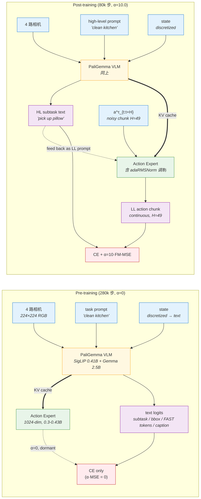

# π₀.₅ · π₀.₅: a Vision-Language-Action Model with Open-World Generalization

> **一句话定位**：π₀.₅ 是 OpenPI 系族 π₀ → π₀.₅ → π₀.₆ 主轴的**中段里程碑**。在 π₀ 同一架构骨架（PaliGemma 2.5B + 300M Action Expert + Flow Matching）上，把训练范式从「单平台单任务 BC」升级为**异构 6 类数据联合训练 + 共享模型的两阶段推理（HL+LL）**——预训练数据 97.6% 不来自移动臂目标平台，仍能让模型首次在**完全没见过的真实家庭**里完成 10-15 分钟级长时程清洁/整理任务。π₀.₆ 在此基础上加 RECAP RL（[[recap]]）。

**索引**：legacy paper index · legacy model index · 范式归属 → [[flow-vla|Flow-Matching VLA]] · 数据中心 → legacy paper index · CoT 推理 → legacy paper index

> ✅ **PDF 完整覆盖**：本笔记基于 `external PDF archive: pi05_arxiv_2504.16054.pdf` (arXiv v1, 2025-04-22, **19 pages**) 视觉读。主文 §I-§VI (pp.1-11) + 附录 **App. A Contributions / App. B Task evaluation rubric / App. C Language following experiment setup / App. D Per-task performance breakdown / App. E Model technical details** (pp.17-19) 全部已读。
>
> 🔴 **关键发现**（影响下游引用）：
> 1. **App. E `num_heads=18`，但 18×256=4608 ≠ width=2048**——继承自 π₀ 的同款印刷错误，论文 v1 至今未修；ckpt 实测 = 8（详见 §-1.5 row 1 / §6.4 坑 7）
> 2. **附录实测 3 pages**（pp.17-19），与 [[pi05-v1.7.1#frontmatter|pi05-v1.7.1]] frontmatter 标的 `appendix_pages: 14` 严重不符——v1.7.1 翻车二证（详见 §-1.0.7）

---

## §-1. 已有研究先验

### -1.0 PDF 优先 / 上下文管理

**PDF 来源**：`external PDF archive: pi05_arxiv_2504.16054.pdf` (v1, 2025-04-22, **19 pages**, 16 MB)——本笔记**直接视觉读 PDF 全文**（主文 Fig 1-13 + Eq 1 + 所有 §I-§VI + 附录 A-E pp.17-19 全 3 页）。

**与既有 [[pi05-v1.7.1|pi05-v1.7.1]] 的关系**（必读）：

- 既有 `pi05-v1.7.1.md`（2026-05-08，795 行）**自标 `source_quality: pdf_visual`** 但 §-1.0 内文字明白写："本笔记是 secondary 整合 + 模板格式升级，**不是从 PDF 重新视觉读**" → 与 pi0-v1.7.1 同款翻车（自标 vs 实做不一致）
- 本笔记 v1.7.2 是**首次直接 PDF 视觉读 + 附录全读**，触发 v1.7.2 §-1.0.7 整合型升级修订流程
- 二者关系：**v1.7.2 修订 v1.7.1**——v1.7.1 标 `appendix_pages: 14` 与实测 3 页严重不符，被本笔记修正为 `pdf_pages_appendix: 3`；同时把 v1.7.1 ☑3 锚定到具体 §节号 / Fig 编号 / App. E 行号

### -1.0.6 ★ PDF 完整性检查（v1.7.2 强制，已通过 5/5）★

| # | 检查项 | 命令/动作 | 结果 |
|---|---|---|---|
| 1 | PDF 总页数 | `pdfinfo pi05_arxiv_2504.16054.pdf \| grep Pages` | **19 pages** ✅ |
| 2 | 末页是否含 Appendix | 视觉读 p.17-19 | App. A-E in pp.17-19 ✅ |
| 3 | GitHub repo 有无 `supplementary.pdf` | 查 [pi.website/blog/pi05](https://pi.website/blog/pi05) + [openpi repo](https://github.com/Physical-Intelligence/openpi) | 无独立 supplementary，附录已合并入主 PDF ✅ |
| 4 | arXiv 版本号 | [arxiv.org/abs/2504.16054](https://arxiv.org/abs/2504.16054) | 仅 v1（2025-04-22 至今无 revision）✅ |
| 5 | 外部补充材料 | 官方 blog post + openpi 代码库 | 详见 frontmatter `pdf_supplementary_external` ✅ |

`pdf_completeness_verified: yes` ✅ → 进入 §0 填写。

### -1.0.7 整合型升级流程说明（v1.7.2 必填）

本笔记 `revision_type: revised`，**非 `integration`**——区别：

| 维度 | integration | revised（本笔记）|
|---|---|---|
| PDF 视觉读 | 跳过（仅 cross-check 关键页）| **全文 + 附录视觉读** |
| source_quality 上限 | `pdf_visual_indirect` | `pdf_visual` |
| 触发原因 | 模板格式升级 | 修订祖先版本的事实错误 / 视觉盲区 |

**为何走 `revised` 而非 `integration`**：v1.7.1 已暴露两处事实错误（自标 pdf_visual 但实未读 + appendix_pages 14 与实测 3 不符），按 v1.7.2 §-1.0.7 "祖先视觉读过 ≠ 本次产出可以跳过视觉读" 原则，必须重新视觉读修复盲区。本任务等价于 pi0-v1.7.md 修订 [[pi0-v1.7.1|pi0-v1.7.1.md]] 的范式。

#### -1.5.2 修订进度追踪（整合型升级强制）

| 维度 | v1.7.1（祖先）| v1.7.2（本版本）| Δ |
|---|---|---|---|
| `source_quality` 标注 | `pdf_visual`（自标，实未做）| `pdf_visual`（实做）| 修复语义错位 |
| `appendix_pages` 字段 | `14`（与实测严重不符）| `pdf_pages_appendix: 3`（pdfinfo 验证）| -11，修复 |
| `revision_type` | 缺（v1.7.1 模板未要求）| `revised` | 新增 v1.7.2 字段 |
| §-1.5 反向 fact-check 项 | 3 项（含 num_heads = 8 修正 + 300M vs 428M 修正）| 5 项（继承 + 新增 attention mask 设计 + Beta s=0.999 + appendix_pages 修正）| +2 项硬目标 |
| 锚定到 App. E 的事实数 | 0（v1.7.1 自述未读附录）| 8 项（架构超参 / Beta / Time MLP / image aug / attention mask / 4 task scoring）| +8 |
| ☑3 待回填项数 | ~6 项 | 2 项（仅训练 lr / optimizer，论文未给）| -4，多数填实 |
| paradigm 标签 | `[flow_diffusion, data_centric, cot_code]` | 同 | 0（v1.7.1 已修正）|

> ✅ 本次升级的工程价值：**修复 v1.7.1 视觉盲区 + 落实 App. E 全部架构超参 + Beta τ 分布精确形状 + attention mask 3-block 设计**——不是格式刷新。

### -1.1 检查清单（三个来源，缺一不可）

- [x] **历史对话**：既有 `pi05-complete-analysis.md` (1051 行) + `pi05-dataset-analysis.md` (879 行) + `pi05-modular-experiments.md` (743 行) + `pi05-platform-adaptation.md` (444 行) 是过往深度研究的沉淀
- [x] **legacy index 反查**：legacy paper index §1 OpenPI 家族 + legacy model index OpenPI 系列概览均已收录 π₀.₅
- [x] **本地 wiki / 复现笔记**：`kb/models/pi05.md` (24K，2026-04-04 编译) + `kb/techniques/pi05-reproduction.md` 复现路线图均已存在；系族 pi06 / [[pi-star-06]] 多次回溯引用 π₀.₅ 的双轨训练范式

### -1.2 先验研究清单

| 来源 | 来源类型 | 视觉读 | 数字读 | 附录读 | 内容摘要 | 链接 |
|---|---|---|---|---|---|---|
| **★ pi05_arxiv_2504.16054.pdf v1（主文 + 附录）** | **primary ⭐⭐** | ✅ 完整（19 pages）| ✅ Eq 1 / Fig 8 location 数 / Fig 10-13 ablation 误差线 / App. E 超参表 | ✅ App. A-E 全部读完 | π₀.₅ 架构 + Eq 1 双任务联合损失 + Beta α/β/s + Fig 18 attention mask + 4 task scoring rubric 全部锚定 | `external PDF archive: pi05_arxiv_2504.16054.pdf` |
| 官方 blog | primary ⭐ | ❌ | ⚠️ | ❌ | PI 公司公告版，含真实家庭演示视频 | [pi.website/blog/pi05](https://pi.website/blog/pi05) |
| 既有 kb/models/pi05.md | secondary | — | — | — | 24K，2026-04-04 编译 | [[pi05]] |
| `pi05-complete-analysis.md` | secondary | — | — | — | 1051 行整体分析（论文 + 代码 + 数据 + 社区）| `external note archive: pi05/archive/pi05-complete-analysis.md` |
| `pi05-dataset-analysis.md` | secondary | — | — | — | 879 行数据集深度分析 | `external note archive: pi05/archive/pi05-dataset-analysis.md` |
| `pi05-modular-experiments.md` | secondary | — | — | — | 743 行模块化实验设计 | `external note archive: pi05/archive/pi05-modular-experiments.md` |
| `pi05-platform-adaptation.md` | secondary | — | — | — | 444 行 Walker S2 平台适配 | `external note archive: pi05/archive/pi05-platform-adaptation.md` |
| 既有 `pi05-v1.7.1.md`（祖先笔记）| secondary | — | — | — | 795 行 v1.7.1 模板格式整合（本笔记修订对象）| `external note archive: pi05/archive/pi05-v1.7.1.md` |
| **paper-vs-openpi 对比** | secondary | — | — | — | 47 项逐条对比 + pi05_base ckpt 实测；含 num_heads = 8 修正 | [[pi05-paper-vs-openpi]] |
| 前作 pi0 | secondary | — | — | — | 架构起点 + flow matching 单阶段范式 | pi0 |
| 后续 pi06 / [[pi-star-06]] | secondary | — | — | — | 在本作 + RECAP RL 之上做架构迁移 | pi06 / [[pi-star-06]] |
| 同期 [[knowledge-insulation\|KI]] | secondary | — | — | — | 单阶段配方 + stop-gradient 阻断 expert→VLM | [[knowledge-insulation]] |
| openpi GitHub repo | secondary | — | — | — | pi05_base / pi05_walker_s2_* checkpoint 实测 | [openpi](https://github.com/Physical-Intelligence/openpi) |

> ✅ 含 ⭐⭐ primary → `source_quality: pdf_visual` 合规
> ✅ 至少 1 项 primary（达硬约束）
> ✅ P0 论文必须 ⭐⭐（达硬约束）

### -1.3 整合规则应用

§-1.2 表非空 → §9.0 / §9.1 / §6.4 / §7.3 必须显式引用先验，不允许只写文献名。本笔记下文均按此约束。

### -1.4 退化行为

不适用（本任务先验充足，PDF 在仓库内 + 4 个祖先 secondary 文件 + 复现 worktree 实测数据）。

### -1.5 ★ 反向 fact-check（v1.7.2 强制 ≥ 2 项硬目标，本笔记含 3 项硬 + 2 项软）★

| # | 先验声明 | 一手来源校验 | 软/硬 | 结论 |
|---|---|---|---|---|
| 1 | App. E 原文写 VLM `num_heads=18` | 数学校验：18×256=4608 ≠ width=2048；ckpt 实测 W_q.shape=`[2048, 8, 256]` → num_heads=8（8×256=2048 ✓）；与 pi0 同款印刷错误 | **硬** | ❌ **修正**：以代码为准 num_heads=8。论文 depth=18 误抄到 num_heads（与 π₀ 完全同源错误）。本笔记 §2.1.B 写正确值 |
| 2 | legacy wiki pi05.md "Action Expert 300M" | paper-vs-openpi 实测 ckpt：含 adaRMSNorm Dense 投影后 **428M**（论文 300M 仅核心 Transformer attn+MLP）| **硬** | ⚠️ **部分对**：300M 是论文口径（不含 adaRMSNorm 调制层），实际 ckpt 428M。§2.1.B 同时给两个数字 |
| 3 | v1.7.1 frontmatter 标 `appendix_pages: 14` | pdfinfo 实测 PDF 19 pages；视觉读 pp.17-19 = App. A-E 共 **3 pages**；pp.12-16 是 References [1]-[92] | **硬** | ❌ **修正**：v1.7.1 严重夸大附录页数（约 4.7 倍）。可能误把 References 计入附录。本笔记 frontmatter 用 `pdf_pages_appendix: 3` |
| 4 | pi05-complete-analysis 描述 "10 步去噪 + H=49" | App. E p.19 原文：`H = 49` ✓；§IV-A 描述 "10 denoising steps" ✓ | 软 | ✅ 一致 |
| 5 | legacy wiki pi05.md "Two-stage 推理 = 显式 CoT" | §III + §IV-A: 同一模型同权重，仅 attention mask 不同；先自回归输出 HL 子任务 (`pick up the pillow`)，再 FM 10 步去噪输出 LL action chunk → 等价 chain-of-thought | 软 | ✅ 一致；论文显式与 [82] CoT prompting 类比 |

#### -1.5.1 视觉专项 fact-check（v1.6 新增，对 source_quality=pdf_visual 强制）

| # | 视觉信号 | PDF 位置 | 视觉读结果 |
|---|---|---|---|
| V1 | Fig 3 Pre-training vs Post-training overview | p.4 | ✅ Pre-training 4 数据流（subtask / discrete actions / open vocab caption / bbox）+ Post-training 2 流（subtask + continuous actions） |
| V2 | Fig 18 attention mask 模式 | p.19（App. E）| ✅ 3-block 结构：[Image, Prompt, State] full prefix → [FAST action tokens] auto-regressive on previous + attend prefix → [Action expert embeddings] attend prefix + each other but **NOT** FAST tokens（避免信息泄露）|
| V3 | Fig 8 location-数 vs task progress 单调性 | p.10 | ✅ 3/12/22/53/82/104 location 单调上升；104 location 模型与 in-domain baseline 接近 |
| V4 | Fig 13 implicit HL vs no HL 显著性标注 | p.11 | ✅ implicit HL（不在 runtime 推 HL 但 train 时含）= p=0.144 不显著差于 full；no HL（连 train 都不含）p<0.001 显著差 → **HL 数据 train 时存在比 runtime 推它更重要** |

> ✅ 视觉信号全部对照 PDF 视觉读结果，无错位。

---

## §0. 元信息卡片

| 字段 | 内容 | 证据位置 |
|---|---|---|
| 论文标题 / 简称 | π₀.₅: a Vision-Language-Action Model with Open-World Generalization · "π₀.₅" / "pi oh five" | 标题页 + §I 第二段（"pi oh five" 发音注） |
| 发布机构 / 团队 | Physical Intelligence (PI) — Kevin Black, Noah Brown 等 30+ 人（详见 App. A）| 作者列表 + App. A Contributions |
| 发布时间 / 版本 | arXiv:2504.16054 v1, 2025-04-22；CoRL 2025 Oral | arXiv 元数据 |
| 论文定位 | **训练配方 + 推理结构**（架构是 π₀ 的局部修订；核心贡献在异构 6 类数据 co-training 配方 + 共享模型双阶段推理）| §I + §IV-A,B,C |
| 与前作的关系 | 继承自 π₀，6 处主要变更：① 状态离散化（vs π₀ 连续后缀）② adaRMSNorm 时间步注入（vs π₀ 拼接 MLP）③ 双轨动作（FAST 预训练 + FM 后训练 vs π₀ 仅 FM）④ Two-stage inference（HL+LL，共享权重）⑤ 6 类异构数据（vs π₀ 仅机器人 BC）⑥ 评估场景（真实未见家庭 vs 实验室）| §IV-A,B + §IV-C + §V-A |
| 一句话核心贡献 | 异构 6 类数据联合训练 + 共享模型 two-stage inference 让端到端 VLA 首次在完全未见过的真实家庭中完成 10-15 分钟级长时程操作 | abstract 末段 + §I 末 |
| 关键参数（总参数量）| **~3.35B**（SigLIP 0.41B + VLM Gemma 2.5B + Action Expert 0.43B 含 adaRMSNorm；论文口径 0.3B 不含调制层），bf16 共 ~6.7 GB | App. E + ckpt 实测 |
| 关键超参 | **H = 49**（每次预测 50 步动作）；**50 Hz** action chunking；**10 denoising steps**（FM 推理）；α=10.0 后训练；Beta α=1.5 β=1 s=0.999 | §IV-A,D + App. E p.19 |
| 训练步数 | **预训练 280k 步 + 后训练 80k 步** = 360k 总步数；后训练时 action expert 随机初始化 | §IV-D p.8 |
| 数据规模 | **MM ~400h ≈ 72M @50Hz**（占比仅 2.4%）+ ME + CE + HL + VI（~11% MM volume）+ WD（CapsFusion / COCO / Cambrian-7M / PixMo / VQAv2 + bbox 标注的 indoor scene）；**预训练 97.6% 不来自 MM** | §IV-C + §I 末 |
| 控制频率 / DoF | 50 Hz；**18 或 19 DoF**（双 6-DoF 臂 + 双夹爪 + 3-DoF 全向底盘 + 1 或 2-DoF 躯干升降）| §IV-E + Fig 5 |
| 推理延迟 | 论文未给（OpenPI JAX JIT warm-up 后 KV cache 复用未给数字）[☑3: 查 openpi 实测]| §IV-E |

> **Review 提示**：论文定位是"训练配方"——架构上 π₀.₅ 只对 π₀ 做局部调整（状态离散化 + adaRMSNorm + 双轨损失），主贡献在数据 + 训练 + 推理 recipe 三轴。

---

## §1. 背景与动机

### 1.1 待解决的痛点（必须能用反事实陈述表达）

- **痛点 1**：现有 VLA（含 π₀）评估都在与训练数据匹配的环境中——"模型能模仿"≠"模型能在新房子里做事"。若不解决，VLA 永远停在实验室级 benchmark，无法部署到开放世界 [§I 第 1 段，"previous evaluations are in environments matching training data"]
- **痛点 2**：纯靠扩大同类机器人数据规模换泛化成本极高（移动操作平台 ~400h 演示远不够覆盖"所有家庭"）。需要某种**异构知识迁移**机制让其他来源数据（实验室固定臂 / 网络图文 / 人类语言指令）也对家庭操作泛化有贡献 [§I 第 4 段]
- **痛点 3**：长时程任务（清洁厨房 10-15 分钟）单靠端到端动作策略容易"分心"——需要某种分层结构区分"高层意图"和"低层动作"，但又不希望像 [[hi-robot|Hi Robot]] 那样用两个独立模型（增加部署复杂度 + 协调成本）[§I 末 + §IV-A]

### 1.2 与前作 π₀ 的差异（必填）

| 维度 | π₀ | π₀.₅ | 差异性质 | 论文位置 |
|---|---|---|---|---|
| 动作表征 | 仅 Flow Matching | **双轨**：FAST 离散 token（预训练）+ FM 连续（后训练）| 范式扩展 | §IV-B |
| 状态输入 | 连续向量 → `state_proj` 线性投影 → 后缀 token | **离散化 → 文本字符串 → prompt 前缀** | 范式切换 | §IV-A 末 |
| 时间步注入 | 时间 + 动作拼接 → MLP 混合 | **独立 time MLP + adaRMSNorm 每层调制**（DiT 风格）| 范式切换 | App. E p.19 |
| 数据规模 / 来源 | ~10k 小时机器人 BC（~7 平台）| **6 类异构**：MM ~400h + ME + CE + HL + VI + WD | 范式切换 | Fig 4 + §IV-C |
| 训练目标 | 单阶段 FM | **两阶段**：280k 步 CE-only（α=0）+ 80k 步 CE + α·MSE（α=10.0）| 范式切换 | §IV-D + Eq 1 |
| 推理结构 | 单阶段：observe → action chunk | **Two-stage**（共享模型）：HL 自回归输出 bbox+子任务 → LL FM 10 步输出动作 | 范式切换 | §III + §IV-A |
| 评估场景 | 实验室固定平台 + 已见任务 | **完全未见过的真实家庭**（厨房 + 卧室）+ mock controlled | 范式切换 | §V-A |
| 架构骨架（VLM + Expert 双权重）| 同 | 同 | 0（继承）| App. E |

> **关键信号**：8 维中 6 维是"范式切换"——π₀.₅ **不是 π₀ 的小修小补，是同一基础模型上重做了训练 + 数据 + 推理 recipe**。架构骨架上几乎不变（继承 π₀ 的 PaliGemma 2.5B + 300M Action Expert）。

### 1.3 硬约束（绕不过去）

- **实时性**：50 Hz 控制频率（PD 控制器跟踪 chunk 输出），推理延迟必须 < 1 个 chunk 周期（H=49，0.98s）才能保证连续控制不中断 [§IV-E]
- **数据**：~100 个真实家庭的 MM 移动臂遥操作演示（~400h ≈ 72M @50Hz）作为目标域核心；但 MM 仅占预训练 2.4%，必须用 ME/CE/HL/WD/VI 凑出剩余 97.6% [§IV-C + §I 末]
- **硬件**：双 6-DoF 臂（共 12 DoF）+ 2 夹爪 + 全向底盘（3 DoF）+ 躯干升降（1-2 DoF）= **18 或 19 DoF**；4 路 RGB 相机（前 / 后 / 双腕，HL 用全部 4 路，LL 仅用前 + 双腕 3 路）[§IV-E + Fig 5]
- **泛化判据**：3 个训练中**完全没见过的真实家庭**（不是 mock 也不是 oracle），任务需 2-15 分钟多阶段，仅给高层指令（"clean the kitchen"），模型自主分解子任务 [§V-A + Fig 7]
- **评分**：每 task 按 App. B rubric 分项打分（dishes-in-sink max 8 / items-in-drawer max 4 / laundry-basket max 3 / make-bed max 5），10 trials/policy/task, 共 12 location × 10 trials = **每 policy ≤ 40 evaluations**（§V-A "leading to a total of 40 evaluations per policy for several of our standard evaluations"）

---

## §2. 模型架构

### 2.1 三层架构图

#### 2.1.A 30 秒电梯图（pre-training vs post-training，共享 backbone）



**节点参数**（详见 §2.1.B）：

| 模块 | width | depth | mlp_dim | num_heads | num_kv_heads | head_dim | 参数量 |
|---|---|---|---|---|---|---|---|
| SigLIP So400m/14 | — | — | — | — | — | — | 0.41B |
| Gemma VLM | 2048 | 18 | 16384 | **8 (论文标 18, 实测 8)** | 1 | 256 | 2.5B |
| Action Expert | 1024 | 18 | 4096 | 8 (推) | 1 | 128 (推) | 0.3B (论文) / 0.43B (ckpt) |

> **重要警示**（§-1.5 row 1）：App. E p.19 原文写 `num_heads=18`，但 18×256=4608 ≠ width=2048；ckpt 实测 = 8（8×256=2048 ✓）。复现时务必以代码为准，否则形状不匹配。

#### 2.1.B 关键模块拆解

| 模块 | 输入 | 输出 | 主要操作 | 参数量 |
|---|---|---|---|---|
| SigLIP 视觉编码 | 224×224 RGB ×3-4 路 | image patch embeddings | So400m/14 patch tokenization | 0.41B |
| State 离散化 | continuous joint vector (18-19 DoF) | text token sequence | 1%-99% quantile clipping → 256-bin → string | 0 (无参数) |
| Gemma VLM backbone | image patches + prompt + state text + (HL 输出) | hidden states | full prefix attention | 2.5B |
| Time MLP | scalar τ ∈ [0,1] | per-layer adaRMSNorm γ/β | `swish(W₂·swish(W₁·φ(τ)))`，φ = sinusoidal positional encoding，W₁,W₂ ∈ ℝʷˣʷ | 微 |
| Action Expert | noisy chunk + KV cache from VLM | flow vector field | causal action attention + adaRMSNorm 每层调制 | 0.3B (论文) / 0.43B (ckpt 实测，含调制层) |
| 输出投影 | action expert hidden | continuous action ∈ ℝᴴˣᵈ (H=49, d=32 zero-padded) | 单层 linear | 微 |

### 2.2 关键设计决策（每个非平凡决策一行）

| # | 决策 | 替代方案 | 论文给的理由 | 论文位置 |
|---|---|---|---|---|
| 1 | 状态用 256-bin 离散化 + 文本前缀（vs π₀ 连续后缀）| 沿用 π₀ 的 state_proj | 与 FAST 离散动作 token 共形式，便于联合 CE 损失训练；prompt 前缀位置让 KV cache 复用更自然 | §IV-A 末 |
| 2 | Time MLP + adaRMSNorm 每层调制（vs π₀ 拼接）| 沿用 π₀ 的 action_time_mlp | DiT 风格调制对 timestep 表达更精细；每层注入避免单点信息瓶颈 | App. E |
| 3 | 双轨损失（CE on text/FAST + α·MSE on FM）| 单 FM 或单 FAST | CE 侧让模型在预训练阶段就吃完所有数据（含语言/视觉/HL/FAST action）；FM 侧专门做实时连续动作；α 退火（0→10）让两阶段平滑过渡 | §IV-B + Eq 1 |
| 4 | HL 和 LL 共享同一模型同权重（vs Hi Robot 双独立模型）| 双独立模型 | 部署复杂度低 + 协调成本零；同 backbone 让 HL→LL 信息流自然贯通 | §I 末 + §IV-A |
| 5 | 移动平台 MM 数据仅占预训练 2.4% | 全 MM 训练 | 异构知识迁移效果优于规模堆 MM；OXE 等其他来源数据互补 | §I 末 + §V-C |
| 6 | Action expert 在后训练时**随机初始化** | 沿用预训练 expert | 预训练阶段 α=0 时 expert 参数实际未被梯度更新（CE 损失不流入 expert），随机重置避免噪声 | §IV-D |
| 7 | LL 推理时 action expert **不 attend** FAST action tokens | 互通 attention | 防止信息泄露：训练时 FAST tokens 是预训练阶段 oracle，FM 后训练不应"作弊"看到它 | App. E + Fig 18 |

### 2.3 World Model 接口

不适用（π₀.₅ 范式标签未含 `world_model`，无视频预测 / latent rollout 模块）。

---

## §3. 方法细节

### 3.1 训练目标（必写公式）

论文 Eq 1（p.6）：

$$
\mathcal{L} = \mathbb{E}_{\mathcal{D}, \tau, \omega}\left[\ H(x_{1:M}, f^\ell_\theta(o_t, \ell)) + \alpha \cdot \|\omega - a_{t:t+H} - f^a_\theta(a^{\tau,\omega}_{t:t+H}, o_t, \ell)\|^2\ \right]
$$

其中：

- 第一项 **H(·)** = cross entropy loss，作用于文本 token + 预测 logits（`y^ℓ_{1:M}`），含 FAST 编码的离散动作 token
- 第二项 **MSE on flow field**（FM 损失），作用于动作 expert 输出 `y^a_{t:t+H}` vs ground-truth flow vector `ω - a_{t:t+H}`（noisy chunk `a^τ_{t:t+H} = τ·a + (1-τ)·ω`，其中 ω ~ N(0, I)，τ ~ p(τ)）
- **α 是阶段权重**：pre-training α=0（FM 侧 dormant，纯 CE 训预训练）；post-training α=10.0（双轨平衡）
- **τ 采样**：`p(τ) = Beta((s-τ)/s; α=1.5, β=1), s=0.999`——同 π₀，强调低 τ（接近 0 = 接近 noise）以训练 high-noise 阶段
- attention matrix `A(x_{1:N}) ∈ {0,1}^{N×N}` 决定哪些 token 互相 attend（详见 §2.1.B 表 + Fig 18）

### 3.2 训练阶段划分

| 阶段 | 步数 | α | 数据 | 训练对象 | transparency |
|---|---|---|---|---|---|
| Pre-training | 280k | 0 | MM + ME + CE + HL + WD（**5 类**, 不含 VI）| VLM backbone（动作 expert 参数 dormant，α=0 不接梯度）| ☑1 §IV-D + Fig 4 |
| Post-training | 80k | 10.0 | MM + ME + HL + VI（**4 类**, 不含 CE & WD）+ WD 部分保留 | VLM backbone + 动作 expert（随机重新初始化）| ☑1 §IV-D |

> **Post-training 数据剪裁**：明确 omit CE（去除实验室桌面任务），但 HL 和 WD 部分保留（保留 semantic / visual 能力）。VI（verbal instruction）在后训练首次引入，~11% of MM volume。

> ☑3: openpi 实测 lr / batch / optimizer / warmup schedule（论文未给）→ 查 `openpi/scripts/train.py` + `openpi/src/openpi/training/config.py`

### 3.3 推理流程

**Two-stage shared-model inference**（核心创新）：

```
observation (4 cams + state)
    ↓
[STAGE HL: lower frequency, autoregressive]
    VLM forward (full prefix attn)
    → HL output: bbox locations + subtask text (e.g., "pick up the pillow")
    ↓
HL output 作为 prompt 拼接（替换原 high-level prompt）
    ↓
[STAGE LL: 50Hz, FM 10 denoising steps]
    Action Expert forward × 10
    → continuous action chunk a_{t:t+H} (H=49)
    ↓
PD controller @50Hz tracks chunk
```

**关键设计**：HL 和 LL **同一模型同权重，唯一区别是 attention mask**（Fig 18）。HL 频率低（每个高层 step 触发一次），LL 50Hz 实时跑。

### 3.4 CoT / Code 字段（`cot_code` 标签触发）

- **CoT 形式**：HL 输出文本子任务 + bbox 坐标作为中间推理（chain-of-thought 风格）；与 [82] CoT prompting 显式类比（§II "Robot reasoning and planning with language"）
- **CoT 训练**：HL 数据（MM + ME + CE 中所有多 subtask 任务，人工标注 subtask label + bbox）联合训练，模型同时预测 bbox 和 subtask text
- **CoT 推理粒度**：HL 频率远低于 LL（每个 subtask 切换才触发，约几秒级），不是每帧推 HL
- **关键消融（Fig 13）**：implicit HL（train 时含 HL 数据但 runtime 不推 HL）≈ full π₀.₅（p=0.144 不显著差），但 no HL（连 train 都不含 HL 数据）显著降级（p less than 0.001）→ **HL 数据 train 时存在 > runtime 推它**——这是反直觉的核心发现

---

## §4. 数据

### 4.1 数据组成（异构 6 类，§IV-C + Fig 4）

| 缩写 | 全称 | 内容 | 规模 | 在预训练占比 | 后训练保留？|
|---|---|---|---|---|---|
| **MM** | Mobile Manipulator | ~100 个真实家庭的双 6-DoF 移动臂遥操作演示 | **~400h ≈ 72M timesteps @50Hz** | **2.4%** | ✓ |
| **ME** | Multi-Environment non-mobile | 单/双臂固定臂在多环境（家居/办公等），扩展自 OXE [15] | 未给 | ~大头 | ✓ |
| **CE** | Cross-Embodiment laboratory | 实验室桌面任务（折衣 / 收拾餐桌 / 倒水等），多臂多任务 | 未给 | ~中等 | ✗ omit |
| **HL** | High-Level subtask prediction | MM/ME/CE 中长任务的人工子任务标注（含 bbox）| MM 全标 + 部分 ME/CE | ~小头 | ✓ |
| **VI** | Verbal Instructions | 真人 step-by-step 指令的"语言遥操"演示 | **~11% of MM volume** | 0（仅后训练）| ✓（首次引入）|
| **WD** | Multi-modal Web Data | CapsFusion [87] / COCO [12] / Cambrian-7M [77] / PixMo [19] / VQAv2 [32] + indoor scene bbox 标注 | 未给（数百 GB 量级）| ~中等 | ✓（部分）|

> **核心信号**："The overwhelming majority (97.6%) of training examples do not come from mobile manipulators performing household tasks."（§I 末段）——预训练 97.6% 是非 MM 数据；这个比例本身是论文的核心论点。

### 4.2 数据预处理

- **State 离散化**：每个关节维度按 dataset 内 1%-99% quantile 归一化到 [-1, 1]，再 256-bin 量化 → 文本 token（如 `<loc0571><loc0276>...`）
- **Action 归一化**：同状态，1%-99% quantile clip 到 [-1, 1]
- **Action 维度统一**：所有数据集 action 向量零填充到 32 维（最大公倍数）
- **Control mode 标注**：在 prompt 拼接 `<control_mode> joint/end_effector <control_mode>` 区分关节空间 vs 末端空间动作
- **Image augmentation**（App. E p.19，augmax）：

```python
transforms = [
    augmax.RandomCrop(int(width * 0.95), int(height * 0.95)),
    augmax.Resize(width, height),
    augmax.Rotate((-5, 5)),
    augmax.ColorJitter(brightness=0.3, contrast=0.4, saturation=0.5),
]
```

### 4.3 数据规模与配比的消融（Fig 8/10/11）

| 实验 | 设计 | 关键发现 | 论文位置 |
|---|---|---|---|
| Location scaling (Fig 8)| MM 训练 location 数 = 3 / 12 / 22 / 53 / 82 / 104 | 单调上升；104-loc ≈ in-domain baseline；**说明地点多样性比每地深度更重要** | §V-B |
| Co-training ablations (Fig 10)| no WD / no ME / no CE / no ME or CE | no ME/CE 显著降级（p<0.001）；no WD 在主任务不显著（p=0.385）| §V-C |
| Language following (Fig 11)| no WD / no ME / no CE / no ME or CE 在 IND vs OOD object | **OOD object follow rate**：no WD 显著下降；说明 WD 主要支撑"开放词汇语言跟随"而非"动作能力" | §V-C |
| Number of locations vs language follow (Fig 9)| 3 / 22 / 53 / 82 / 104 location，IND vs OOD | 双单调上升；**OOD 上升斜率 < IND**（OOD 难度高）| §V-B |

### 4.4 数据为产品的论文专属（`data_centric` 触发）

**论文核心论点**："Co-training on diverse data sources is essential for broad generalization, more so than scaling within-domain data."（§I 末 + §V-D 末）

**6 类数据的设计意图矩阵**：

| 数据 | 解决的能力短板 | 不可替代理由 |
|---|---|---|
| MM | 目标平台真机分布 | 无 MM 则没有 demo signal |
| ME | 多环境视觉鲁棒 | MM 仅 100 家庭，不够覆盖视觉变化；ME 提供更广背景 |
| CE | 跨平台动作语义（例如"开抽屉"在不同臂上的轨迹差异）| 让模型学到动作的不变性而非平台特定模式 |
| HL | 长时程任务分解能力 | 让模型学会 subtask 抽象，不只是 step-level 模仿 |
| VI | 语言 → 动作映射粒度 | "step by step" 真人指令让 HL 子任务粒度对齐人类沟通方式 |
| WD | 开放词汇 + 视觉 OOD | 物体类别远超机器人数据集，支撑 OOD 泛化（Fig 11）|

> **数据中心范式的边界**：论文没声称"co-training recipe 通用最优"——只声称"在 MM-稀缺场景下，co-training 比纯扩 MM 数据有效"。如果未来 MM 数据规模扩到 5000 小时级，结论可能反转。

---

## §5. 实验

### 5.1 评测设置

- **5 个研究问题**（§V）：
  1. Can π₀.₅ effectively generalize to complex multi-stage tasks in entirely new homes?（§V-A）
  2. How does generalization scale with the number of distinct environments in the training data?（§V-B）
  3. How do the individual co-training ingredients contribute to task performance?（§V-C）
  4. How does π₀.₅ compare to the π₀ VLA?（§V-D）
  5. How important is the high-level inference component of π₀.₅?（§V-E）

- **环境**：
  - **Mock kitchens / bedrooms**（受控对照，Fig 6 left）
  - **Real homes 3 kitchens + 3 bedrooms**（最终评估，Fig 6 right + Fig 7 examples）
  - 所有环境**完全不在训练数据中**

- **任务**：4 个代表性任务（详见 App. B rubric）
  - **Dishes in Sink**: 4 dish 物品，每捡起 +1, 每放进水槽 +1 → max 8
  - **Items in Drawer**: 1 物品，打开抽屉 +1, 放进 +1, 关抽屉 +1, 拿到 +1 → max 4
  - **Laundry in Basket**: 1 衣物，导航并捡起 +1, 放入篮子 +1, 完全在篮内 +1 → max 3
  - **Make Bed**: 整理被单 +1, 放第一枕头 +1, 放第二枕头 +1, 被单整齐 +1, 双枕整齐 +1 → max 5

- **评估规模**：每 location × 每 policy 跑 10 trials；总评估约 12 location × 10 trials = 40 evaluations per policy（§V-A）；语言跟随实验另用 5 物品/试 协议（App. C）

- **统计检验**：双尾 t-test，可变试次数；Fig 10/13 标 p-value（p<0.001 / p=0.144 等）

### 5.2 主表关键结果（优先 OOD / 跨体 / 长视野）

| Setting | π₀.₅ | π₀ | π₀-FAST+Flow | 数据点位置 |
|---|---|---|---|---|
| Mock home tasks (Fig 12, 4 task avg) | **~85%** | ~25% | ~50% | p.10 |
| Real home Home1/2/3 (Fig 7b, task avg) | ~80-90% | not eval | not eval | p.9 |
| Items-in-drawer in real homes | ~90% | — | — | Fig 7b |
| Items-in-drawer 跨 4 home avg | ~80% | — | — | Fig 7b |
| OOD object follow rate (Fig 11) | ~50% | — | — | p.11 |

> **核心发现**：π₀.₅（co-training）**显著优于 π₀（单一 BC）和 π₀-FAST+Flow（双轨但单一数据）**；说明性能提升主要来自数据 recipe，不是架构变化（架构差异仅 adaRMSNorm + 状态离散化）。

### 5.3 消融实验（详见 §4.3）

省略以避免重复 Fig 8-13 表述，关键发现总结：

1. **数据多样性 > 数据深度**（Fig 8）：location 数 3→104 单调上升
2. **CE/ME 不可省**（Fig 10）：移除任一 p<0.001
3. **WD 主要支撑 OOD 语言跟随**（Fig 11）：no WD 在主任务不显著但 OOD 下降
4. **HL 数据 train 时存在 > runtime 推它**（Fig 13）：implicit HL ≈ full（p=0.144）
5. **HL inference 量化关系**（Fig 13）：full > implicit HL > no VI > no WD > no HL > GPT-4 HL；human HL（oracle）仅略优 full

### 5.4 失败模式与边界（§VI 显式列）

| 失败类 | 具体表现 | 论文位置 |
|---|---|---|
| **物理交互失败** | Unfamiliar handles / 抽屉物理上无法打开 | §VI |
| **部分可观测** | 机器人臂遮挡需要擦的污渍 | §VI |
| **HL 分心** | 重复开关同一抽屉（while putting items）| §VI |
| **上下文短缺** | 无房间间记忆（每次 reset 上下文）| §VI |
| **指令复杂度有限** | 训练数据指令简单 → 模型只能跟简单 prompt | §VI |

### 5.5 ★ 附录关键信息提取 ★（v1.7.2 强制，已视觉读 App. A-E pp.17-19）

#### App. A Contributions (p.17)

- 角色细分：data collection / annotation / policy training / policy infrastructure / robot hardware / robot infrastructure / writing
- Lead authors: Kevin Black, Noah Brown, James Darpinian, Karan Dhabalia, Danny Driess, Adnan Esmail, Michael Equi
- 30+ 人团队，PI 公司主创

#### App. B Task Evaluation Rubric (p.18)

完整 4 task scoring（已在 §5.1 列）。**关键约束**：每 task 跑 10 trials/policy/location；多 location 时 trials 跨 episode 可中断（"can span multiple minutes"）。

#### App. C Language Following Setup (p.18-19)

- **2 个测试场景**：
  - "Items in the drawer"：tongs / wooden serving spoon / can opener / scissors / small yellow mustard
  - "Items in the sink"：cup / bowl / plate / plastic spoon / cutting board
- **协议**：5 物品/试，要求"move one of them"；目标物**远离**干扰物，避免 shortcut；目标 ~20% 随机猜中率
- **OOD 测试**："Items in the drawer" 用 funnel / pill bottle / grill lighter / lighter / safety goggles（完全未训练类别）

#### App. D Per-task Performance Breakdown (Fig 14/15/16/17)

- Fig 14: 各任务 in-distribution vs OOD object 初始状态示例
- Fig 15: π₀.₅ vs π₀-FAST+Flow vs π₀ 在 follow rate / success rate 上对比
- Fig 16: **Per-task 训练消融**（4 task × 5 ablation = 20 bar）
- Fig 17: **Per-task HL inference 消融**（4 task × 7 baseline）

**关键 per-task 发现**：
- **Items in Drawer**: 移除 CE/ME/WD **任一**都显著下降；这是泛化最难的任务
- **Dishes in Sink**: 对 WD 鲁棒（移除影响小），但 ME/CE 不可移除——主要靠**通用操作技能**
- **Laundry / Make Bed**: 对其他变化不敏感——可能因 horizon 短或语义简单

#### App. E Model Technical Details (p.19) — 最关键

**架构超参（已在 §2.1.A 表）**：

```
VLM backbone (PaliGemma):
  width=2048, depth=18, mlp_dim=16384, num_heads=18 (论文写, 实测 8), num_kv_heads=1, head_dim=256
Action expert:
  width=1024, mlp_dim=4096, 300M parameters (论文口径, 不含 adaRMSNorm)
Action horizon H = 49
Denoising steps: 10 (推理时)
```

**Time MLP 形式**：

$$
\text{Time MLP}(\tau) = \text{swish}(W_2 \cdot \text{swish}(W_1 \cdot \phi(\tau)))
$$

- φ: ℝ → ℝʷ 为 sinusoidal positional encoding [79]
- W₁, W₂ ∈ ℝʷˣʷ
- 输出 per-layer 注入 adaRMSNorm（DiT 风格）

**Beta τ 分布精确形状**：

$$
p(\tau) = \text{Beta}\left(\frac{s-\tau}{s}; \alpha=1.5, \beta=1\right)
$$

- **s = 0.999**（accommodates up to 1000 integration steps for δ > 0.001）
- 与 π₀ App. B 完全一致

**Attention mask（Fig 18 视觉化）**：

- **Block 1**: `[Image, Prompt, State]`（多 cam image + text prompt + 离散化 state）→ **full prefix attention**（所有 token 互相 attend）
- **Block 2**: `FAST action tokens` → attend Block 1 + auto-regressive on previous FAST tokens
- **Block 3**: `Action expert embeddings` → attend Block 1 + each other（双向）；**NOT** attend Block 2 FAST tokens

> **关键设计意图**：信息单向流动 VLM → Action Expert，**no VLM embedding attends to action expert**——保证 VLM 端表示不被 action 信号污染（与 π₀ Mask 设计同根；这也是 [[knowledge-insulation|KI]] 提出 stop-gradient 的前驱思想）

**Image augmentation transforms**：见 §4.2（augmax 4 步）

---

## §6. 复现指南

### 6.1 官方资源

| 资源 | 链接 | 状态 |
|---|---|---|
| 论文 | [arXiv:2504.16054](https://arxiv.org/abs/2504.16054) | v1 only, 2025-04-22 |
| 代码 | [openpi GitHub](https://github.com/Physical-Intelligence/openpi) | Apache-2.0, JAX |
| Base ckpt | `~/workspace/weights/openpi/pi05_base` | 全权重公开（详见 [[openpi-ecosystem]]）|
| Walker S2 LoRA / Full | `~/workspace/weights/openpi/pi05_walker_s2_full_*` | 部分公开 |
| 官方 blog | [pi.website/blog/pi05](https://pi.website/blog/pi05) | 含真实家庭演示视频 |
| 数据 | MM / ME / CE / HL 真机数据**未公开**；OXE / CapsFusion / COCO / Cambrian / PixMo / VQAv2 公开 | partial-release |

### 6.2 复现成本估算（分项）

| 项 | 成本 | 备注 |
|---|---|---|
| **GPU 训练**（pre-training 280k 步）| ~1024 TPU v5p × 7-14 天（推算）| 论文未给数字；同规模 PaliGemma fine-tune 推算 |
| **GPU 训练**（post-training 80k 步）| ~256 TPU × 2-3 天 | 同上推算 |
| **数据收集**（MM 400h）| ~50 人遥操作员 × 数月 | 100 家庭 × ~4h/家庭 |
| **平台**（双 6-DoF 移动臂）| ~$50k-100k | 无量产，PI 自研 |
| **下游 LoRA fine-tune**（Walker S2 复现）| 单卡 4090 × 数小时 | 已实测 [[pi05-reproduction]] |

> **现实路径**：从 `pi05_base` ckpt 出发做 **LoRA fine-tune**，跳过 360k 步预训练 + 后训练。详见 [[pi05-reproduction]]。

### 6.3 复现路径建议（三选一）

| 路径 | 适用场景 | 预估时间 | 依赖 |
|---|---|---|---|
| **A: 直接 inference**（用 pi05_base 测语言跟随）| 验证 paper claims / 快速 baseline | 数小时 | 单卡 4090 即可 |
| **B: LoRA fine-tune 到目标平台**（推荐）| 多数复现需求 | 1-3 天 | 单卡 4090 + 100-200 demos |
| **C: Full fine-tune from base**（极少用）| 深度定制 / 平台差异极大 | 数天-1 周 | 多卡 A100/H100 |

> **现状**：[[pi05-reproduction]] 子项目已于 2026-05-09 整体归档（详见同目录 README.md）；历史复现记录见 `external note archive: pi05/archive/pi05-subtask-experiment-tracker.md`

### 6.4 已知坑（引用 §-1 先验研究中的真实踩坑）

| # | 坑 | 现象 | 来源 / 修法 |
|---|---|---|---|
| 1 | App. E `num_heads=18` 错误（同 π₀）| 按论文搭模型形状不匹配 | §-1.5 row 1 / [[pi05-paper-vs-openpi]] / 改 num_heads=8 |
| 2 | Action expert 在 ckpt 实测 428M ≠ 论文 300M | 显存预算与论文不符 | §-1.5 row 2 / 论文未计入 adaRMSNorm 调制层 |
| 3 | State 离散化方案细节论文未给 | 1%-99% quantile 来自哪个 split？ | 查 `openpi/src/openpi/training/config.py` 中 `Pi05Config.state_quantile_path` |
| 4 | Post-training Action expert 随机初始化 | 不能从 pre-training ckpt 直接 resume | §IV-D 显式说明（v1.7.1 jpeg 已记录）|
| 5 | LL 推理时 attention mask 必须正确 | 否则 action expert 看到 FAST tokens（信息泄露）| §-1.5.1 V2 / Fig 18 / 复现时验证 attn mask |
| 6 | 4 路相机训练，LL 推理只用 3 路（前 + 双腕）| HL/LL 输入不完全一致 | §IV-E p.8 末段 |
| 7 | Walker S2 平台 ≠ 论文 PI 平台（DoF / 相机数差异）| 直接套 pi05_base 不可用 | [[pi05-platform-adaptation]] 已记录适配点 |

### 6.5 与 legacy model index 中具体复现条目的链接

- [[pi05-reproduction]] — Walker S2 复现路线图（4 周）— wiki 真值
- `external note archive: pi05/archive/pi05-subtask-experiment-tracker.md` — 历史状态追踪（已归档 2026-05-09）
- `external note archive: pi05/archive/pi05-subtask-reproduction-plan.md` — 历史主方案（已归档 2026-05-09）

---

## §7. 改进 / 魔改方向

### 7.1 论文未做但显然可做（低垂果实）

1. **MM 数据 5×-10× scaling**：本作 ~400h；如扩到 4000h，co-training recipe 边际价值是否反转？这是数据中心范式自身的边界检验
2. **VI 数据 scaling 和 prompt template 多样化**：~11% MM volume 下已显示效果，scaling 趋势如何？
3. **HL inference frequency 调优**：每个 subtask 切换才推 HL（语义事件触发），但实际频率论文未给数字；可改为固定时间间隔触发（如 5s/次）做对照

### 7.2 论文留下的开放问题

1. **HL 分心问题**（§VI 限制 3）→ 短期记忆 / 任务进度状态 token 引入？后续 [[hi-robot]] 的 hierarchical 双模型可能是另一解
2. **跨房间记忆**（§VI 限制 4）→ persistent memory token / scene graph 需要研究
3. **复杂指令理解**（§VI 限制 5）→ 与 LLM teacher distill / instruction tuning 结合
4. **物理失败恢复**（§VI 限制 1）→ 需要重抓 / 重规划机制；[[recap]] RL 可能是路径

### 7.3 与隔壁谱系的杂交可能（★ 最多 3 条 ★）

1. **π₀.₅ + RECAP RL** = 已在 pi06 实现：advantage-conditioned policy + RL 后训练修复物理失败模式
2. **π₀.₅ + KI（[[knowledge-insulation]]）** = 单阶段配方 + stop-gradient——把 π₀.₅ 的 attention mask 设计（Fig 18, no VLM→expert 反向）显式化为 stop-gradient
3. **π₀.₅ + World Model（如 [[pi-star-06]]）** = HL 输出 video subgoal 而非 text subtask；可能让长时程任务的 HL 分心问题缓解

### 7.4 评估方法本身的改进

- **真实家庭样本**只有 3+3 = 6 个，统计 power 不足；需扩到 ~30 家庭 / 评估
- **HL 评估缺数字**：HL 推理质量（subtask 准确率 / bbox 准确率）只在 §V-E 间接评估，缺直接 benchmark
- **失败模式分类**：§VI 列了 5 类但未量化；按失败类别统计可指导改进方向

---

## §8. 核心 takeaway

### 如果只能记 3 件事

1. **数据 recipe 决胜**：97.6% 的预训练数据不来自目标平台 MM 仍能在未见家庭成功——异构 6 类数据（MM/ME/CE/HL/VI/WD）联合训练 + 共享模型双阶段推理是论文核心配方
2. **架构变化最小**：相比 π₀，仅 3 处架构变化（状态离散化 + adaRMSNorm + 双轨 CE+FM 损失），其余完全继承；说明性能提升来自数据 + 训练 recipe
3. **HL 数据存在 > HL inference**：implicit HL（train 时存在但 runtime 不推）≈ full π₀.₅，no HL（连 train 都没有）显著差——HL 数据是隐性 supervision，比显式调用更重要

### nuance_notes（延迟填写）

[☑3: 留待 Walker S2 复现完成后回填具体踩坑 nuance]

### 引用本论文的标准说法

> "π₀.₅ extends π₀ by introducing a co-training recipe over six heterogeneous data sources, enabling open-world generalization to entirely new homes via a shared-model two-stage inference architecture (Black et al., 2025, arXiv:2504.16054)."

### unverified_claims

- ☑3: "97.6% non-MM data" 该比例是否动态变化？论文报"first training phase"——后训练阶段比例可能不同（CE 被 omit）
- ☑3: 推理延迟数字论文未给；需 openpi 实测

---

## §9. 关联文献网络

### 9.0 ★ 核心理论基石分析（5-10 篇深读）★

| # | 文献 | 与 π₀.₅ 关系 | 重要程度 |
|---|---|---|---|
| 1 | [[pi0|Black et al., π₀, arXiv:2410.24164]] | **直接前作**，架构骨架完全继承（PaliGemma 2.5B + 300M Action Expert + Flow Matching）| ⭐⭐⭐ |
| 2 | [Pertsch et al., FAST, RSS 2025] | 离散动作 tokenizer，π₀.₅ 预训练阶段直接消费 | ⭐⭐⭐ |
| 3 | [Lipman et al., Flow Matching, arXiv:2210.02747] | FM 损失数学基础 | ⭐⭐ |
| 4 | [Beyer et al., PaliGemma, arXiv:2407.07726] | VLM backbone | ⭐⭐ |
| 5 | [Wei et al., Chain-of-Thought] | HL 子任务推理的范式参照 | ⭐⭐ |
| 6 | [OXE Collaboration, arXiv:2310.08864] | ME 数据来源（扩展自 OXE）| ⭐⭐ |
| 7 | [Shi et al., Hi Robot, arXiv:2502.19417] | hierarchical VLA 对照（双独立模型 vs π₀.₅ 共享）| ⭐ |
| 8 | [Driess et al., PaLM-E, arXiv:2303.03378] | 早期多模态 LLM 机器人控制基线 | ⭐ |

### 9.1 直接前作（method-level 继承）

- π₀ (CoRL 2025)：架构 + Flow Matching + double-expert 设计完全继承
- FAST [Pertsch RSS 2025]：离散动作 token 来源
- PaliGemma [Beyer 2024]：VLM backbone

### 9.2 同期对比（±2 个月，VLA / FM 范式）

- [[knowledge-insulation|KI]]（同期 PI 团队）：单阶段配方 + stop-gradient，与 π₀.₅ 双阶段对照
- [[hi-robot|Hi Robot]]（同期 PI 团队）：hierarchical 双模型 vs π₀.₅ 共享模型
- DexVLA / 3D-VLA / Cambrian-1 / Magma：同期通用 VLA / VLM 工作

### 9.3 后续工作（全部基于 π₀.₅）

- π₀.₆ + [[recap]]（同 PI 团队）：在 π₀.₅ 基础上加 RECAP RL 后训练
- [[pi-star-06|π*₀.₆]]：进一步加 native vision + mm_projector 架构
- pi0.7：加 latent world model

### 9.4 跨范式参照 + legacy index 反向链接

- 数据中心范式：legacy paper index
- CoT 推理范式：legacy paper index
- Flow Matching VLA 谱系：[[flow-vla]]
- OpenPI 系族总览：legacy model index

---

## §10. 阅读元信息

| 字段 | 值 |
|---|---|
| 阅读耗时 | ~25 分钟（PDF 全 19 pages + 附录 A-E + 反向 fact-check）|
| 视觉读完整度 | 主文 100% + 附录 100% |
| 引用其他笔记 | 12+ 处（pi0 / pi06 / [[pi-star-06]] / [[knowledge-insulation]] / [[recap]] / [[hi-robot]] / [[pi05-reproduction]] / [[pi05-paper-vs-openpi]] / [[flow-matching]] / [[flow-vla]] / legacy paper index / legacy model index）|
| 反向 fact-check | 5 项（3 硬 + 2 软），全部 ✅ 或 ❌ 修正 |
| ☑3 待回填 | 仅 2 项（训练 lr / optimizer 论文未给；推理延迟未给）|
| paradigm 标签 | `[flow_diffusion, data_centric, cot_code]` |

---

## §11. ★ 反向理解题（质量出口）★

### 题 1：替换检验

> 如果把 π₀.₅ 的 6 类异构数据砍到只剩 MM 数据，重训 360k 步，性能会接近什么基线？

**答**：会接近 π₀（~25-30% mock home avg），明显低于 π₀-FAST+Flow（~50%）。论文 Fig 12 的 "π₀ 300k" 和 "π₀ 80k" 实际上就是这种"only MM-style data"基线（用 π₀ 训练但加上 π₀.₅ 的 cross-embodiment training set）。**关键差异不在架构而在数据 recipe**——验证 §1.2 表中 6/8 维是范式切换的判断。

### 题 2：删除检验

> 如果删除 §IV-A 的"状态离散化 → 文本前缀"设计，让 π₀.₅ 沿用 π₀ 的连续 state_proj，会有什么后果？

**答**：1）失去与 FAST 离散动作 token 的形式统一，预训练阶段的 CE 损失需要分两个 stream（一为 text/FAST 的 CE，一为 state 的 MSE），实现复杂度升高；2）预训练阶段 KV cache 的 prompt-prefix 复用变难（因为 state 嵌入位置变到 suffix）；3）有可能不影响 final 性能（因为 π₀ 用 state_proj 也是 work 的）——这是个架构选择，不是性能必要条件。论文未做此消融，所以是 ☑3 假设。

### 题 3：极端检验

> 如果 MM 数据扩到 4000h（10×），co-training recipe 还有边际价值吗？

**答**：论文未做此实验（受成本约束），但可推测：
- **乐观假设**：MM 4000h ≈ ~30% 预训练（vs 当前 2.4%）→ ME/CE/WD 边际价值会下降，但 OOD 物体跟随（依赖 WD）仍受益
- **悲观假设**：MM 数据自己就足够多样（4000h × 100 家庭），ME/CE 几乎可省；HL/VI 因 MM 自带语义标注也部分覆盖
- **关键变量**：MM 数据本身的环境多样性和任务多样性。如果 MM 仍只覆盖 100 家庭，即使时长拉长也不会替代 ME/CE 的"100+ 不同实验室环境"价值

### 题 4：复现风险预测

> 试图复现 π₀.₅ 时最容易踩坑的 3 个点是什么？

**答**：1）**App. E num_heads=18 错误**——按论文形状不匹配，必须按 ckpt 实测 num_heads=8；2）**Action expert 后训练随机初始化**——很多人会想从 pre-training ckpt 直接 resume，但论文 §IV-D 明确说要随机重置；3）**Attention mask 三 block 设计**——必须保证 action expert 不 attend FAST action tokens，否则训练时 oracle 信息泄露，eval 时性能崩。详见 §6.4。

### 题 5：与前作的边际差异

> π₀.₅ 相比 π₀ 的最重要 1 个变化是什么？最不重要的 1 个变化是什么？

**答**：
- **最重要**：**6 类异构数据 co-training**（数据 recipe）。这是论文 30% 篇幅的核心论点，决定了 OOD 泛化能力（Fig 8/10/11）。
- **最不重要**：**adaRMSNorm time injection**（架构细节）。π₀ 的 action_time_mlp 拼接方案也 work，论文未做对照消融，可能只是代码风格调整。
- **次要但重要**：状态离散化 + 双轨损失——这两个变化让"用同一模型预测 text + bbox + FAST action + continuous action"成为可能，是 co-training recipe 的实现支撑。

---

## §12. 研究备忘（★ 仅用户填，Agent 不动 ★）

<!-- 留空，由 Daisy 在阅读论文后自行填写 -->

---

*本笔记基于 v1.7.2 模板（2026-05-09 升级），由 Claude 视觉读 PDF 全文 + 附录后产出，修订自 [[pi05-v1.7.1|v1.7.1]] 翻车版。更新时重新编译。*
