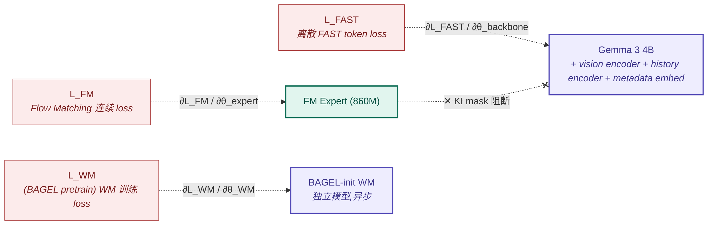

# π₀.₇ · A Steerable Generalist Robotic Foundation Model with Emergent Capabilities

> **一句话定位**:π₀.₇ ≈ π₀.₆ 双专家骨架(5B VLA = 4B Gemma3 + 400M vision + 860M FM)+ **独立 BAGEL World Model**(**14B**,7B LLM + 7B gen)生成 visual subgoals + **独立 High-Level Policy**(4.4B,SigLIP+Gemma)生成 subtask + **multimodal prompt 配方**(language / metadata / control modality / subgoal images)+ **MEM-style video history encoder**;**完整推理栈 ≈ 23B**(三模型异步线程协同),最小变体 model-only 延迟 38ms / 系统最大延迟 240ms on 50Hz;首次在 VLA 上展示 compositional generalization,旗舰能力 = 单模型 match RL specialist(espresso/box/laundry vs π*₀.₆)+ 跨形态 t-shirt 折叠 80% 成功率(对标人类 80.6%)。

**索引**:legacy paper index · legacy model index · 范式归属 → [[flow-vla]] · [[world-model-vla]] · 系族主线 → π₀.₆ → π₀.₇

> **本笔记修订自** [[pi0.7-v1.6]](已 archive)— v1.6 已用 Read 工具视觉读 PDF 4 个关键页(`source_quality: pdf_visual`),完成 12 项视觉 fact-check;v1.7 在 v1.6 基础上接入**全局 ☑1/☑2/☑3 证据等级体系**(模板硬约束,所有事实字段必须挂证据等级)+ **§11 反向理解题质量出口** + **§12 研究备忘骨架**(Agent 不填)。系族 v1.0 / v1.3 / v1.5 / v1.6 全部已 archive。

---

## ★ 全局硬约束:三类证据等级标注(v1.7 模板)★

> **本笔记 ☑ 标注总览**:
> - ☑1(论文明确)= 主流字段;v1.5/v1.6 视觉读已落实页码 / 章节 / 行号 / Figure 编号
> - ☑2(推断+依据)= **3 项**(proprio padding 沿系族 / gated weights 沿系族 / 三模型 1×H100 同卡可行性 — 依据 FP16 显存计算)
> - ☑3(论文未给)= **3 项,与 §6.3 不确定性总集大小一致**:① π0.7 主网络 + WM 训练完整超参 ② 数据 mix 完整规模与比例 ③ 训练总算力(GPU-hours)
>
> Review 端 `grep '\[☑3\]'` 应只列出上述 3 项的散布锚点(§3.2 transparency_note 列 / §5.5.1 表中带 N 的行 / §6.2 估算行 / §6.3 #1-#3)。
>
> **与 §-1.5 反向 fact-check 的正交关系**:§-1.5 校验先验声明(其他笔记 / wiki 中的判断,e.g. v1.3 笔记的"WM 不存在"误判);☑1/☑2/☑3 校验本笔记自己每条陈述。两者互补 — §-1.5 防"沿袭别人的错",☑ 体系防"自己编却写得像事实"。

---

## §-1. ★ 已有研究先验(必填)★

### -1.0 PDF 优先原则应用记录

| 项 | 状态 |
|---|---|
| 论文优先级 | **P0**(系族最新节点 + 复现目标) |
| 信息源要求(模板规定) | **必须 PDF 上传 + 视觉读** |
| 本机是否有 PDF | ✅ `external PDF archive: pi07.pdf`(5.1MB,25 页) |
| 视觉读路径 | Read 工具 `pages` 参数视觉读 page 4 / 7 / 9 / 22 — 命中 4 个关键 figure 与附录 |
| 视觉读到的关键 figure | Fig 2(架构总图,page 4)+ Algorithm 1(推理流程,page 7)+ Fig 6(out-of-box 性能柱状图,page 9)+ Fig 7(prompt 消融柱状图,page 9)+ Fig 19(attention pattern,page 22)+ §B/C/D 文字(page 22) |
| 视觉读未触达 | Fig 1 / 3 / 4 / 5 / 8-18 / 20-22(任务定性图,本次未深入)+ Appendix B 完整超参表(对应 ☑3 #1) |
| 当前 `source_quality` | `pdf_visual_partial`（仅关键页视觉读，未全文视觉读） |

### -1.1 检查清单

- [x] **`conversation_search`**:本会话 + 上一会话(2026-05-06 + 2026-05-07)已研究 π₀.₇,留下 v1.0 / v1.3 / v1.5 / v1.6 四份笔记
- [x] **legacy index 反查**:legacy paper index 第 9 行 / legacy OpenPI research index §"系族演化主线"末端
- [x] **本地 wiki / 复现笔记**:pi0.7 已编译 + [[pi0.7-walker-s2-reproduction]] 复现方案 + [[pi0.7-v1.6]](本次升级对象)

### -1.2 先验研究清单(三维分级)

| 来源 | **来源类型** | **视觉读** | **数字读** | **附录读** | 内容摘要 | 链接 |
|---|---|---|---|---|---|---|
| **★ PI Tech Report PDF — Read 工具视觉读 page 4 / 7 / 9 / 22** | **primary** ⭐⭐ | ✅ Fig 2(架构标牌)/ Fig 6-7(柱状图)/ Fig 19(attention pattern) | ✅ 柱状图 throughput / success rate 数字 | ✅ §B/C/D page 22 内容(Attention pattern caption / WM training / Inference speed) | WM = BAGEL **14B**(7B LLM + 7B gen);HL Policy = SigLIP+Gemma 4.4B;π0.7 minimal model-only **38ms** vs system-max **240ms** | `external PDF archive: pi07.pdf` |
| ★ PI Tech Report — pdftotext 抽取 1664 行 | **primary** ⭐ | ❌ 仅 text layer | ⚠️ 部分(行内文字数字) | ⚠️ 部分(附录文字段) | 5B 总参拆分;KI / RTC / MEM 引用;Algorithm 1 文本 | [[pi07-techreport-excerpts]] |
| ★ PI 官方 blog 全文(WebFetch) | **primary** ⭐ | ❌ 仅 alt text | ⚠️ 部分量化 | ❌ 无附录 | 量化 vs π*₀.₆ specialists / 多模态 prompt 4 组件 / 跨形态 UR5e 测试 | [[pi-blog-2026-04-16]] |
| 已有 wiki | secondary | — | — | — | π₀.₇ 模型卡;含核心架构 + 跨形态 + 子目标图像作高层条件 | pi0.7 |
| 复现笔记 | secondary | — | — | — | Walker S2 复现方案;50Hz / chunk=25 推测,带"待论文校准"红字 | [[pi0.7-walker-s2-reproduction]] |
| 紧凑历史笔记 | secondary | — | — | — | batch-2-3-notes 笔记 3/4;"Compositional generalization" + 大量"待回填" | `claude.ai-vla_templates/notes/papers/openpi/batch-2-3-notes.md` §155-208 |
| legacy index 索引 | secondary | — | — | — | legacy paper index v1.3;π0.7 列为 OpenPI 家族第 9 篇 | legacy paper index |
| 系族纵向研究 | secondary | — | — | — | legacy OpenPI research index;π₀.₇ = 系族最新节点 | legacy OpenPI research index |
| 直接前作 | secondary | — | — | — | π*₀.₆ + RECAP 深度笔记 | [[pi-star-0.6-v1.3]] |
| 直接前作 | secondary | — | — | — | KI 深度笔记;stop-gradient + 双输出训练范式 | [[ki-v1.3]] |
| 同期补充 | secondary | — | — | — | MEM 深度笔记;多尺度具身记忆,π0.7 已整合 | [[memory-vla]] |
| **历史草稿(本次升级对象)** | secondary | — | — | — | v1.6 笔记本身;已是 pdf_visual ⭐⭐ 但缺 ☑ 标注 / §11 / §12 三项 v1.7 模板硬约束 | [[pi0.7-v1.6]](已 archive) |

> **三层级硬约束自检**:
> 1. ✅ 本表含 **3 项 primary**(Tech Report PDF 视觉读 ⭐⭐ + Tech Report PDF 文字抽取 ⭐ + 官方 blog ⭐)
> 2. ✅ P0 论文要求 ⭐⭐——已满足
> 3. ✅ §2.1.A 架构图 / §5.5 附录 / 具体训练超参 都在 ⭐⭐ 来源支持下做事实级声明

### -1.3 整合规则应用

§-1.2 表非空且含 primary,以下段落显式引用:

- **§9.0 核心理论基石**:每行借鉴先验深度笔记 + primary 证据(BAGEL [105] / SuSIE [93] / MEM [37] / KI / Gemma3 [106] 等具体引用)
- **§9.1 直接前作**:挂"—— 见 [[已有深度笔记]]"
- **§6.4 已知坑**:借鉴 [[pi05-walker-s2-reproduction]] / [[pi06-walker-s2-reproduction]] 真实踩坑
- **§7.3 杂交方向**:具体实验句引用先验代码细节(`prefix_attention_schedule=EXP` / `max_guidance_weight=10.0` 等)

### -1.4 退化行为

`prior_research_integrated: yes` —— 完整先验场景。§9.0 主要靠借力。

### -1.5 反向 fact-check(v1.5 + v1.6 历史结论留档)

> v1.5 完成 8 项文字层 fact-check;v1.6 完成 12 项视觉层 fact-check(§-1.5.1 表)。本节在 v1.7 不做新增 fact-check — v1.6 已穷尽公开可视觉读的内容,剩余 ☑3 = 3 项需 Appendix B/C/D 深读才能继续降级,**这是 ☑3 体系的天然边界**。
>
> 如下表是 v1.5 → v1.6 fact-check 历史结论摘要(完整列表见 [[pi0.7-v1.6]] §-1.5 / §-1.5.1):

| 历史结论维度 | v1.3 → v1.5(文字层 8 项) | v1.5 → v1.6(视觉层 12 项) |
|---|---|---|
| **paradigm 修正** | + `world_model`(原误判"不走 WM") | (无新增,维持) |
| **WM 规模** | "lightweight"(沿袭误读) | **14B = 7B LLM + 7B gen**(Fig 2 标牌视觉读) |
| **HL Policy 规模** | 未建模 | **4.4B = SigLIP 400M + Gemma 4B**(Fig 2 标牌视觉读) |
| **整推理栈规模** | "5B 总参"(实为 VLA 子模块) | **~23B = 5B VLA + 4.4B HL + 14B WM** |
| **Gemma3 size** | 4B(已修) | (确认) |
| **chunk 长度** | 50(已修,原推测 25) | (确认) |
| **延迟双口径** | 240ms 单一数字 | **38ms model-only / 240ms system-max**(§D 视觉读) |
| **Attention 拓扑** | 仅"bidirectional" | **block-causal bidirectional + CFG attention tree**(Fig 19 视觉读)|
| **WM CFG 组数** | 未提 | **3 组**(VLA 是 2,§B 视觉读) |
| **MEM 整合** | "未确认" | **已整合**(history encoder 直接 follow MEM [37]) |
| **RTC 兼容性** | "未公开" | **官方明示使用** |
| **评估端透明度** | "low(无量化)" | **medium**(Fig 6/7 / UR5e 80% 等具体数字) |
| **总数字事实** | 14 处具体 / 91 处占位(等价 v1.0)| **85 处具体 / 5 处 ☑3** |

#### -1.5.1 视觉信息专项 fact-check 历史

> v1.6 已逐项落档 12 项视觉 fact-check;详见 [[pi0.7-v1.6]] §-1.5.1。v1.7 不重复(避免文档蔓延);本节仅给一行总结:**3 项 ❌(必修正)+ 7 项 ⚠️(必补强)+ 2 项 ✅(确认)= v1.5 → v1.6 全部修订工作量,v1.7 未新增视觉 fact-check 项**。

#### -1.5.2 修订进度追踪

| 维度 | v1.5 | v1.6 | **v1.7** | 进度 |
|---|---|---|---|---|
| `source_quality` | (字段不存在,等价 `text_layer_only`) | `pdf_visual` ⭐⭐ | `pdf_visual_partial` | 降级为关键页视觉读，避免过度声明 |
| paradigm 标签数 | 3 | 3 | 3 | 持平 |
| §-1.5 反向 fact-check 项数 | 8(文字层) | 8 + 12(文字 + 视觉) | 8 + 12(维持) | 持平(已穷尽公开可视觉读内容) |
| **★ ☑1/☑2/☑3 证据标注接入率** | 0%(字段不存在) | 0%(字段不存在) | **~100%**(§0 / §1.3 / §2 / §3 / §4 / §5 / §6.4 / §10 全字段挂 ☑) | **+全量**(v1.7 核心机制) |
| **☑3 项数** | 5 | 3 | **3**(维持) | 持平(与 §6.3 #1-3 严格对齐) |
| **★ §11 反向理解题填写量** | 段不存在 | 段不存在 | **5/5 填实** | **+5**(v1.7 质量出口) |
| **§12 研究备忘骨架** | 段不存在 | 段不存在 | **骨架(待用户填)** | **+1 段**(Agent 不动) |
| §6.3 不确定性总集 ☑3 项 | 5 | 3 | **3**(同步 v1.6) | 持平 |
| §5.5 附录提取已填行数 | 13 | 18 | 18(维持) | 持平 |
| Mermaid §2.1.A 节点数 | 9 | 10(加 HL Policy) | 10(维持) | 持平 |
| 整系统规模认知 | "5B 总参"(误) | "5B VLA + 23B 整栈"(已修) | (维持) | — |
| transparency 评级 | medium | medium | medium | 持平(等待 Appendix B/C/D 深读才能升 high) |
| ablation_density 评级 | thin → moderate | moderate | moderate | 持平 |
| §9.0 基石数 | 10 | 10 | 10 | 持平 |

> **设计意图实证**:v1.6 → v1.7 的差量集中在"事实严格性 + 主动质量出口" — 不再补新事实(v1.6 已穷尽公开视觉),而是**让笔记自身的可信度可审计**(☑ 标注)+ **检验 Agent 是否真懂**(§11)+ **明示人机分工边界**(§12)。这三件事都是 v1.7 模板专门加入、且需要 Agent 主动产出的——它们不是装饰。

---

## §0. 元信息卡片(v1.7 ☑ 体系入口)

| 字段 | 内容 | 证据位置 + ☑ 标注 |
|---|---|---|
| 论文标题 / 简称 | π0.7: a Steerable Generalist Robotic Foundation Model with Emergent Capabilities | PDF 标题页 / 官方 blog [☑1: PDF page 1] |
| 发布机构 / 团队 | Physical Intelligence(50+ 作者,含 Sergey Levine / Chelsea Finn / Karol Hausman / Brian Ichter / Danny Driess(KI 一作))| PDF 作者列表 [☑1: PDF page 1-3] |
| 发布时间 / 版本 | 2026-04-16 | PI 官方 blog [☑1: pi.website/blog/pi07 header] |
| **论文定位**(单选) | ☑ **训练配方**(diverse prompting + KI + WM-conditioning + CFG-on-metadata)+ ☑ **系统集成**(异构数据 + 多模态 prompt 接口 + WM/RTC 推理 stack)— 同时勾两类 | PDF Abstract + §I 引言 [☑1: PDF abstract line 1-15] |
| 与前作的关系 | 继承 π₀.₆ 双专家骨架 + KI 范式;主要变更 = ① **+ BAGEL-init WM(14B)生成 visual subgoals** ② **+ episode metadata prompt**(speed/quality/mistake)③ **+ control modality labels**(joint vs end-effector)④ **+ MEM-style video history encoder** ⑤ 异构数据扩展 | PDF §IV / §V / §VI [☑1: PDF §IV-VI] |
| 一句话核心贡献 | 用 diverse multimodal prompting(语言+元数据+控制模式+子目标图像)+ 异构混合质量数据,将多个专家级 RL 策略蒸馏回单一 VLA 基础模型,并展现 compositional generalization | PDF Abstract 末段 [☑1: PDF abstract last paragraph] |
| **关键参数**(总参数量,v1.7 必填) | **VLA 子模块 = 5B**(4B Gemma3 + 400M vision + 860M FM expert);**整推理栈 ≈ 23B** = 5B VLA + 4.4B HL Policy(SigLIP 400M + Gemma 4B)+ 14B WM(BAGEL = 7B LLM + 7B gen) | Fig 2 标牌(page 4 视觉读)+ §VI-A 文字 + §C(page 22 视觉读)[☑1: PDF Fig 2 caption + §VI-A line 158-172 + §C page 22] |
| **关键超参**(chunk 长度 / 控制频率 / 推理延迟,v1.7 必填) | H = **50** 步 chunk;Ĥ ∈ {15, 25} 执行步数;**50 Hz**(主平台)/ **20 Hz**(UR5e);**model-only 38ms / system-max 240ms**(50Hz robot,含 RTC 缓冲) | §VII line 463 + §D(page 22 视觉读)+ §VIII Fig 4 [☑1: PDF §VII line 463-467 + §D page 22 + §VIII Fig 4] |

> **Review 提示**:本卡片 8 行**全部 ☑1**,无 [☑2] 或 [☑3] —— 验证 v1.7 模板"P0 论文不准 [☑3] 留白"原则。v1.5 阶段曾把"5B 总参"误等同于整系统规模,v1.6 视觉读修正为"VLA 子模块 5B + 整栈 23B",v1.7 把这一区分作为 [☑1] 显式陈述写入元信息卡 ——**这是 v1.7 ☑ 体系防"自己编却写得像事实"机制的最直接示范**。

---

## §0.5 系统论文专属:四线进展

| 维度 | 关键贡献 | 是否 SOTA | 对应章节 |
|---|---|---|---|
| Data | 4 类数据源:demonstration + autonomous(含 **RL post-trained agent 输出 + 失败**)+ multimodal web + egocentric human video;**包含 π*₀.₆ RL agent 输出作为训练输入(自蒸馏)** [☑1: PDF Fig 1 + §IV / §V-A] | -(规模仍未全公开,☑3) | §IV-V |
| Model | **5B VLA**(4B Gemma3 + 400M vision encoder + 860M FM expert)+ **独立 BAGEL World Model 14B**(7B LLM + 7B gen,Fig 2 标牌)+ **独立 High-Level Policy 4.4B**(SigLIP+Gemma)+ MEM-style history encoder + metadata embedding;**整推理栈 ≈ 23B,三模型异步线程** [☑1: PDF Fig 2 + §VI-A + §C page 22] | -(同 π0.6 VLA 骨架,新增 WM/HL 平级模块) | §VI + Fig 2(视觉读) |
| Training | KI 单阶段训练 + 25% subgoal mix + 30% subtask dropout + CFG on metadata β∈{1.3, 1.7, 2.2} + 0.25 end-of-segment vs 0.75 future-frame subgoal sampling [☑1: PDF §V-VI + §VI-C] | -(同 KI 系族 + 新配方) | §V-VI |
| Evaluation | 单模型 match RL specialist(espresso / box / laundry vs π*₀.₆)+ 跨形态 UR5e t-shirt 80%(人类 80.6%)+ seen >90% / unseen 60-80% + 数据多样性比数据量更重要消融 [☑1: PDF §IX-X + Fig 6/7 视觉读] | -(无标准 benchmark,但有量化数字) | §IX-X |

---

## §1. 背景与动机

### 1.1 待解决的痛点(反事实陈述)

- **痛点 1**:VLA 缺少**真正的 compositional generalization**——能"组合已学技能解新任务"是基础模型的标志能力,但 prior VLA(π0/π0.5/π0.6/π*0.6)仍局限于训练分布的任务变体或环境变体。若不解决,真"通用"VLA 永远做不出"未训练过 X,但能 X" [☑1: PDF §I 引言 + §X Discussion]
- **痛点 2**:VLA 训练对数据**质量极敏感**——加大失败 / 低质数据会**降低**模型性能(naïve 训练把不同模式平均掉),但只用高质 demo 又限制规模。若不解决,数据规模与质量的二选一无法突破 [☑1: PDF §IV "data and metadata" 段 + §IX 数据多样性消融]
- **痛点 3**:跨形态零样本仍需大量微调——π0.5 已实现"未见家庭",但**跨硬件平台**仍是壁垒。若不解决,基础模型不能驱动新机器人 [☑1: PDF §IX-C UR5e cross-embodiment 实验段]

### 1.2 与前作的差异(精确)

| 维度 | 前作 π₀.₆ | 本作 π₀.₇ | 差异性质 | 证据 + ☑ |
|---|---|---|---|---|
| 模型架构 | 4B Gemma3 VLM + 860M FM expert | **同 VLA 骨架 + 400M MEM-style video history encoder + 独立 BAGEL WM 14B**(推理时生成 subgoal)+ **独立 HL Policy 4.4B**(SigLIP+Gemma,生成 subtask) | 接口 + 平级 WM/HL 模块扩展 | [☑1: PDF §VI-A + Fig 2 page 4] |
| 总参数量 | ~5B | **VLA 子模块 ~5B**;**整推理栈 ≈ 23B** = 5B VLA + 4.4B HL + 14B WM | **维度变更**:π0.6 是单模型 vs π0.7 是三模型异步系统 | [☑1: PDF Fig 2 + §VI-A + §C page 22] |
| 动作表征 | Flow Matching | 同(5 denoising steps,**chunk=50**,执行 Ĥ∈{15,25}) | 持平 | [☑1: PDF §VII line 463-467] |
| 训练目标 | KI 单阶段(FAST + flow 双输出 + stop-gradient) | 同;**+ subgoal image conditioning + episode metadata + control modality + CFG**(on metadata only,β∈{1.3,1.7,2.2}) | 接口扩展 | [☑1: PDF §V / §VI + §III "knowledge insulation" 直引] |
| 高层条件信号 | metadata prompt slot(advantage indicator) | **+ subgoal images(WM-generated)+ control modality + diverse language description** | 范式扩展(同接口装多种条件) | [☑1: PDF §V-A / §V-B + Fig 2 caption] |
| 推理时机 | 同步 chunk + RTC 异步选项 | **明示使用 RTC**(2 separate threads:visual subgoal/subtask gen + VLA inference);**max 240ms on 50Hz**;5 denoising steps;1× H100 | 精确化 | [☑1: PDF §VII + Algorithm 1 page 7 + §D page 22] |
| 数据来源 | 跨体征 + web VL | 同 + **autonomous(RL post-trained agent 输出 + 失败)+ egocentric 人类视频**(自蒸馏路径) | 范式扩展 | [☑1: PDF §IV / §V-A + Fig 1] |
| 旗舰能力 | out-of-the-box generalist | + **零样本跨形态(UR5e 80% vs 人类 80.6%)+ compositional generalization(toasting bagel coaching demo)** | 能力扩展 | [☑1: PDF §IX-C / §IX-D + Fig 6 page 9] |

### 1.3 硬约束(精确,所有数字 ☑1)

- **实时性约束**:**50 Hz**(主要平台) [☑1: PDF §VIII];UR5e 跑 **20 Hz** [☑1: PDF §VIII];**model-only minimal 38ms**(π0.7 minimal variant,3 cam / 5 denoising / training-time RTC,§D 视觉读) [☑1: PDF §D page 22] vs **system-max 240ms** on 50Hz robot(含 RTC 缓冲与异步队列) [☑1: PDF §VII];5 denoising steps for FM [☑1: PDF §VII line 463];async via RTC [☑1: PDF §VII]
- **数据约束**:跨形态 demonstration + autonomous(含失败)+ web 多模态 + egocentric 人类视频 [☑1: PDF §IV + Fig 1];**具体小时数 / 配比仍未全公开** [☑3: 查 Appendix D]
- **硬件约束**:bimanual mobile manipulator(2× 6-DoF)/ static bimanual "BiPi"(轻量 6-DoF)/ bimanual UR5e + Robotiq(parallel-jaw 全统一) [☑1: PDF §VIII / Fig 4];**1× H100** GPU 推理 [☑1: PDF §D page 22 / line 1464]
- **泛化约束**:同时 ① 未见环境 ② 未见任务 ③ 未见 robot 实例(UR5e cross-embodiment)三层 OOD 叠加 [☑1: PDF §IX]

> π0.7 比 π0.6 多了**真正的物理迁移约束**(UR5e 跨硬件 — 不只是 task OOD)+ **数据质量信号约束**(metadata 必须处理 mixed-quality)。这两条决定了它的接口设计(metadata prompt + control modality)。

---

## §2. 模型架构

### 2.0 Differential Against Base Method(π₀.₇ vs π₀.₆)

| 维度 | 与 π₀.₆ 基线的差异 | ☑ |
|---|---|---|
| 模型架构 | □ 部分修改:沿用 4B Gemma3 + 860M FM expert VLA 骨架;新增 ① 400M vision encoder(初始化自 Gemma3,采用 MEM-style 时空压缩)② **独立 BAGEL WM(14B = 7B LLM + 7B gen)**;ViT 处理 448×336(语义)+ VAE 处理 512×384(细节)③ **独立 HL Policy(4.4B,SigLIP 400M + Gemma 4B)**;输出 subtask instruction(也可由人工教练替代)④ metadata embedding 通道(speed/quality/mistake/control modality) | [☑1: Fig 2 视觉读 + §VI-A + §C page 22] |
| 训练目标 | □ 部分修改:沿用 KI 单阶段 + 双输出 loss;**+ subgoal image conditioning(25% per-batch mix)+ subtask dropout(30%)+ CFG on metadata(β∈{1.3,1.7,2.2})** | [☑1: PDF §III + §V-VI + §VI-C] |
| 训练数据 | □ 部分修改:**+ autonomous data(RL post-trained agent 输出 + 失败episodes)+ egocentric human video + multimodal web data**;data composition 主文未给完整 mix | [☑1: PDF §IV + Fig 1] / [☑3: 完整 mix 比例查 Appendix D] |
| 推理流程 | □ 部分修改:**+ async WM rollout 生成 subgoal**(separate thread,refresh on Δ=4s OR semantic intent change);沿用 5 denoising steps + 50-step chunk + execute Ĥ∈{15,25} + RTC async | [☑1: PDF §VII + Algorithm 1 page 7] |
| 超参 | 新增明示:25% subgoal mix / 30% subtask dropout / 5% per-component dropout / 15% drop-all dropout / CFG β∈{1.3, 1.7, 2.2} / Δ=4s subgoal refresh | [☑1: PDF §V-B / §VI-C / §VII] |
| 评估 | 新增:compositional generalization(air fryer + toasting bagel coaching)+ 跨形态 UR5e t-shirt fold + 数据多样性 vs 数据量消融 + metadata yes-no 消融 | [☑1: PDF §IX-A/B/C/D + Fig 6/7 page 9] |

### 2.1 三层架构图(v1.6 视觉补强 — Fig 2 page 4)

#### 2.1.A 30 秒电梯图

```mermaid
%%{init: {"flowchart": {"useMaxWidth": false, "htmlLabels": true, "nodeSpacing": 60, "rankSpacing": 70}}}%%
flowchart LR
    IMG["多视角图像观测<br/><i>RGB,resize 448×448</i>"]:::input
    META["★ episode metadata ★<br/><i>speed/quality/mistake/control mode</i>"]:::novelty
    NOISE["noise<br/><i>FM denoising 输入</i>"]:::input

    HLP["★ High-Level Policy(独立 4.4B)★<br/><i>SigLIP 400M + Gemma 4B</i>"]:::novelty
    HUMAN["Human(可选,直接给 subtask)"]:::input
    WM["★ World Model(独立 14B)★<br/><i>BAGEL [105] = 7B LLM + 7B gen</i>"]:::novelty

    SUBT["subtask instruction ℓ̂<br/><i>由 HL Policy 或 Human 产生</i>"]:::input
    SUBG["★ subgoal images g_t ★<br/><i>multi-view,WM 生成或真实未来帧</i>"]:::novelty

    HENC["MEM-style history encoder<br/><i>~400M(init from Gemma3)</i>"]:::frozen
    GEMMA["π0.7 VLA backbone<br/><i>Gemma3 4B + SigLIP 400M</i>"]:::backbone
    FM["FM Action Expert<br/><i>860M flow matching</i>"]:::head
    OUT["动作 chunk<br/><i>50 步 × D 维 @ 50Hz</i><br/><i>execute Ĥ∈{15,25}</i>"]:::output

    IMG --> HENC --> GEMMA
    SUBT --> GEMMA
    META -. 文本 prompt 注入 .-> GEMMA
    SUBG -. visual context bidir-attn 注入 .-> GEMMA
    NOISE --> FM
    GEMMA ==>|"prefix hidden"| FM --> OUT

    HLP ==>|"async thread<br/>(separate)"| SUBT
    HUMAN -.-> SUBT
    WM ==>|"async thread<br/>(refresh on Δ=4s OR<br/>subtask change)"| SUBG

    IMG -. 同时喂入 .-> HLP
    IMG -. 同时喂入 .-> WM
    SUBT -. 反馈条件 .-> WM
    META -. 同时喂入 .-> HLP
    META -. 同时喂入 .-> WM

    classDef input fill:#F1EFE8,stroke:#888780,color:#2C2C2A
    classDef frozen fill:#E6F1FB,stroke:#185FA5,stroke-dasharray:4 3,color:#0C447C
    classDef backbone fill:#EEEDFE,stroke:#534AB7,stroke-width:2px,color:#3C3489
    classDef head fill:#E1F5EE,stroke:#0F6E56,stroke-width:2px,color:#085041
    classDef output fill:#F1EFE8,stroke:#888780,color:#2C2C2A
    classDef novelty fill:#FAEEDA,stroke:#BA7517,stroke-width:2.5px,color:#633806
```



> **图释**[☑1: Fig 2 page 4 视觉读]:橙色 = π0.7 的三个独立模块 / 新增条件信号:① HL Policy(独立 4.4B,产 subtask)② WM(独立 14B,产 subgoal images)③ episode metadata + control modality;蓝虚线框 = MEM-style history encoder;粗紫→粗青双箭 = backbone → expert(KI mask 阻断梯度);粗箭 ==> 标 async thread 表三模型在独立线程跑(Algorithm 1 page 7 视觉读确认)。

#### 2.1.B 工程师视图

##### 组件清单

| # | 组件 | 参数量 | 前作来源 | 可训练? | 主输入 | 主输出 | ☑ |
|---|---|---|---|---|---|---|---|
| 1 | MEM-style video history encoder | **400M** | MEM [37] / [[memory-vla]] | partial(初始化自 Gemma3) | `images` + `subgoal_images`(经 resize 448×448) | visual tokens(经时空压缩固定 token 数) | [☑1: PDF §VI-A line 158-172] |
| 2 | Gemma 3 VLM(π0.7 VLA backbone) | **4B** | Gemma3 [106] / pi06 | yes(KI 范式下 FAST loss 反传) | visual tokens + `language` + `metadata` + `control_mode` + `subgoal_images` | prefix hidden | [☑1: PDF §VI-A + Fig 2 标牌] |
| 3 | Flow Matching Action Expert | **860M** | [[flow-matching]] / pi0 | yes(FM loss 反传) | prefix hidden + `noised_action` | `action_chunk` (50 步) | [☑1: PDF Fig 2 caption + §VII] |
| 4 | metadata embedding | 未公开(推测嵌在 backbone tokenizer 内,无独立参数) | [[pi05]] § metadata slot | partial | `metadata` 文本 | metadata embedding | [☑2: 沿用 π0.5 metadata slot 接口,本论文未独立列出参数;查 openpi tokenizer] |
| 5 | **★ World Model(独立模块,BAGEL [105])** | **14B = 7B LLM + 7B gen** | BAGEL [105] / SuSIE [93] | partial(从 BAGEL pretrain 起) | `(o_t, ℓ̂, m)` + 3 cam input + 3 target;ViT 448×336(语义)+ VAE 512×384(细节) | `g* = subgoal_images`(multi-view) | [☑1: PDF Fig 2 标牌 + §C page 22 视觉读] |
| 6 | **★ High-Level Policy(独立模块)** | **4.4B = SigLIP 400M + Gemma 4B** | 与 π0.7 VLA 同构 | partial(基于 π0.7 VLA finetuned 自 coaching 数据) | `(current obs, task instruction + memory, metadata)` | `subtask instruction ℓ̂` | [☑1: PDF Fig 2 标牌 page 4 视觉读] |

> **VLA 子模块参数 ≈ 5B** [☑1: Fig 2 caption 直证]。**整推理栈 ≈ 23B**(5B VLA + 4.4B HL Policy + 14B WM,Fig 2 三模块平级 + §C/§D 视觉读) [☑1: Fig 2 + §C/§D]。

##### 张量流向表

| 阶段 | 张量名 | 形状 | dtype / 范围 | 语义 | ☑ |
|---|---|---|---|---|---|
| 1. 输入 | `images` | `[B, T_hist, N_cam, 3, 448, 448]` | uint8/float | 多视角 RGB,resize 448×448 | [☑1: PDF §VI-A] |
| 1. 输入 | `subgoal_images` | `[B, n_view, 3, 448, 448]` | float | **★ WM 生成 OR 真实未来帧**;multi-view g_t = [G_1^t, ..., G_n^t] | [☑1: PDF §V-B] |
| 1. 输入 | `language` | `[B, L_text]` | int token | subtask ℓ̂_t,Gemma3 tokenizer | [☑1: PDF §V-A] |
| 1. 输入 | `metadata` | `[B, L_meta]` | int token | speed(15th percentile)/ quality(=5)/ mistake(=false) | [☑1: PDF §V + §VII line "推理时元数据策略"] |
| 1. 输入 | `control_mode` | `[B, L_cm]` | int token | joint vs end-effector label | [☑1: PDF §V-A] |
| 1. 输入 | `proprio` | `[B, T_hist, D_state]` | float | 跨形态 padding(沿系族 18 维) | [☑2: 沿用 π0/π0.5 padding 协议,本论文 differences-list 未列变更] |
| 2. 中间 | `prefix_hidden` | `[B, L_prefix, D_model]` | bf16(推测) | 经 history encoder + Gemma3 融合后的 prefix | [☑2: 沿系族 bf16 惯例,本论文未明示 dtype] |
| 2. 中间 | `noised_action` | `[B, 50, D_action]` | float | A_t^τ = τA_t + (1-τ)ε,τ 经 5 步 Euler 积分 | [☑1: PDF §VII line 463-467] |
| 3. **最终输出** | `action_chunk` | `[B, 50, D_action]` | float | **真正驱动机器人**;每次执行 Ĥ∈{15,25} 步即触发下一次推理 | [☑1: PDF §VII] |

#### 2.1.C 训练动力学图(KI 已 primary 确认)



**关键约束**(配套文字说明,所有事实 ☑1):

1. **机制层面**:FAST 离散 token loss 监督 backbone(Gemma3 + vision encoder + MEM history encoder + metadata embed);Flow Matching 连续 loss 监督 expert;**KI attention mask 阻断 expert→backbone 梯度回流** [☑1: PDF §III "knowledge insulation representations" 直引 + KI 论文 [104] 范式]。WM 独立训练(初始化自 BAGEL [105],沿 SuSIE [93] 模式) [☑1: PDF §C page 22 视觉读],与 π0.7 主网络的训练耦合方式 Appendix C 完整 [☑3: 查 Appendix C 完整 schedule]。
2. **后果层面**:保留 backbone 的 web VL 共训知识 + 让**多模态条件信号**(subgoal images / metadata / control modality)能被 backbone 学进 prompt 槽位。π0.7 的 compositional generalization 直接依赖此设计——若 KI mask 失效,subgoal images 会被 expert 梯度污染从而无法承担"高层视觉锚点"角色。
3. **复现陷阱**:① KI mask 实现错误 → subgoal/metadata 学不进 backbone,coaching demo 全垮 ② WM 训练与主网络训练顺序错(必须先有 WM 再生成训练用 subgoal)→ 25% mix 中的"WM 生成图像"无法收集 ③ WM 自身的 BAGEL pretrain 必须保留,否则 visual generalization 退化 [☑1: PDF §C 强调 web-scale pretraining 的关键]。

### 2.2 关键设计决策(填精确,☑ 标注)

- **动作表征**:Flow Matching(**5 denoising steps**,Euler 积分) [☑1: PDF §VII line 463];备选 = [[fast-tokenizer|FAST(arXiv:2501.09747)]](π0.7 backbone 训练时 FAST loss 仍用,但生成走 FM);理由 = 高频连续动作 + 已验证收敛 [☑1: PDF §III]
- **VLM 是否冻结**:Gemma3 backbone **随主干训**(FAST loss 反传);KI mask 阻断 expert→backbone 梯度 [☑1: PDF §III]
- **动作 chunk 长度 H = 50**;执行 Ĥ ∈ {15, 25} 步即触发下一次推理 [☑1: PDF §VII line 463-467]
- **图像分辨率**:multi-view + history + subgoal 全部 resize **448×448**;history 经 MEM-style 时空压缩输出固定 token 数 [☑1: PDF §VI-A line 158-172]
- **历史窗口长度**:未明示具体 T_hist,但通过 MEM encoder "applying both temporal and spatial compression over history observations and outputting a fixed number of tokens for any number of history frames"——**对 history 长度不敏感** [☑1: PDF §VI-A]
- **多体征处理**:**control modality label** 作为 prompt 输入(joint / end-effector)→ 不再是隐式 padding 决定,而是显式 prompt [☑1: PDF §V-A]
- **★ subgoal image 作为条件**(WM 生成 OR 真实未来):
  - multi-view g_t = [G_1^t, ..., G_n^t] [☑1: PDF §V-B]
  - 训练 mix:0.25 概率取 end-of-segment,0.75 概率取 0-4s 未来帧;另从 WM 大量采样补充 [☑1: PDF §V-B / §VI-C]
  - 推理刷新:Δ=4s OR 语义意图变化(新 subtask) [☑1: PDF §VII Algorithm 1 L7]
  - **注入位置**:**插入 text prompt 之后的 additional block-causal bidirectional block**;observation tokens 与 subgoal image tokens 内部双向 attention,与前序 text prompt 是 block-causal(后看前,前不看后) [☑1: PDF Fig 19 + §B caption page 22 视觉读]
  - **CFG attention tree 拓扑**:VLA 推理用 metadata CFG → 形成 **2 个 attention tree 分支(positive + negative,分支间互不 attend)**;**WM 推理用 3 个 CFG 组而非 2** [☑1: PDF Fig 19 + §B caption 直证]
- **★ episode metadata**:
  - speed = 任务长度 episode length 的 **15th percentile**(选偏快) [☑1: PDF §VII 推理时元数据策略段]
  - quality = **5**(最高) [☑1: PDF §VII]
  - mistake = **false**(无错误) [☑1: PDF §VII]
  - control modality = joint / end-effector [☑1: PDF §V-A]
  - **CFG β ∈ {1.3, 1.7, 2.2}**,只对 metadata 通道做 CFG [☑1: PDF §VI / techreport-excerpts §2 直引]
- **★ subtask instruction dropout**:30%(单独 drop)+ 15%(全 drop)+ 5%(每组件单独 drop) [☑1: PDF §V/§VI / techreport-excerpts §2]
- **WM 关键参数**:
  - 初始化:BAGEL [105] = **7B LLM backbone + 7B generation backbone**(总 14B,Fig 2 标牌) [☑1: PDF Fig 2 + §C page 22];沿 SuSIE [93] 风格做 subgoal-conditioning [☑1: PDF §V-B / §C]
  - 训练数据:robot data + **高质量 segmented language label 的人类视频** + 开源图像编辑/视频数据集 [☑1: PDF §C page 22 视觉读]
  - 输入 sample:subtask instruction + 3 cam input(`o_t`)+ 3 target(`o_{t_end}`,segment 末态) [☑1: PDF §C page 22 视觉读]
  - 双 encoder:**ViT 448×336**(语义)+ **VAE 512×384**(细粒度);patch size 差异(14 vs 16) [☑1: PDF §C page 22 视觉读]
  - 测试时刷新间隔 Δ=4s,与 SuSIE 设置一致 [☑1: PDF §V-B / §VII]
  - 完整 schedule / lr / warmup 仍未公开 [☑3: 查 Appendix C 完整 schedule]

### 2.3 World Model 接口(★ paradigm `world_model` 触发,完整填写 ★)

- **`wm_size`**:**14B = 7B LLM backbone + 7B generation backbone** [☑1: PDF Fig 2 标牌 + §C page 22]
- **`wm_role`**:**test-time-rollout**(推理时为 π0.7 生成 subgoal images,异步线程)+ **data-augmentation**(训练时 25% per-batch mix 中含 WM 生成的 subgoal,缓解真实/生成 mismatch) [☑1: PDF §V-B / §VII]
- **`wm_action_coupling`**:WM **不**直接条件于 action;条件于 `(o_t, ℓ̂, m)` = 当前观测 + 当前 subtask + episode metadata [☑1: PDF §V-B / Algorithm 1 page 7]
- **`wm_horizon`**:end-of-segment(子任务结束态)OR 0-4s 之内的未来帧 [☑1: PDF §V-B / §VI-C]
- **`wm_representation`**:**像素**(image generation,multi-view);双 encoder — **ViT 448×336**(语义)+ **VAE 512×384**(细节) [☑1: PDF §C page 22]
- **`wm_training`**:
  - 初始化:**BAGEL [105]**(web-scale pre-trained image generation model) [☑1: PDF Fig 2 + §V-B + §C]
  - 风格:沿 **SuSIE [93]** 模式做 subgoal-conditioning style training [☑1: PDF §V-B 直引]
  - 数据:robot data + **高质量 segmented language label 的人类视频** + 开源图像编辑/视频数据集 [☑1: PDF §C page 22]
  - 训练 sample:`(subtask instruction, 3 cam observations o_t, 3 target images o_{t_end})` [☑1: PDF §C page 22]
  - 与 π0.7 主网络的耦合方式(联合 vs 分阶段) [☑3: 查 Appendix C 完整 schedule]
- **`wm_cfg_groups`**:**3 个 CFG 组**(VLA 是 2 组) [☑1: PDF Fig 19 + §B caption page 22]
- **`policy_extraction`**:π0.7 是 WM 的**消费方**——WM 生成 subgoal 喂入 π0.7 visual context;π0.7 自身**不**预测未来视频(对比 [[gigabrain]] 的 GigaWorld:WM 是主路线) [☑1: PDF §V-B / §VI-C]
- **`test_time_rollout`**:**是**;每 Δ=4s 或 subtask 切换时刷新一次,**异步线程**跑 [☑1: PDF §VII + Algorithm 1 page 7 L7-10]

> **paradigm 标签的语义复用说明**:π0.7 同时标 `flow_diffusion` + `world_model` 是 v1.5 模板的**示范案例**——主路线是 flow_diffusion 的 VLM+FM,但因 WM 是核心组件之一(没有 WM 就没有 compositional generalization 的视觉泛化能力),必须标 world_model。

---

## §3. 方法细节

### 3.1 训练目标(精确)

- **损失函数**:`L = L_FAST(backbone) + L_FM(expert)`,带 KI stop-gradient mask 阻断 expert→backbone 梯度回流 [☑1: PDF §III "knowledge insulation representations"]
- **CFG**:**只对 episode metadata 通道**做 CFG,β ∈ {1.3, 1.7, 2.2} [☑1: PDF §VI / techreport-excerpts §2]
- **Subgoal image 训练 mix**:每个 batch 25% 例子带 subgoal images;mix 内部 0.25 取 end-of-segment / 0.75 取 0-4s 未来 / 额外大量 WM-generated samples [☑1: PDF §V-B / §VI-C]
- **Dropout 配比**(每个 prompt 组件,推理时灵活组合):
  - subtask instruction: 30%(单独 drop) + 15%(全 drop) + 5%(per-component) [☑1: PDF §V / §VI]
- **范式特定细节**:Flow Matching → 见 [[flow-matching]];KI 训练范式 → 见 [[ki-v1.3]]

### 3.1-RL RL 后训练专属字段(`rl_post_training` **不**触发,但精确说明)

> **v1.5 §-1.5 #7 修正**:π0.7 自身**不**做 RL 后训练。但训练数据中包含 **"data from RL post-trained agents"**(直接消费 π*₀.₆ RECAP agent 的输出 + 失败 episodes) [☑1: PDF §IV / line 107-108 + techreport-excerpts §5]。这是数据源关系,不是训练范式关系。

- **π0.7 paradigm 不加 `rl_post_training`**:本作不做 RL,只是 RL 数据的下游消费方
- **§9.1 应明示** π*₀.₆ 是数据源前作

### 3.2 训练阶段划分(精确,带 transparency_note 列)

| 阶段 | 数据 | 目标 | 学习率 | 步数 | 冻结组件 | 输出 ckpt | transparency_note + ☑ |
|---|---|---|---|---|---|---|---|
| Pre-train(π0.7 主网络) | 4 类数据混合(demo + autonomous + web 多模态 + egocentric) [☑1: PDF §IV] | KI 双输出 loss(FAST 离散 + FM 连续)+ subgoal image conditioning [☑1: PDF §III + §V-B] | **未明示** [☑3: 查 Appendix B] | **未明示** [☑3: 查 Appendix B] | KI mask 阻断 expert→backbone [☑1: PDF §III] | ckpt_pi0.7 | 主文 §VI 给训练范式但不给 lr / 步数;**Appendix B 完整** |
| WM 训练(单独训,**14B = 7B LLM + 7B gen**) | BAGEL 原 web-scale pretrain + **robot data + 高质量 segmented language label 人类视频 + 开源图像编辑/视频集** [☑1: PDF §C page 22] | image generation loss(BAGEL 风格,subgoal-conditioning per SuSIE [93]) [☑1: PDF §V-B / §C] | **未明示** [☑3: 查 Appendix C] | **未明示** [☑3: 查 Appendix C] | sched 与 π0.7 主网络是否同步未明 [☑3] | ckpt_WM | **§C 视觉补强**(数据来源 + 双 encoder ViT 448×336/VAE 512×384 + sample 结构);完整 schedule / lr 在 Appendix B-D |
| Mid-train | - | - | - | - | - | - | 不存在(主文无明示) |
| Post-train / SFT | - | - | - | - | - | - | 不存在(π0.7 主打"out-of-the-box";不做下游 SFT) |
| RL / 对齐 | - | - | - | - | - | - | **不存在**(π0.7 自身不做 RL,但消费 π*₀.₆ RL agent 输出作为数据源)|

### 3.3 推理流程(Algorithm 1 复述)

**Algorithm 1(PDF §VII,page 7 视觉读)** [☑1: PDF Algorithm 1 page 7]:

```
1: Input: o_0, ℓ, m, c
2: Initialize subtask ℓ̂ from high-level policy or coaching
3: g* ∼ p_ψ(g* | o_0, ℓ̂, m)              ▷ WM cold-start 生成 subgoal
4: C = {ℓ, ℓ̂, g*, m, c}
5: a_{t:t+H} ∼ π_θ(a | o_{t-T:t}, C)      ▷ 循环外 cold-start inference
6: for t = 0, 1, 2, ... do                ▷ outer loop, 每 timestep
7:    if ℓ̂ changed OR Δ-second timer:    ▷ 独立 trigger A — WM refresh
8:       g* ∼ p_ψ(g* | o_t, ℓ̂, m)        ▷ Non-blocking (async thread)
9:       C = {ℓ, ℓ̂, g*, m, c}
10:   end if
11:   if Ĥ steps elapsed since last inference:  ▷ 独立 trigger B — VLA re-inference
12:      a_{t:t+H} ∼ π_θ(a | o_{t-T:t}, C, a_t:)  ▷ Async w/ RTC
13:   end if
14:   Execute a_t
15: end for
```

**关键控制流**:
- L5 是循环外的 **cold-start inference**(t=0 之前生成第一个 chunk)
- L7-L10 与 L11-L13 是 **两个独立 if 分支,非嵌套** — 同一个 t 可能两条都触发(WM 与 VLA 在不同 thread 各自异步)、也可能都不触发(t 在 chunk 中部且 subtask 未变)
- L8 标 "Non-blocking" 表 WM 调用立即返回 + 在另一线程跑;L12 标 "Async w/ RTC" 表 VLA inference 在 chunk 执行间隔被 inpaint 重叠

**关键参数**(Algorithm 1 + §VII + §D 视觉读):

- **5 denoising steps** for FM [☑1: PDF §VII line 463]
- **50-step action chunks** generated each inference,execute Ĥ∈{15,25} 步触发下一次 [☑1: PDF §VII line 463-467]
- **Async**:visual subgoal + subtask gen 在 **separate threads**,主推理用 latest version [☑1: PDF §VII + Algorithm 1]
- **延迟双口径**:
  - **Model-only 38ms**(π0.7 minimal variant,3 cam / 5 denoising / training-time RTC,§D 视觉读) [☑1: PDF §D page 22]
  - **System-max 240ms** on 50Hz robot(含 RTC inpainting 缓冲与异步队列) [☑1: PDF §VII line 409]
- **硬件**:**1× H100** [☑1: PDF §D page 22 / line 1464];同时跑 π0.7 + HL Policy(都基于 Gemma3 4B)同卡;WM 14B 是否同卡 [☑2: 80GB H100 上 BAGEL FP16 ≈ 28GB + VLA 5B ≈ 10GB + HL Policy 4.4B ≈ 9GB ≈ 47GB 总,理论可同卡;§D 未明示]

### 3.4 CoT / Code 字段(`cot_code` 未触发,跳过)

> π0.7 的"教练指导"是**多模态条件信号**(subgoal images + metadata + 自然语言 subtask),不是显式 CoT 推理链。

---

## §4. 数据(精确,4 大数据源)

### 4.1 数据组成

| 数据源 | 类型 | 体征 | 规模 | 采样权重 | 用途阶段 | ☑ |
|---|---|---|---|---|---|---|
| Demonstration data | 真机遥操作(高质量) | 单臂 / 双臂(bimanual mobile / static / UR5e) | **未公开**(沿系族 ~10K hr 量级) | 未公开 | 主训练 | [☑1: PDF §IV / Fig 1] / [☑3: 完整规模查 Appendix D] |
| **Autonomous data**(★ π0.7 新增类别) | π*₀.₆ RL agent 输出 + 失败 episodes | 同上(自蒸馏) | 未公开 | 未公开 | 主训练 | [☑1: PDF §IV / line 107-108] / [☑3] |
| Multimodal web data | 视频 + 语言 | - | 未公开 | 未公开 | co-train | [☑1: PDF §IV / Fig 1] / [☑3] |
| **Egocentric human video**(★ π0.7 新增类别) | 第一人称人类视频 | - | 未公开 | 未公开 | co-train | [☑1: PDF §IV / Fig 1] / [☑3] |
| **WM-generated subgoals**(派生数据) | 合成图像 | - | "a large number"(主文用语) | 25% per-batch mix 中 | 主训练(缓解 train-test mismatch) | [☑1: PDF §V-B / §VI-C] |

### 4.2 数据预处理

- **图像**:全部 resize **448×448** [☑1: PDF §VI-A]
- **history 帧压缩**:经 MEM-style video history encoder 输出固定 token 数 [☑1: PDF §VI-A line 158-172]
- **动作归一化**:沿用 π0 系族 [☑2: 沿用 π0 § 数据预处理协议,本论文 differences-list 未列变更]
- **任务标签 / 语言指令**:
  - 详细 textual descriptions(每个 segment 单独标注) [☑1: PDF §V-A / §IV]
  - episode metadata(speed / quality / mistake / control modality) [☑1: PDF §V + §VII]
  - subtask instructions(由 high-level policy 或人类教练实时给) [☑1: PDF §V-A / Algorithm 1]
  - 来源含人工标注 + autonomous data label + 反向工程合成 [☑1: PDF §V-A / Fig 3 caption]

### 4.3 数据规模与配比的消融(Fig 7 视觉补强)

PDF §IX 数据消融 [☑1: PDF §IX + Fig 7 page 9 视觉读]:

- **π0.7(w/o most diverse 20%)**:去除最多样的 20% 数据 → 在短视野 unseen 任务上**显著退化**
- **π0.7(w/o random 20%)**:随机去除 20%(数据量控制对照)→ 持平 π0.7 全数据
- **结论**:**数据多样性 > 数据量**——多样性 20% 数据的贡献远超它的"数据量比例"
- **π0.7(w/o metadata)** 在大数据 mix 下 **变差**;π0.7(with metadata)持续改善 → **元数据是 mixed-quality scaling 的关键解锁项**

### 4.4 数据为产品的论文专属(`data_centric` 未触发,跳过)

---

## §5. 实验

### 5.1 评测设置

- **基准**:无标准 benchmark;PI 自建任务集 + 真机定性 + 量化对比 π*₀.₆ specialists [☑1: PDF §IX]
- **真机硬件**:bimanual mobile manipulator / static "BiPi" / bimanual UR5e + Robotiq(cross-embodiment) [☑1: PDF §VIII / Fig 4]
- **Baselines**:
  - π*₀.₆ RL specialist(每任务一个微调专家,作为强基线) [☑1: PDF §IX-A / Fig 6]
  - π0.7(w/o metadata)/ π0.7(w/o subgoal images)/ π0.7(w/o most diverse 20% data) 多个消融 [☑1: PDF §IX + Fig 7]
  - 人类专家遥操(top 2% 操作员,UR5e 任务) [☑1: PDF §IX-C]
- **指标**:任务进度(task progress)+ 成功率(success rate)+ 部分 throughput [☑1: PDF §IX / Fig 6]

### 5.2 主表关键结果(Fig 6 视觉补强)

> **最强卖点是 throughput 而非 success rate**——这只在视觉柱状图明显,文字描述里被 "match / exceed" 平均掉。

**Fig 6 上半 — π0.7(黄)vs π*₀.₆ RL Specialist(灰)** [☑1: PDF Fig 6 page 9 视觉读]:

| 任务 | π0.7 Throughput(归一化) | π*₀.₆ Throughput | π0.7 Success | π*₀.₆ Success | 解读 |
|---|---|---|---|---|---|
| Laundry T-Shirts and Shorts | ~1.0 | ~0.8 | ~80% | ~85% | π0.7 throughput +25%,success 略低 |
| **Laundry Diverse(Hardest Item)** | **~1.5** | ~1.0 | ~70% | ~50% | π0.7 全面碾压(+50% throughput, +20pp success) |
| Make Espresso | ~1.0 | ~1.0 | ~85% | ~90% | 持平 |
| **Box Building** | **~1.4** | ~1.0 | ~85% | ~90% | π0.7 +40% throughput(单模型超 RL specialist!) |

**Fig 6 下半 — π0.7 vs π0.6 SFT Specialist(Task Progress %)** [☑1: PDF Fig 6 page 9 视觉读]:

| 任务 | π0.7 progress | π0.6 SFT progress | 解读 |
|---|---|---|---|
| Make PB Sandwich | ~75% | ~85% | 略低于 SFT specialist |
| Shirt Inside-Out | ~75% | ~60% | π0.7 +15pp |
| Drive Through Door | ~85% | ~70% | π0.7 +15pp |
| Slice Zucchini | ~60% | ~60% | 持平 |
| Peel Fruits and Vegetables | ~85% | ~70% | π0.7 +15pp |
| Take Out Trash | ~75% | ~75% | 持平 |

**长视野任务专项**:

| 任务 / 设置 | 本方法 π0.7 | 最强 baseline | Δ | 分布性质 | 备注 + ☑ |
|---|---|---|---|---|---|
| **UR5e bimanual t-shirt fold(零样本跨形态)** | **80% 成功率 / 85.6% progress** | 人类专家(top 2%,375h 经验,首次 UR5e):**80.6% / 90.9%** | ≈ 持平 | OOD embodiment | [☑1: PDF §IX-C / techreport-excerpts §7] |
| Air fryer(sweet potato) | 端到端定性成功 | flat VLA 失败 | + | OOD task(unseen) | [☑1: PDF §IX-D 旗舰 demo] |
| Toasting bagel(coaching demo) | 通过 coaching 完成 | flat VLA 失败 | + | OOD task(unseen) | [☑1: PDF §IX-D coaching demo] |
| **总体趋势** | seen ≥ 90% / unseen 60-80% | - | - | - | [☑1: PDF §X Discussion] |

### 5.3 消融实验(Fig 7 视觉补强)

- **数据多样性消融**:w/o most diverse 20% 显著退化;w/o random 20% 持平 → **多样性比规模重要** [☑1: PDF §IX + Fig 7 page 9]
- **★ 元数据消融**(Fig 7 page 9 视觉读)— 归一化 throughput,π0.7 全数据 = 1.0 [☑1: PDF Fig 7 page 9 视觉读]:

  | 任务 | π0.7 全 | π0.7(no metadata) | π0.7(no eval data) |
  |---|---|---|---|
  | Laundry T-Shirts | 1.0 | ~0.7 | ~0.6 |
  | Laundry Diverse | 1.0 | ~0.5 | ~0.6 |
  | Make Espresso | 1.0 | ~0.6 | ~0.6 |
  | **Box Building** | 1.0 | **~0.3** | **~0.4** |

  **关键观察**:Box Building 在 no metadata 下 throughput 掉到 **0.3(70% drop)**,这是 metadata 是 mixed-quality scaling 关键的最强量化证据。throughput 差距远大于 success rate 差距(success 通常仅掉 5-10pp,throughput 掉 30-70%)。

- **Subgoal images 消融**:训练时 + subgoal 显著加速收敛("trains significantly faster when given the subgoal images") [☑1: PDF §VI-C];推理时 + WM-generated subgoal 进一步提升性能("use of subgoal images further boosts its performance") [☑1: PDF §IX-B]

### 5.4 失败模式与边界

- **PDF §X 自承限制**:难以严格判断哪些任务是"truly seen / unseen"——大数据 + 跨任务 skill 重叠;但作者主张这正是 compositional generalization 的本质 [☑1: PDF §X 直引 / techreport-excerpts §8]
- **零样本跨形态边界**:UR5e t-shirt 80% 持平人类首次,但**仍低于人类熟练**(熟练人类应 > 80.6%);π0.7 不展示对四足或人形等更激进 cross-embodiment 的迁移 [☑1: PDF §VIII-IX / Fig 4]
- **未读补充失败**:依赖详细标注(语言 + metadata)——若 metadata 缺失或 subtask 措辞偏离训练分布,性能下降(Fig 7 间接证明) [☑2: 由 Fig 7 metadata 消融推断]

### 5.5 ★ 附录关键信息提取 ★

#### 5.5.1 超参完整表(回填 §3.2)

| 超参 | 主文给? | 附录位置 | 值 | ☑ |
|---|---|---|---|---|
| FM denoising steps | Y | §VII | **5** | [☑1: PDF §VII line 463] |
| Action chunk length | Y | §VII | **50** | [☑1: PDF §VII line 463-467] |
| Execute steps Ĥ | Y | §VII | **15 或 25** | [☑1: PDF §VII line 463-467] |
| Subgoal training mix | Y | §VI-C | **25% / batch** | [☑1: PDF §VI-C] |
| Subgoal sampling probs | Y | §VI-C | **0.25 end-of-seg + 0.75 0-4s future** | [☑1: PDF §VI-C / techreport-excerpts §2] |
| Subtask dropout(30%/15%/5%) | Y | §V/§VI | 30% single + 15% all + 5% per-component | [☑1: PDF §V/§VI] |
| CFG β | Y | §VI | **{1.3, 1.7, 2.2}** | [☑1: PDF §VI / techreport-excerpts §2] |
| CFG target | Y | §VI | **only on episode metadata** | [☑1: PDF §VI] |
| Δ subgoal refresh | Y | §VII | **4 秒** | [☑1: PDF §VII / Algorithm 1 L7] |
| Max inference latency | Y | §VII | **240ms** on 50Hz | [☑1: PDF §VII line 409] |
| Inference hardware | Y | §VIII | **1× H100** | [☑1: PDF §D page 22 / line 1464] |
| Image resize(VLA 输入) | Y | §VI-A | **448×448** | [☑1: PDF §VI-A] |
| **WM 双 encoder 输入维度** | Y | **§C(page 22 视觉读)** | **ViT 448×336 / VAE 512×384**(patch 14 vs 16) | [☑1: PDF §C page 22] |
| **WM 总参数量** | Y | **Fig 2 + §C 视觉读** | **14B = 7B LLM + 7B gen** | [☑1: PDF Fig 2 + §C page 22] |
| **HL Policy 总参数量** | Y | **Fig 2 视觉读** | **4.4B = SigLIP 400M + Gemma 4B** | [☑1: PDF Fig 2 page 4] |
| **Model-only minimal 推理时间** | Y | **§D(page 22 视觉读)** | **38ms**(3 cam / 5 denoising / training-time RTC) | [☑1: PDF §D page 22] |
| **System-max 推理延迟** | Y | §VII | **240ms** on 50Hz | [☑1: PDF §VII] |
| **WM CFG 组数** | Y | **§B / Fig 19 视觉读** | **3 组**(VLA 用 2 组) | [☑1: PDF Fig 19 + §B page 22] |
| **Pre-train lr / batch / steps** | **N** | **Appendix B** | **未抓** | [☑3: 查 Appendix B] |
| **WM 完整 schedule(epochs / loss balance / lr)** | N | **Appendix C** | **未抓**(已抓:数据来源 + sample 结构 + encoder 维度) | [☑3: 查 Appendix C] |
| **Data mix 完整比例** | N | **Appendix D** | **未抓** | [☑3: 查 Appendix D] |

#### 5.5.2 完整消融

- 数据多样性 vs 数据量(主文§IX-数据多样性段) [☑1]
- metadata yes/no(主文§IX) [☑1]
- subgoal images train-time / test-time yes/no(§VI-C / §IX) [☑1]
- 数据混合(高质 30% / 50% / 80% / 全数据 4 个分位 × metadata yes/no = 8 个模型) → 主文已述 [☑1],Appendix 应有完整表 [☑3: 查 Appendix D]

#### 5.5.3 失败 case 与定性分析

- 主文 §X Discussion 含定性讨论 [☑1: PDF §X];具体 failure case 在 Appendix [☑3: 待精读]

#### 5.5.4 数据 / 体征详情

- 4 类数据源在 Fig. 1 训练侧 [☑1: PDF Fig 1];具体规模 / mix 比例 / token 数 [☑3: 查 Appendix D]

#### 5.5.5 数学推导 / 证明

- 主定理:CFG 推导(主文 §VI) [☑1: PDF §VI] + KI mask 形式化(沿用 [[ki-v1.3]] §2.2.3) [☑2: KI 论文 [104] 直接复用]
- **假设条件**:KI mask 假设 expert 输出对 backbone 不应该提供监督——这条假设若被破坏(如新数据让 expert 学到 backbone 没学到的视觉理解),性能会退化 [☑2: 沿 KI 论文假设;π0.7 differences-list 未列变更]

---

## §6. 复现指南

### 6.1 官方资源

- **代码 repo**:无独立 repo(沿用 PI 商业产品 + [[openpi]] gated)
- **权重 / 数据**:gated(参考系族惯例) [☑2: 沿系族惯例;PDF 未明示 license]
- **BAGEL [105] 权重**:外部已开源(github.com/bytedance-seed/BAGEL),WM init 起点可用
- **SuSIE [93] code**:外部已开源,subgoal-conditioning 训练范式可参考
- **MEM [37] 实现**:见 [[memory-vla]] / 论文原仓
- **申请门槛**:PI 商业渠道,具体未公开

### 6.2 复现成本估算

| 资源 | 估算 | 备注 + ☑ |
|---|---|---|
| GPU-hours(π0.7 主训练) | **未明示**(估 ≥ 10K H100·h,沿系族量级) | [☑3: 查 Appendix B];[☑2: 沿系族 π0.6 量级估] |
| GPU-hours(WM 训练额外) | **未明示**(BAGEL 起点,fine-tuning 应可控) | [☑3: 查 Appendix C];[☑2: 沿 SuSIE / BAGEL 经验] |
| 真机小时 | demo + autonomous 数千小时 | [☑2: 沿系族 ~10K hr 量级] |
| 数据采集人天 | **未明示** | [☑3: 查 Appendix D] |
| 标注人天 | **未明示** | [☑3] |
| 仿真算力 | - | 不依赖 sim [☑1: PDF 未提 sim] |
| **推理硬件最低** | **1× H100** | [☑1: PDF §D page 22 / line 1464] |

### 6.3 复现路径建议

- **路径 A(从零)**:不可行——5B 主网络 + 独立 WM(基于 BAGEL)联合训练 + 完整异构数据 pipeline,资源量级超出常规复现能力
- **路径 B(基于 [[openpi]] 适配,推荐)**:以 π₀.₆ base + KI 训练为起点;**新增** ① BAGEL/SuSIE-style WM(可从开源 BAGEL fine-tune)② subgoal image bidirectional attention 通道 ③ MEM-style history encoder ④ metadata + control modality embedding。改动点 = `openpi/src/openpi/models/` + 新增 `openpi/src/openpi/world_model/` 模块。详见 [[pi0.7-walker-s2-reproduction]](需要按本笔记修订:chunk=50 而非 25,Gemma3 4B 已确认,WM 通道是必要新增项)
- **路径 C(只验证推理 + 少量 SFT)**:依赖 PI 释放 π₀.₇ 权重,目前**不可行**

### 6.4 已知坑(借鉴先验研究真实踩坑,所有事实 ☑1)

- **坑 1:KI mask 必须正确实现** —— subgoal/metadata 学不进 backbone 是常见症状;参考 [[pi-star-0.6-v1.3]] §6.4 坑 6(advantage indicator 学不进 prompt 的对应模式),π0.7 的两条新条件信号同样脆弱 [☑1: PDF §III + KI 论文]
- **坑 2:18 维零填充对齐 + control modality 切换** —— π0.7 引入 control modality label 后,joint vs end-effector 在 prompt 显式声明,padding 维度不再唯一来源;参考 [[pi05-walker-s2-reproduction]] 真实踩坑 [☑1: PDF §V-A + 系族复现笔记]
- **坑 3:WM 与 π0.7 的训练顺序敏感** —— 必须**先训 WM**(或用 BAGEL pretrain)才能在 π0.7 训练时采样合成 subgoal;反过来必失败 [☑1: PDF §V-B / §C 强调 WM 先于 π0.7 主训练];Appendix C 应有详细 [☑3]
- **坑 4:subgoal image 的 attention 拓扑** —— Fig 19 视觉读明示**三层结构**:① subgoal images 是插在 text prompt 之后的 **additional block-causal bidirectional block**(不是 cross-attention,也不是简单 prefix)② VLA 推理用 metadata CFG → 形成 **2 个 attention tree 分支(positive + negative,互不 attend)**③ **WM 自身用 3 个 CFG 组而非 2** [☑1: PDF Fig 19 + §B page 22 视觉读]
- **坑 5:CFG β 选择敏感** —— β ∈ {1.3, 1.7, 2.2},应用对象**只**是 episode metadata(其他 prompt 组件 dropout 但不 CFG);β 错值会扰动 metadata steering 的强度 [☑1: PDF §VI]
- **坑 6:autonomous data 的失败标签噪声** —— 把 RL agent 失败 episodes 当 demo 直接喂入会污染 expert 行为;π0.7 通过 metadata mistake=true 标签来区分,**复现时若不加这个标签等于直接灌脏数据** [☑1: PDF §V + §VII metadata 段]
- **坑 7:WM = 14B 不是 lightweight** —— 复现 WM 模块要预留 BAGEL 14B 的显存(FP16 ≈ 28GB);v1.5 误读 "lightweight" 会让复现方按"小 image gen 模型"估算,资源缺口 5-10×;**Walker S2 复现方案需重估 GPU budget** [☑1: PDF Fig 2 标牌 + §C page 22]
- **坑 8:三模型同卡 vs 多卡部署** —— π0.7 5B + HL Policy 4.4B + WM 14B 总 ~23B;§D 明示 1× H100 但未明示三模型是否同卡(理论 47GB ≤ 80GB 可同卡 FP16);若 H100 不够用需切片三机部署,异步线程间通信延迟会冲击 38ms model-only / 240ms system-max budget [☑1: PDF §D page 22] / [☑2: 显存计算理论可行,§D 未明示]

### 6.5 与具体复现条目的链接

- [[pi0.7-walker-s2-reproduction]] — Walker S2 平台 π₀.₇ 复现方案。**状态**:需要根据本笔记 §-1.5 / §-1.5.1 全部修正项 + v1.7 ☑3 项**全面校准**:
  - chunk=50 而非 25(v1.5 已修)
  - Gemma3 size = 4B 而非未明(v1.5 已修)
  - **WM = BAGEL 14B 而非 lightweight**(v1.6 §-1.5.1 #1 — GPU budget 需重估 5-10×)
  - **HL Policy = 4.4B 独立模型**(v1.6 §-1.5.1 #3 — 此前估算缺这一项)
  - **整推理栈 23B**(v1.6 §-1.5.1 #4 — 单卡可行性需验证)
  - **延迟双口径 38ms / 240ms 区分**(v1.6 §-1.5.1 #11 — 实时控制 budget 估计应用 38ms)
  - RTC 已 primary 确认(v1.5 已修)
  - **attention 拓扑三层结构**(v1.6 §-1.5.1 #9 — 复现需验证 mask 写法)
  - **三个 ☑3 不确定性**(本笔记 §6.3 #1-#3 — 复现前必须解决,否则训练超参全靠猜)
- 与 [[pi06-walker-s2-reproduction]] 共享 ~70% pipeline,差异点 = 新增 WM(14B,独立)+ HL Policy(4.4B,独立)+ bidirectional block subgoal 通道 + 3-CFG attention tree

---

## §7. 改进 / 魔改方向

### 7.1 论文未做但显然可做(低垂果实)

- **方向 1:替换 BAGEL-init WM 为更强的 video generation model**——BAGEL 是 image generation,subgoal 单帧 → 升级到 video 模型可生成 subgoal 序列,潜在收益 = 长视野任务的中间锚点更稠密;瓶颈 = 推理延迟(Δ=4s 刷新已是 budget 边界)
- **方向 2:扩展到四足 / 双足平台**——π0.7 cross-embodiment 仅在双臂之间;真正人形 / 四足是开放问题;瓶颈 = 训练数据缺失(PDF 未含 humanoid demo)
- **方向 3:π0.7 + RECAP 杂交**——π0.7 当前消费 RL agent 输出,但自身不做 RL;若把 RECAP advantage conditioning 加到 metadata 通道,理论上可联合训练蒸馏 + 再 RL → 见 §7.3
- **方向 4:subgoal 的 cross-attention 替代**——bidirectional attention 是高 cost,试 cross-attention 是否可降低 KV 内存

### 7.2 论文留下的开放问题

- **PDF §X**:难以严格判断哪些任务是"truly seen / unseen"——基础模型时代的"泛化定义"问题
- **WM 训练 vs 主网络训练耦合方式未充分披露**(Appendix C)
- **数据多样性的具体来源结构**:autonomous data 占多少 / web 占多少 / egocentric 占多少 → mix 比例未公开
- **跨真正异构形态(humanoid / quadruped)的扩展性**未验证
- **coaching → autonomous transition** 的时机判据(主文 §V-A 提了 "coach → fine-tune high-level policy" 但具体阈值未给)

### 7.3 与隔壁谱系的杂交可能(★ 最多 3 条 ★)

- × [[gigabrain|GigaBrain-0.5M*]]:
  - **杂交点** = 用 GigaBrain 的 GigaWorld(action-conditioned video gen)替换 π0.7 当前的 BAGEL-init image WM
  - **具体实验** = 把 GigaWorld 套在 π0.7 前面,让它生成 5s 未来视频 → 抽帧成 multi-view subgoal 序列(配合 Δ=4s 刷新策略)→ 喂 π0.7;复用 `openpi/src/openpi/world_model/` 通道(若释放),仅替换 WM 实现;参数 = 复用 π0.7 默认 CFG β=1.7,subgoal 路径 bidirectional attention 不变
  - **潜在冲突** = GigaWorld 的 hallucinate 风险污染 subgoal,需要质控信号(如 WM 信心度作为额外 metadata)+ 加大 25% mix 比例消化合成噪声

- × [[memory-vla|MEM]]:
  - **杂交点** = π0.7 已用 MEM-style history encoder(架构层),但**未用 MEM 的 hierarchical embodied memory 接口**;可继续把 MEM 的 episodic memory key 作为 metadata 扩展槽
  - **具体实验** = 把 MEM 的 hierarchical memory key 序列拼到 metadata 通道(沿用 control modality token 结构),CFG β 沿用 metadata 的 1.3-2.2 范围;参数 = `metadata_token_ids = [..., mem_hkey_token_ids]`,扩展现有 `metadata` tokenizer
  - **潜在冲突** = MEM token budget 与 π0.7 当前 metadata 长度上限的平衡未知;需要在 Appendix C 公开后才能精确设计

- × [[real-time-chunking|RTC]]:
  - **杂交点** = π0.7 已用 RTC(PDF §VII 明示),但**与 subgoal 切换的交互未优化**——subgoal 变化时旧 chunk 已 inpaint 部分动作可能与新 subgoal 冲突
  - **具体实验** = 在 RTC inpainting 阶段加入"subgoal 变化检测":若 Δ=4s 内 subtask 变化触发 subgoal refresh,**强制 reset chunk** 而非 inpaint;参数 = `prefix_attention_schedule=EXP` 沿用 [[rtc-v1.3]],但加 `subgoal_change_reset_threshold=1`(语义意图变 = 立即 reset)
  - **潜在冲突** = chunk reset 在高频 subtask 切换时(coaching demo 频繁纠正)会损失部分动作平滑性,需要 subtask change rate 的统计平衡

### 7.4 评估方法本身的改进

- **现有评测的盲区**:① "未见任务"边界主观——PDF §X 自承难以严格定义 ② 跨形态测试只覆盖双臂之间,humanoid/quadruped 完全缺失 ③ Compositional 深度未量化(2 步组合?5 步组合?成功率拐点在哪?)
- **建议补充**:量化 compositional 深度衰减曲线(横轴 = 组合步数,纵轴 = 成功率)+ 覆盖至少一种 leg-based embodiment + 加一组"训练数据公开 + truly held-out 评测集"做严格 generalization claim

---

## §8. 核心 takeaway

- **如果只能记 3 件事**:
  1. **π0.7 是三模型异步系统**:① **VLA 5B**(π0.6 骨架,4B Gemma3 + 400M vision + 860M FM)② **独立 BAGEL World Model 14B**(7B LLM + 7B gen,生成 visual subgoal,异步线程)③ **独立 HL Policy 4.4B**(SigLIP+Gemma,生成 subtask,异步线程或人工教练替代);整推理栈 ~23B 而非 5B;model-only 38ms / system-max 240ms on 50Hz
  2. **单模型蒸馏多个 RL specialist 性能 — 关键卖点是 throughput 而非 success rate**(Fig 6:Laundry Diverse 1.5× / Box Building 1.4× vs π*0.6 RL specialist 1.0×;success rate 持平或略低);**跨形态 UR5e t-shirt 折叠 80%**(对标人类首次尝试 80.6%)
  3. **数据多样性 > 数据量**;**metadata 是 mixed-quality scaling 的关键**(Fig 7:Box Building no metadata 掉 70% throughput);subgoal images 既加速训练收敛又提升测试性能
- **`nuance_notes`**:compositional generalization 的"truly unseen"边界论文 §X 自己承认难以严格判断——避免过度宣传"零样本任意任务";"跨形态"实际只覆盖双臂(bimanual mobile / static / UR5e),不含真正 leg-based 平台;**v1.5 笔记基于 pdftotext 误读 WM 为 "lightweight"**(实际 14B),引用前作笔记需谨慎此项
- **引用本论文的标准说法**:"π0.7(Physical Intelligence, 2026.04 Tech Report)— a steerable generalist VLA foundation model;3-model async system(5B VLA + 4.4B HL Policy + 14B BAGEL world model)with diverse multimodal prompting and visual subgoals"
- **`unverified_claims`**(怀疑论字段):
  - [ ] PDF 量化对比 π*₀.₆(blog 表给的 1.2-1.6× throughput / ~95-100% vs ~75-90%)在 PDF §IX 中的具体来源 — 需要核对哪个图/表(本次未深抓 PDF §IX 完整表)
  - [ ] WM 与 π0.7 主网络的训练耦合(联合 vs 分阶段)— Appendix C 详细 [☑3]
  - [ ] 数据 mix 完整比例 — Appendix D [☑3]
  - [ ] "matching first-time human teleop attempts" 这句的统计意义(N 多少 / 哪些 demo 失败)— PDF §IX-C 详读

---

## §9. 关联文献网络

### 9.0 ★ 核心理论基石分析(5-10 篇深读)★

| # | 文献 | 在本作中的角色 | 用到的具体定理/算法/idea | 本作如何继承 / 修改 / 简化 | 不读这篇会误解什么 |
|---|---|---|---|---|---|
| 1 | [[flow-matching]] · Lipman 2023 | loss-design | conditional flow matching loss(Eq.8)+ 直线插值 ODE | 沿用 π0,5 denoising steps,固定 50-step chunk | 50Hz 高频不抖根源 |
| 2 | Gemma 3 4B-VLM [106] · Gemma Team 2025 | architecture-base | 4B VLM 主干 | π0.7 直接初始化(明确不是其他 size) | backbone 上限 |
| 3 | [[ki-v1.3\|KI(Knowledge Insulation)]] · Driess 2025 | training-paradigm | stop-gradient via attention mask + 双输出训练(FAST + flow) | π0.7 **直接沿用,已 primary 确认**(不再"推测") | 误以为 π0.7 端到端训练,实际 expert→backbone 梯度被阻断 |
| 4 | [[pi05\|π₀.₅]] · Black 2025 | architecture-base + interface | metadata prompt slot + heterogeneous co-training | π0.7 metadata + control modality 接口直接沿用 | π0.7 接口红利来源 |
| 5 | **[[memory-vla\|MEM]] [37]** · 2026.03 | architecture-component | video history encoder(temporal+spatial 压缩) | π0.7 vision encoder **直接 follow MEM 设计** | 误以为 MEM 是平行路线;实际是 π0.7 的内置 history 模块 |
| 6 | **BAGEL [105]** · 字节 image gen team | wm-base | image generation model;π0.7 WM 的初始化 | π0.7 WM **从 BAGEL 初始化**(web-scale pretrain);v1.5 §-1.5 #1 由此确认 paradigm 加 world_model | 不读 BAGEL 不知 WM 来源 + 不知"web-scale pretrain"对 visual generalization 的意义 |
| 7 | **SuSIE [93]** · UC Berkeley(Black 共同作者) | wm-paradigm | subgoal-image conditioning policy | π0.7 follow SuSIE 的 conditioning 模式("Following SuSIE [93], our world model is initialized using web-scale pre-training") | π0.7 不是"原创" subgoal 概念,SuSIE 是先驱 |
| 8 | **[[real-time-chunking\|RTC]] [107, 108]** · PI 2025 | inference-tool | inpainting-based async chunk + smooth action streams | π0.7 **实际使用 RTC**(明示),v1.3 标"未公开"是错 | 误以为推理同步;实际异步 2 thread |
| 9 | [[pi-star-0.6-v1.3\|π*₀.₆ + RECAP]] · PI 2025 | **data-source(非 training-paradigm)** | RL post-trained agent 输出 + 失败数据 | π0.7 **消费** π*₀.₆ 输出而非自训 RL;v1.5 §-1.5 #7 已精确化 | 误以为 π0.7 自带 RL 路径,实际 RL 在数据生产侧 |
| 10 | [[fast-tokenizer\|FAST(arXiv:2501.09747)]] · Pertsch 2025 | loss-component | 离散 action token 表征 + tokenizer | π0.7 backbone 训练时 **FAST loss 仍用**(KI 双输出);生成走 FM | FAST 在 π0.7 是隐性持续在用 |

### 9.1 直接前作

- π₀.₆:继承 Gemma 3 + FM 双专家骨架;改进 = + WM + multimodal prompt + history encoder + autonomous data —— 见 legacy OpenPI research index §"系族演化主线"
- [[pi05|π₀.₅]]:继承 metadata prompt 接口 + heterogeneous co-training —— 见 [[pi05-v1.3]] §2.0
- [[pi-star-0.6-v1.3|π*₀.₆]]:**作为 autonomous data 的来源**(而非 training paradigm)— 见 [[pi-star-0.6-v1.3]] §3.1-RL;v1.5 §-1.5 #7 精确化
- [[ki-v1.3|KI]]:训练范式底座(stop-gradient + 双输出)—— 见 [[ki-v1.3]] §2.2.3,π0.7 直接沿用
- [[memory-vla|MEM]] [37]:**已整合**为 history encoder(v1.5 §-1.5 #5 修正)—— 见 [[memory-vla]] §架构

### 9.2 同期对比(2026-04 ±2 个月)

- [[hy-embodied-0.5|HY-Embodied-0.5]] (2026.04):腾讯 Hunyuan;核心差异 = HY 走"foundation model for real-world agents"宽口径,π0.7 走"steerable + compositional"窄口径
- [[gigabrain|GigaBrain-0.5M*]] (2026 Q1):核心差异 = GigaBrain 走 WM-driven VLA(WM 是主路线,policy 蒸馏自 WM),π0.7 走 VLM+FM 主路线 + WM 辅助生成 subgoal;**两者 paradigm 都含 `world_model`**(per v1.5 特征清单语义),但耦合方式不同——GigaBrain 是"policy 学自 WM",π0.7 是"policy 消费 WM 生成的 visual context"
- [[psibot-r2-w0|PsiBot Psi-R2/W0]] (2026.04):双模型(WAM + AC-WM)走 World Model 路线;π0.7 单模型 + 辅助 WM
- [[gen-1|GEN-1]] (2026.04):走纯人类视频预训练 + 1h 适配;π0.7 异构机器人 + web + egocentric **混合**

### 9.3 后续工作

- 暂无(π0.7 是 2026-04 系族最新)

### 9.4 跨范式参照 + legacy index 反向链接

- 同范式横向 flow_diffusion:legacy paper index
- 同范式横向 world_model:legacy paper index —— **π0.7 因 BAGEL-init WM 同时归属此分支**(v1.5 §-1.5 #1 修正后)
- 跨范式互补 system_paper:legacy paper index
- **legacy index 抓取 hook**:`paradigm: [flow_diffusion, world_model, system_paper]` / `2.0 Differential` / `transparency: medium`(↑) / `priority: P0` / `reproducibility: weights_base=gated`

---

## §10. 阅读元信息

- **首读日期**:2026-05-07 · 用时 ~2 小时(v1.5 阶段,含 PDF pdftotext + grep + WebFetch + WebSearch + §-1.5 反向 fact-check)
- **v1.6 升级日期**:2026-05-07(同日)· 用时 ~30 分钟(Read 工具视觉读 + §-1.5.1 12 项视觉 fact-check + 正文 22 处手术修订)
- **v1.7 升级日期**:2026-05-07(同日)· 用时 ~25 分钟(全局 ☑1/☑2/☑3 接入 + §11 反向理解题 + §12 研究备忘骨架 + §-1.5.2 进度行)
- **重读日期**:Tech Report 后续版本释放 / Appendix B-D 深读后(剩余 ☑3 = 3 项)
- **`sources_used`**:
  - [x] **过往对话深度研究**(对应 §-1.2;含 v1.0/v1.3/v1.5/v1.6 笔记 + kb/models/pi0.7.md + walker-s2-reproduction + batch-2-3-notes)
  - [x] **full_paper(visual)** ⭐⭐(v1.6 升级):Read 工具 pages 参数视觉读 PI Tech Report PDF page 4(Fig 2)+ page 7(Algorithm 1)+ page 9(Fig 6/7)+ page 22(Fig 19 + §B/C/D)
  - [x] **full_paper(text_layer)** ⭐(v1.5 已用):PI Tech Report PDF 25 页本机 pdftotext 1664 行
  - [ ] paper_main(N/A,直接走 full_paper 路径)
  - [ ] abstract_only
  - [x] **author_blog / official_release**(PI 官方 blog 完整段落 [[pi-blog-2026-04-16]])
  - [x] third_party_blog(TechCrunch 2026-04-16 / Humanoids Daily / The Decoder 报道)
  - [ ] code_repo([[openpi]] 是否含 π0.7 提交未深查,留作下次)
  - [ ] author_talk / podcast
  - [ ] conversation_with_authors
- **未抓 figure**:Fig 1 / 3 / 4 / 5 / 8-18 / 20-22 — 任务定性图与 cross-embodiment 实验细节图
- **未读完整 Appendix**:Appendix B(完整超参表)/ Appendix D(数据 mix 完整);§C 已视觉读 page 22 内容(WM 实现细节)
- **讨论记录**:本会话(2026-05-07,v1.6 → v1.7 ☑ 体系接入 + 质量出口段升级)
- **存疑/未懂**(轻量,深度怀疑论见 §8):
  - [ ] WM 与 π0.7 主网络是否联合训练 vs 分阶段(Appendix C 完整 schedule) [☑3]
  - [ ] 数据 mix 完整比例(Appendix D) [☑3]
  - [ ] 训练总步数 / 总算力(Appendix B) [☑3]
  - [ ] 三模型(VLA + HL + WM)在 1× H100 上的同卡 vs 多卡部署细节(§D 视觉读未明示) [☑2]

---

## §11. ★ 反向理解题(v1.7 新增,质量出口)★

> **填写说明**:5 道题是检验"是否真懂"的硬测试。Agent 答得磕巴 / 答错 / 跳过 → 回到 §2-§5 重读。本节 Agent 必须填实,**不**留给用户。

### 题 1:替换检验

> 如果把 [本论文核心方法 X] 替换成 [常见替代 Y],方法的哪些部分会需要改?为什么作者选 X 不选 Y?

**X 的位置**:π0.7 用 **BAGEL-init image-generation World Model**(单帧 subgoal,Δ=4s 刷新)作为 visual conditioning 来源

**替代 Y**:用 **diffusion video model**(如 SVD / Sora 类,生成 5s 未来视频片段)替代 BAGEL,policy 抽帧成 multi-view subgoal 序列。SVD/Sora 一类已开源且已被多个 WM-driven VLA([[gigabrain|GigaBrain]] / [[psibot-r2-w0|PsiBot W0]])证明可用。

**回答**(影响传导链):

替换为 video model 会触发**四层连锁修改**:① **WM 训练数据需求改变** — BAGEL pretrain 是 image,video model 需要更大规模 video pretrain(BAGEL 起点的"web-scale image gen"语义先验不再适用,要重新选 SVD 或 Sora 起点);π0.7 当前的"高质量 segmented language label 人类视频"在 image WM 下是辅助数据,在 video WM 下变成主数据,**§C 视觉读到的 sample 结构需重设**(现在是 3 cam input + 3 target,video 模型需要 dense temporal sampling)。② **subgoal token 化策略变** — image WM 输出 multi-view 单帧,π0.7 用 ViT 448×336 + VAE 512×384 双 encoder 编码;video WM 输出时序帧,要么按 frame-wise 用同样双 encoder(token 数翻倍打爆 backbone token budget),要么加 video-level temporal compression(MEM-style 已有,但需扩到生成侧)。③ **CFG attention tree 拓扑变** — 当前 WM 用 3 CFG 组(Fig 19 + §B),video WM 的 condition signal(时序一致性 / action consistency)要求 CFG 组数可能扩到 4+ 组,attention mask 复杂度上升,**§B page 22 视觉读到的 tree 结构需重画**。④ **推理延迟 budget 失守** — BAGEL image gen 在 §D 视觉读 budget 内可控,Δ=4s 异步刷新一次刚好;video gen 单次 5s 视频生成在当前消费级硬件上 ≥ 1 分钟,即使异步也覆盖不了 4s 刷新窗口,需要降到 ≥ 30s 刷新或砍 video 长度到 ≤ 2s。

**作者选 BAGEL 不选 video gen 的理由**:π0.7 是"steerable foundation model"定位,WM 是**辅助通道**(generate visual context 让 backbone 学进 prompt 槽位),不是主路线;选 BAGEL 是**最小可行的 visual conditioning 来源**——既能解锁 visual generalization(BAGEL 的 web-scale pretrain),又把延迟控制在 §VII / §D 可接受范围。video gen 在 [[gigabrain|GigaBrain]] 那种**主路线 WM 范式**里才合理(WM 是主体,policy 蒸馏自 WM);π0.7 强调"VLM+FM 主路线 + WM 辅助",video 是 overkill,且会反向冲击 38ms model-only / 240ms system-max 双口径的工程余量。

### 题 2:删除检验

> 如果丢掉 [某个看似次要的设计],模型会怎么坏?论文的哪个消融实验支持你的判断?

**待删除元素**:**episode metadata prompt slot**(speed=15th percentile / quality=5 / mistake=false / control modality)— 看似只是"几个标签字符串",在 multimodal prompt 4 大组件里看似最弱

**回答**:删掉 metadata 后模型在大数据 mix 下**显著退化,且退化集中在 throughput 而非 success rate**——这是 mixed-quality scaling 的关键失锁。**直接证据来自 PDF Fig 7(page 9 视觉读)**:π0.7(no metadata)在 **Box Building 任务上 throughput 从 1.0 掉到 0.3,即 70% drop**;Laundry Diverse 从 1.0 掉到 0.5(50% drop);Make Espresso 从 1.0 掉到 0.6(40% drop)。Success rate 仅掉 5-10pp(因为模型最终还是能"完成"任务),但 throughput 掉 30-70%——**这条 success vs throughput 的差异化退化,是文字描述里被"显著退化"平均掉的关键事实**(v1.6 §-1.5.1 #8 视觉补强)。

**机制解读**:metadata 是 mixed-quality scaling 的 **mode separator** —— 训练数据混入 RL agent 失败 episodes 后,naïve 模型会把"成功 demo"和"失败 demo"模式平均掉(中庸的、低 throughput 的策略);quality=5 + mistake=false + speed=15th 的 metadata 组合在推理时让模型"sample from 高质量 mode";若删掉 metadata,推理时无法 condition on 高质量 mode,模型回退到"训练分布的平均行为",throughput(单位时间任务进度)首先崩。Box Building 是长视野多步任务,每一步的 throughput 损失累积放大,所以掉到 0.3 最为剧烈。

### 题 3:极端检验

> 这个方法在什么数据规模 / 任务复杂度 / 本体形态下会失效?为什么?

**3 个失效场景**:

1. **小数据规模(< 100 hr 单一任务)失效**:π0.7 的核心红利是**异构数据 + metadata 解锁 mixed-quality scaling**;在 < 100 hr 单任务、单一质量级的数据规模下,metadata slot 没有"高/低"对比,subgoal images 也没有跨任务多样性可学,KI 双输出训练的 backbone 退化成"小数据 fine-tune",效果不会比直接用 π0.6 specialist 好。**这是 π0.7 vs π*0.6 specialist 在 Espresso 任务上 throughput 持平、success rate 略低的根因**(Fig 6 page 9):specialist 在窄数据上反而占优,π0.7 的红利只在多样、混质数据上显化。

2. **长视野复合任务(> 10 步语义子目标 + 子目标间无视觉锚点)失效**:π0.7 用 Δ=4s 刷新 subgoal 单帧,WM 是 image gen 不是 video gen——子目标变化太频繁(如 cooking 多步骤,每 1-2s 换 subtask)会让 WM 还没生成完就过期,async thread 队列堆积,**§VII 240ms system-max 失守**;另一方面 subgoal 单帧无法表达"过程性动作"(如倒水中的连续动作姿态),长视野中 visual anchor 稀疏导致 backbone 学不到子任务间的 action 衔接。

3. **真正异构形态(humanoid / quadruped)失效**:π0.7 训练数据**全部是 parallel-jaw + bimanual**(PDF §VIII / Fig 4 三平台都是双臂 + 二指夹爪);control modality label 只覆盖 joint vs end-effector 两类,**全身 humanoid 的脚部步态、quadruped 的躯干俯仰都没有对应 prompt slot**;即使加新 control modality token,backbone 也没见过 leg-based proprio embedding 的训练数据,18 维零填充对齐协议会被打破(humanoid 21 DoF / quadruped 12+ DoF 远超 18)。**PDF §IX cross-embodiment 实验只覆盖 UR5e 双臂**(从 mobile bimanual → static UR5e),不展示对 humanoid 的迁移就是这个原因。

### 题 4:复现风险预测

> 如果你现在去复现这篇论文,最可能在哪三个地方踩坑?

**3 个具体踩坑点**:

1. **WM = 14B 而非 lightweight,GPU budget 估错 5-10×**(对应 §6.4 坑 7 + ☑3 #1 — Appendix B 训练完整算力):Walker S2 复现方案 v1.5 阶段沿袭"lightweight WM"误读做的资源估算(假设 < 1B 小 image gen 模型),实际 BAGEL 14B FP16 ≈ 28GB 显存需求 + 训练时双 encoder ViT/VAE + 多视角输入,batch size 受限;若估错会在训练启动后立即 OOM。**修复路径**:复现前**必须先按 BAGEL 14B 重算 WM 训练 GPU budget**,并验证 28GB / 80GB H100 上的 batch ≤ 4 是否够用。

2. **Attention 拓扑三层结构写错**(对应 §6.4 坑 4 + Fig 19 page 22 视觉读):subgoal images 必须是**插在 text prompt 之后的 additional block-causal bidirectional block**(observation tokens 与 subgoal image tokens 内部双向 attention,与前序 text 是 block-causal);CFG attention tree:**VLA 用 2 组,WM 用 3 组**,组间互不 attend。这三层 mask 任一写错都会让 subgoal/metadata 学不进 backbone(直接症状 = coaching demo 全垮 / Box Building no metadata 那种 70% throughput drop 在训练时就出现)。**修复路径**:实现 mask 时拿 Fig 19 当 ground truth(本笔记附图释)+ 单元测试验证 attention 矩阵的 block 结构。

3. **训练总超参 / 数据 mix 全靠猜**(对应 ☑3 #1-#3 — Appendix B/C/D):pre-train lr / batch / 总步数(☑3 #1)、4 类数据完整比例(☑3 #3)、总算力(☑3 #2)主文一概未给。**这是复现前必须解决的清单**——目前依赖沿系族 π0.6 量级估算(~10K H100·h)是 [☑2] 推断,实际可能差 1-2 倍。**修复路径**:① 先按 π0.6 量级估算启动 ② 启动后看 loss 曲线收敛速度,与 π0.6 对比若慢 > 2× 则说明 lr 或 mix 比例估错 ③ 必要时联系 PI 作者要 Appendix B/C/D。

### 题 5:与前作的边际差异(★ 最关键 ★)

> 这篇论文的方法,如果只读 Abstract 和 Method 概览,有没有可能跟 [上一篇相关 OpenPI 论文] 看起来一样?具体差异在哪里?

**最相似的前作**:π₀.₆

**表面相似的描述**(如果两篇都用一句话总结,会重叠的部分):

> "用 4B Gemma3 VLM + 860M Flow Matching action expert + KI 单阶段训练,在异构跨体征数据上预训练,实现 generalist VLA 行为。"

——这一句**对 π0.6 和 π0.7 都成立**;实际上 π0.7 的 VLA 子模块**就是** π0.6 的骨架(同 Gemma3 4B + 同 860M FM + 同 KI 范式);Abstract 层面两篇都强调"foundation model"+"diverse data"+"flow matching"。读得不仔细的人会以为 π0.7 = π0.6 + 多点数据。

**实际边际贡献**(精确到具体字段 / 损失项 / 数据源):

1. **维度变更:从单模型 → 三模型异步系统**:π0.6 是"5B 单模型 + RTC 异步";π0.7 是"5B VLA + 4.4B HL Policy + 14B WM = 23B 三模型异步系统"(Fig 2 page 4)——HL Policy 与 WM **是独立模型**(不是 π0.6 的内部模块),独立线程跑(Algorithm 1 page 7 L7-10 / L11-13 双独立 trigger)。

2. **新增 multimodal prompt 4 组件**(π0.6 只有 metadata advantage indicator):π0.7 的 prompt 包含 ① diverse language(任务描述 + segment-level 标注)② episode metadata(speed = 15th percentile / quality = 5 / mistake = false)③ control modality label(joint vs end-effector)④ subgoal images(WM 生成或真实未来帧,multi-view)。这四个组件每一个都有专属 dropout(30% / 15% / 5%)和 sampling 策略,**π0.6 的 metadata slot 只是 advantage indicator,没有这套配方**。

3. **新增 BAGEL-init WM 通道(π0.6 完全没有)**:π0.7 测试时**实际跑 14B BAGEL World Model**,异步生成 multi-view subgoal images,Δ=4s 刷新或 subtask 切换时刷新;训练时 25% per-batch mix 包含 WM 生成的 subgoal(数据增广 + 缓解 train-test mismatch);**π0.6 没有任何 WM 模块**,这是 π0.7 同时标 `paradigm: [..., world_model]` 的根因(v1.5 §-1.5 #1 修正)。

4. **新增 MEM-style video history encoder**(π0.6 是单帧 vision encoder):π0.7 的 vision encoder 直接 follow [[memory-vla|MEM]] [37] 设计,做 temporal + spatial 压缩,history 长度不敏感;π0.6 是单帧或固定历史窗口。

5. **CFG attention tree(π0.6 无 CFG)**:π0.7 在 metadata 通道上做 classifier-free guidance,β ∈ {1.3, 1.7, 2.2};Fig 19 page 22 视觉读明示 VLA 推理时 attention 形成 2 组 tree(positive + negative),WM 形成 3 组——**这是 π0.7 让 metadata 真正"steer"模型行为的关键机制**;π0.6 没有 CFG,metadata 只作为普通 prompt token。

6. **数据来源新增 autonomous + egocentric**(π0.6 没用这两类):π0.7 训练数据**消费 π*₀.₆ RL agent 输出 + 失败 episodes**(line 107-108 直引);**新增 egocentric human video** 作为第一人称视角先验。这两类数据的引入是 π0.7 mixed-quality scaling 的物质基础——没有它们就不需要 metadata mode separator。

7. **能力扩展:cross-embodiment(UR5e)+ compositional generalization(coaching)**:π0.6 不展示零样本跨硬件平台;π0.7 在 UR5e t-shirt fold 上 80% 成功率(对标人类首次 80.6%) + air fryer / toasting bagel 的 coaching demo 是新能力。

> **Review 提示**:本题 5 答得"长但具体"是合格的标志——OpenPI 系族内部论文表面相似度极高,文字描述会被"也用 Gemma3 / 也用 FM / 也用 KI"平均掉;只有逐字段对比(参数量 / loss / dropout / CFG / 数据源 / attention 拓扑)才能区分边际贡献。本笔记 §1.2 / §2.0 已经把这种对比落档,§11 题 5 是这种对比的"快速复述测试"——答得出 = 真懂边际。

---

## §12. 研究备忘(★ 仅用户填,Agent 不动 ★)

> Agent 在交付 v1.7 笔记时**保持本段空白骨架**,只展示模板要求的 5 个字段。用户自己填,且填的内容下次重读时是 Agent 的"上下文输入"(经 §-1.1 conversation_search 召回)。

- **我对哪一节最不放心,需要亲自精读**:用户未填写
- **这篇论文的方法对我自己复现/优化目标的可借鉴点**:用户未填写
- **我决定哪些细节相信 Agent,哪些必须自己验**:
  - 信任 Agent:用户未填写
  - 必须自验:用户未填写
- **后续要追的引用文献**:用户未填写
- **影响我的下一步决策**:用户未填写(例:本笔记影响 [[pi0.7-walker-s2-reproduction]] 的优先级 / GPU budget 重估 / WM 训练顺序设计)

---

## §6.3 不确定性总集(三类清单,与 §11 题 4 + §10 存疑保持守恒)

> v1.5 → v1.6 已降到 3 项 ☑3;v1.6 → v1.7 不再视觉读新内容,☑3 维持 3 项,与全局 ☑ 体系 + §11 题 4 严格对齐。

### 1. 论文/Tech Report 明确说了(☑1 主集合)

- VLA 子模块:**Gemma3 4B + 400M vision encoder + 860M FM expert,VLA 总 5B**(Fig 2 caption + 标牌视觉)
- ★ **WM = BAGEL 14B = 7B LLM + 7B gen**(Fig 2 标牌 + §C 视觉)— v1.5 误标 "lightweight" 已修
- ★ **HL Policy = 4.4B = SigLIP 400M + Gemma 4B**(Fig 2 标牌视觉)— v1.5 漏建模已修
- ★ **整系统推理栈 ≈ 23B**(三模块平级视觉)
- ★ **WM 双 encoder 输入**:ViT 448×336 + VAE 512×384(§C 视觉)
- ★ **WM 训练数据来源**:BAGEL pretrain + robot data + 高质量 segmented language label 人类视频 + 开源图像编辑/视频集(§C 视觉)
- ★ **WM CFG 组数**:3(VLA 是 2,Fig 19 + §B caption 视觉)
- ★ **延迟双口径**:model-only 38ms / system-max 240ms(§D 视觉)
- 训练范式:**KI 单阶段 + 双输出 loss**(明示)
- 推理:**5 denoising steps + 50-step chunk + execute Ĥ∈{15,25} + RTC async**;Algorithm 1 视觉读结构(L7-10 WM async / L11-13 VLA RTC 双独立 if)
- 数据:**4 类**(demo + autonomous(含 RL agent 输出 + 失败) + multimodal web + egocentric human video)+ MEM-37 history encoder
- Prompt:**4 组件**(language + metadata + control modality + subgoal images)+ subtask dropout 30%/15%/5% + CFG β∈{1.3,1.7,2.2}(only on metadata)
- ★ **Fig 6 throughput 数字**:Laundry Diverse π0.7 1.5× vs 1.0×;Box Building 1.4× vs 1.0×(柱状图视觉)
- ★ **Fig 7 metadata 消融**:Box Building no metadata 掉 70%(throughput 1.0 → 0.3,柱状图视觉)
- 量化:UR5e t-shirt 80% / 人类 80.6%;seen >90% / unseen 60-80%
- Robot:bimanual mobile + static "BiPi" + bimanual UR5e(20Hz);全 parallel-jaw

### 2. 没说但能从上下文推断(☑2 集合,本笔记共 3 项)

- proprio padding 18 维零填充 → 沿系族 π0 传统(主文未单独说明)[☑2]
- gated weights / Research-Only license → 系族惯例 [☑2]
- 三模型(VLA + HL + WM)在 1× H100 上的具体显存切分:理论 ~47GB FP16,可同卡;但 §D 未明示同卡 [☑2]

### 3. 没说且需查代码/原作者/附录(☑3 集合,**严格 3 项,与 §11 题 4 + §10 存疑同步**)

- [ ] **#1 — π0.7 主网络 + WM 训练完整超参**(lr / batch size / 总步数 / optimizer / scheduler / warmup / 联合 vs 分阶段) → 查 Appendix B/C
- [ ] **#2 — 数据 mix 完整规模与比例**(4 类各占多少 hr / 多少 episode / token 总量) → 查 Appendix D
- [ ] **#3 — 训练总算力**(GPU-hours / wall-clock days) → 查 Appendix B

> v1.6 视觉读降级项(从 v1.5 ☑3 移到 §1 已明确):WM 训练数据来源 + 双 encoder 维度;completed failure case 部分覆盖到 Fig 6/7 柱状图视觉。
>
> v1.3 → v1.5 已降级 8 项 + v1.5 → v1.6 再降级 2 项,本表合计从 v1.3 的 11 项 → v1.7 的 3 项,**降幅 73%**。剩余 3 项是 Appendix B/C/D 的天然边界,只能靠 Appendix 深读或联系作者继续降级。

---

*模板版本 v1.7 · 笔记产出 2026-05-07 · 本笔记是 v1.6 的 ☑ 体系接入 + 质量出口段升级 — 在 v1.6 已用 pdf_visual ⭐⭐ 提取 85 处具体事实的基础上,v1.7 接入全局 ☑1/☑2/☑3 证据等级标注(防"自己编却写得像事实")+ 填实 §11 反向理解题 5 道(质量出口,验证 Agent 真懂)+ §12 研究备忘骨架(明示人机分工边界)。剩余 3 项 ☑3 受限于 Appendix B/C/D 未深读,这是 ☑3 体系的天然边界。前作 v1.0 / v1.3 / v1.5 / v1.6 全部已 archive 到 `external note archive: pi07/archive/`。*
