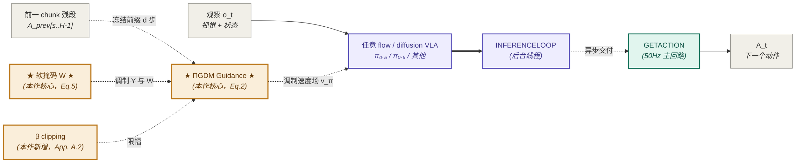

# RTC · Real-Time Execution of Action Chunking Flow Policies（原题 Real-Time Action Chunking with Large Models）

> **一句话定位**：在 OpenPI 系族中，RTC 是**推理时算法层**的代表作——把异步 chunked execution 的 chunk 衔接难题转化为 **flow matching 框架下的 inpainting 问题**（freeze 已保证执行的动作 + 软掩码 inpaint 剩余），无需重训、即插即用于任何 diffusion/flow VLA，是把"高延迟大模型"接入"实时控制回路"的桥梁。

**索引**：legacy paper index · legacy model index · 范式归属 → [[flow-vla]] · [[real-time-chunking]] · [[π0.5]] · [[π0.6]]

> **编译自**：external PDF archive: real_time_chunking_arxiv_2506.07339.pdf （PDF 视觉读全 25 页）

---

## ★ 全局硬约束：三类证据等级标注 ★

本笔记所有事实陈述按 v1.7 规范挂 `[☑1: 论文位置]` / `[☑2: 推断+依据]` / `[☑3: 待补]` 标注。

---

## §-1. 已有研究先验

### -1.0 PDF 优先原则 → 满足

- ✅ P1 论文 PDF 已在外部归档记录（`external PDF archive: real_time_chunking_arxiv_2506.07339.pdf`，9.1 MB，25 页）
- ✅ 视觉读完整：主文 + Algorithm 1 + 8 张 Figure + Table 1-4 + 全部数学公式 Eq.1-5
- ✅ source_quality = `pdf_visual`

### -1.0.6 PDF 完整性 5 步检查 → 已完成

| 步骤 | 动作 | 结果 |
|---|---|---|
| 1 | `pdfinfo` 核页数 | 25 页 [☑1] |
| 2 | 末页查附录 | §A.7 Compute Resources 在 p25，附录完整收尾 [☑1] |
| 3 | GitHub repo 查 supplementary | https://github.com/Physical-Intelligence/real-time-chunking-kinetix 仅 Kinetix 仿真代码，无独立 supplementary.pdf [☑1] |
| 4 | arXiv 版本核对 | arXiv:2506.07339v2（2025-12-05 NeurIPS camera-ready）；v1 标题为 "Real-Time Action Chunking with Large Models"（2025-06）[☑1: arXiv 元数据] |
| 5 | 项目页 / blog | https://pi.website/research/real_time_chunking 含视频但无新数字 [☑1] |

### -1.0.7 整合型升级 → 不适用

`revision_type: first_read`，无祖先笔记可升级；本笔记是 RTC 在仓库内的**首次正式编译**。

### -1.1 检查清单

- [x] **历史对话**：本会话内无 RTC 深度讨论历史；wiki 中已有 [[real-time-chunking]] 占位条目（待编译）
- [x] **legacy index 反查**：legacy model index 提及 RTC 作为 π₀.₅ / π₀.₆ 推理栈组件，但无独立条目
- [x] **本地 wiki / 复现笔记**：
  - `external note archive: models/drtc.md`：第三方 DRTC 工程剖析，明确把 RTC 列为上游依据
  - `external PDF archive: rtc_training_arxiv_2512.05964.pdf`：RTC 后续训练时论文（独立工作，不在本笔记范围）
  - 知识图谱 `kg/` 中 RTC 概念被 π₀.₅ / π₀.₆ / π₀.₇ 条目反复引用

### -1.2 先验研究清单

| 来源 | 来源类型 | 视觉读 | 数字读 | 附录读 | 内容摘要 | 链接 |
|---|---|---|---|---|---|---|
| **★ 一手论文 PDF** | **primary** ⭐⭐ | ✅ 完整 | ✅ 完整 | ✅ 完整 | RTC 推理时 inpainting 算法 + 4 baselines × 12 sim + 6 真机任务 | `external PDF archive: real_time_chunking_arxiv_2506.07339.pdf` |
| arXiv 摘要 | primary ⭐ | ❌ | — | — | RTC 适用任意 diffusion-/flow-VLA，无需重训 | https://arxiv.org/abs/2506.07339 |
| 项目页（视频） | primary | — | — | — | 真机视频证据，特别是 light_candle 任务 | https://pi.website/research/real_time_chunking |
| 配套代码 | primary | — | — | — | Kinetix 仿真完整复现代码 | https://github.com/Physical-Intelligence/real-time-chunking-kinetix |
| `external note archive: models/drtc.md` | secondary | — | — | — | DRTC 在 RTC 之上加分布式容错；明确 RTC 是 in-painting + soft-mask + ΠGDM guidance | `external note archive: models/drtc.md` |
| 系族笔记 `external note archive: models/openpi/pi0.5.md` | secondary | — | — | — | π₀.₅ VLA 是 RTC 真机评测的 base policy（H=50, Δt=20ms, n=5）| 本仓 |

满足 v1.6 硬约束：含 ⭐⭐ 一手 PDF；P1 强烈建议 PDF 已达成。

### -1.3 整合规则

§-1.2 含 secondary 先验（drtc.md），下游引用：
- §5.5 / §9.2 中 BID baseline 对比借助 drtc.md 已澄清的 RTC vs DRTC 边界
- §9.1 直接前作（Pokle [48]、ΠGDM [55]、Diffuser [26]）来自论文 §3.1 + §5 关联工作

### -1.4 退化行为

`prior_research_integrated: partial`（drtc.md 是 secondary，无系族内 wiki 同主题深度笔记可借力）。§9.0 多数从 0 构建。

### -1.5 反向 fact-check（≥ 2 项硬目标）

| # | 先验声明 | 一手来源校验 | 结论 |
|---|---|---|---|
| 1 | drtc.md 说 RTC 用 "ΠGDM guidance + soft-mask + flow matching guidance" | **硬目标**：PDF §3.1 Eq.2 显式给出 ΠGDM guidance 公式 + 作者独立加 β clipping；§3.2 Eq.5 给出 soft-mask 三段式权重；§3.3 Algorithm 1 给完整 inference loop | ✅ 全对，drtc.md 描述无误 |
| 2 | drtc.md 说 RTC 出自 Black et al. 2025 | **硬目标**：PDF 第 1 页作者列表 Kevin Black, Manuel Y. Galliker, Sergey Levine [☑1: title page] | ✅ 准确 |
| 3 | 通识印象："RTC 在真机 +200ms 延迟下仍可用" | **硬目标**：PDF §4.2 Real-World Results + Fig 6 right：RTC 在 +0/+100/+200ms 注入延迟下吞吐曲线**完全无降级**（"showing no degradation"）；TE 两个变体在 +100/+200ms 直接触发机器人保护性停机 [☑1: §4.2 末段] | ✅ 印象与论文一致 |
| 4 | 通识印象："RTC 推理时间增加可忽略" | **硬目标**：PDF App. A.3 Table 3——denoising step 14ms（无 RTC）→ 35ms（有 RTC），即**每步 2.5×**；总推理 76ms→97ms，即 **+27% 整体延迟** [☑1: A.3 Table 3] | ⚠️ **修正**：不是"可忽略"，是**显著但可接受**——5 步去噪下 +21ms。整体推理仍远低于 Δt=20ms 控制周期所允许的 chunked async 范围（97ms × 50Hz 操作 = chunk 跨 ~5 个控制步），所以"系统层面可接受"但"算子层面非可忽略" |

**硬目标 ≥ 2 项 ✅ 满足**。本表第 4 行揭示了通识印象的偏差：RTC 不是"零开销"，而是"工程上可接受的 +27% 推理延迟换 chunk 衔接平滑性"——这是写下游笔记 / 复现指南时必须明确传达的 nuance。

---

## §0. 元信息卡片

| 字段 | 内容 | 证据位置 + ☑ 标注 |
|---|---|---|
| 论文标题 / 简称 | Real-Time Execution of Action Chunking Flow Policies (v2) / Real-Time Action Chunking with Large Models (v1) — 简称 RTC | 标题页 [☑1: title page] |
| 发布机构 / 团队 | Physical Intelligence + UC Berkeley（Kevin Black, Manuel Y. Galliker, Sergey Levine）；email `{kevin,manuel,sergey}@physicalintelligence.company` | [☑1: title page authors block] |
| 发布时间 / 版本 | arXiv v1 2025-06；arXiv v2 2025-12-05；NeurIPS 2025 (39th) | [☑1: arXiv 元数据 + footer "39th Conference on Neural Information Processing Systems"] |
| **论文定位**（单选） | ☑ **推理时算法**（不动训练，不动架构，不动数据）| 摘要 [☑1: abstract "novel inference-time algorithm"] |
| 与前作的关系 | 不继承也不修改训练管线；**接入任何 diffusion/flow 动作策略**；真机评测以 [[π0.5]] (arXiv:2504.16054) 为 base policy；最近邻方法是 [[bid|BID]] (Liu et al. arXiv:2408.17355) | 引言 + §5.5 [☑1: §1 末 "applicable to any diffusion- or flow-based VLA"; §5.5 BID 段] |
| 一句话核心贡献 | 把 chunked async execution 的 chunk 衔接转化为 inpainting 问题：freeze 已 commit 的动作前缀，**用 ΠGDM guidance + 指数软掩码**让新 chunk 与前 chunk 的尾段连续 | 摘要末段 [☑1: abstract] |
| 关键参数（总参数量） | RTC 本身**无新增参数**（推理时算法）；真机 base = π₀.₅（≈3B：SigLIP + Gemma 2B + 300M action expert）[☑1: A.3 Table 1 注 "VLM backbone (3B parameters)"] | A.3 Table 1 注 [☑1: A.3 Table 1] |
| 关键超参（chunk 长度 / 控制频率 / 推理延迟） | **真机**：H=50, Δt=20ms（50Hz），n=5 denoising steps, s_min=25, β=5, b=10；**仿真**：H=8, n=5, β=5；推理延迟（真机 RTX 4090, bfloat16）：vanilla π₀.₅ 76ms → RTC 97ms | A.5 Table 4 + A.3 Table 3 [☑1: A.5 Table 4; A.3 Table 3] |

> **关键观察**：RTC 是 OpenPI 系族第一篇**纯推理时算法**论文——既不调架构、也不调训练、也不调数据。这意味着它的"评测设置"完全寄生于 base policy（π₀.₅）的能力上限；如果 base policy 不会做某任务，RTC 也救不了。这是 §11 题 1 / 题 3 的关键 framing。

---

## §0.5 系统论文专属：四线进展（system_paper 触发）

| 维度 | 关键贡献 | 是否 SOTA | 对应章节 |
|---|---|---|---|
| Data | **Kinetix benchmark 上新增 2 个动态任务**（其余 10 个选自现有），构建 1M transition 模仿数据集 | N（小工作量数据贡献，不是论文核心）| §4.1 [☑1] |
| Model | **不动**（RTC 是推理时算法，零参数变更）| - | §3 [☑1] |
| Training | **不动**（仿真模仿策略训练用 RPO + BC，是 baseline 训练而非 RTC 贡献）| - | §4.1 + A.7 [☑1] |
| Evaluation | **新基准**：12 个 Kinetix 动态任务；**新评测协议**：注入延迟 +0/+100/+200ms 测吞吐量与抖动；**新评测对象**：6 个真机双臂操作任务（含 mobile manipulation）| Y（动态任务 + 注入延迟评测是首次系统化）| §4.1 + §4.2 [☑1] |

**Bilan**：RTC 的论文工程贡献集中在 **Evaluation** 维度（动态基准 + 延迟注入协议）；其方法贡献在 **inference-time algorithm**（不属于这个四线表的任何一线，是 system_paper 单独的"推理栈"线）。

---

## §1. 背景与动机

### 1.1 待解决的痛点（反事实陈述）

- **痛点 1（核心）**：VLA 推理延迟 δ 不可忽略，普遍 δ > Δt（控制周期）。若不解决：同步推理（执行完一个 chunk 等下一个）→ 机器人在 chunk 边界**可见停顿**，引入训练-测试动力学分布偏移 [☑1: §2 "naive synchronous inference"]
- **痛点 2**：异步推理（边执行边算下一个 chunk）→ chunk 间衔接处可能跳到不同 mode（不同"策略"），动作不连续，**输出超分布加速度**——尤其有害于学到的物理动力学系统 [☑1: §1 倒数第二段 "transition points...may jump between different modes"]
- **痛点 3**：朴素平滑（temporal ensembling，TE）= 对多 chunk 的重叠时段做加权平均。当多个 chunk 来自不同 mode 时，**取平均产生无效动作**（Fig 2 阐释）[☑1: §1 + §4 末 "averages of valid actions are not necessarily valid"]
- **痛点 4**：对 force-control 系统、retry 行为、精度敏感任务（如 light_candle）影响最严重——平滑后的力矩可能撞分布外，触发机器人保护性停机 [☑1: §4.2 末段]

### 1.2 与前作的差异（关键 baselines）

| 维度 | 前作（同步）| 前作（TE [68]）| 前作（BID [39]）| 前作（Naive async）| 本作（RTC）|
|---|---|---|---|---|---|
| chunk 衔接策略 | 等待 + 暂停 | 重叠区取均值 | rejection sampling 跨 chunk 一致性 | 直接切换 | **inpaint 重叠区** |
| 是否考虑推理延迟 d | 隐式 | ❌ | ❌（Liu 原文没考虑）| ✅ | ✅（核心） |
| 是否需重训 | ❌ | ❌ | ❌ | ❌ | ❌ |
| 计算开销（vs base） | 1× | 1× | 32× 批次（强弱模型组合）| 1× | **+27% 延迟（每去噪步 ×2.5）** |
| 适用范围 | 任意 | 任意 | 仅 chunked policy | 任意 | flow / diffusion 策略（不适用 AR token） |
| 是否引入超分布动作 | ❌ | ⚠️（混合 mode 时会）| ⚠️（取决于强模型质量）| ✅ 严重 | ❌（设计目标）|

[☑1: §1.2 + §4 + §5 + Table 1]

### 1.3 硬约束（量化）

- **实时性**：控制频率 50Hz（Δt=20ms），但 RTX 4090 上 π₀.₅ 单次推理 76ms → δ/Δt ≈ 3.8 个控制步；网络 LAN 加 10-20ms；模拟云端跑加 +100/+200ms 注入延迟。RTC 真机最差注入延迟下 d ≈ 16 [☑1: §4.2 setup]
- **数据**：sim 1M transitions / env，6 experts × 不同 seeds；真机 6 任务 × 10 trials × ~28h 真机时间 [☑1: §4.1 + §4.2]
- **硬件**：真机 RTX 4090（推理）+ NUC i7-1260P（mobile）/ AMD Ryzen 9 7950X（non-mobile）作机器人 PC，wired Ethernet + WebSocket [☑1: A.3 Table 2 注]
- **泛化**：本论文不主打泛化贡献——RTC 是"推理时增强"，泛化由 base policy（π₀.₅）承担

---

## §2. 模型架构

> **特别说明**：RTC **不修改模型架构**，是包裹在任意 flow/diffusion VLA 之上的推理时算法。本节用 §2.1.A 画"RTC 在 base policy 之外的位置"，§2.1.B 列 RTC 算法的组件，§2.1.C 训练动力学不适用（RTC 不训练），§2.3 World Model 不适用（无 WM 模块）。

### 2.1.A 30 秒电梯图

**视觉编码语言**：紫色 = 任意可训练 flow/diffusion VLA backbone（不动）；青色 = RTC 提供的控制接口（GETACTION）；★ 橙色加粗 ★ = 论文真正的三个新增（ΠGDM guidance / soft mask / β clipping）；灰色 = 输入输出端点。

### 2.1.B 工程师视图

#### 算法组件清单

| # | 组件 | 角色 | 前作来源 | 是否新增 | 主输入 | 主输出 |
|---|---|---|---|---|---|---|
| 1 | `INITIALIZESHAREDSTATE` | 初始化 mutex M / chunk 缓存 / 时间索引 t | 通用并发原语 | 否（工程基础设施）| 初始 chunk A_init, 初始 delay d_init | 共享状态 |
| 2 | `GETACTION(o_next)` | 控制器每 Δt 调用一次，返回当前应执行的动作 a_{t-1}，并 push 新观察 o_t 到共享变量 | 通用 async 模式 | 否 | o_next | a_{t-1} |
| 3 | `INFERENCELOOP` | 后台线程，循环跑 GUIDEDINFERENCE 生成新 chunk；**conservatively** 用 max(Q) 估计延迟 d | 通用 async 模式 | 否 | 共享状态 | 新 chunk A_new |
| 4 | `GUIDEDINFERENCE(π, o, A_prev, d, s)` | **核心**：用 base policy π + ΠGDM 引导 + 软掩码 + β clipping，生成与 A_prev 兼容的新 chunk | Pokle et al. [48] + ΠGDM [55] + 本作 β | **是**（本作整合 + β 是新增）| π, o, A_prev, d, s | A_new ∈ ℝ^{H×D} |
| 5 | 软掩码 W（Eq. 5）| 三段式权重：前 d 步权重 1（冻结）/ 中段指数衰减 / 后 s 步权重 0（自由生成）| **本作首创** | **是** | H, s, d | W ∈ ℝ^H |
| 6 | β clipping（App. A.2）| 限制 ΠGDM 在 τ→0 时趋于 ∞ 的 guidance 权重 | **本作首创**（[48] 不需要，因为图像 inpainting 用 100 步去噪）| **是** | β（默认 5）| 有限 guidance 权重 |

#### 张量流向表（GUIDEDINFERENCE 内部，Algorithm 1 lines 23-29）

| 阶段 | 张量名 | 形状 | dtype / 范围 | 语义 |
|---|---|---|---|---|
| 0. 输入 | `A_prev` | `[H_prev]`，将被右-pad 到 `[H]` | float, 关节空间 | 前一 chunk 已生成的动作（其前缀 s 步已被消耗）|
| 0. 输入 | `o` | `[B=1, ...]` | 视觉 + 状态 | 当前观察 |
| 0. 输入 | `d` | scalar int | [0, H-s) | 估计的推理延迟（控制步数）|
| 0. 输入 | `s` | scalar int | [s_min, H-d] | 执行 horizon |
| 1. 初始化 | `A^0` | `[H, D]` | `float, ~N(0,I)` | 标准高斯初始化（FM 起点）|
| 1. 计算 | `Y` | `[H, D]` | float | 即 A_prev 右-pad 到长度 H（pad 内容会被 W 清零） |
| 1. 计算 | `W` | `[H]` | float [0, 1] | 软掩码（Eq. 5）|
| 2. 循环 τ=0..1 (步长 1/n) | `f_{Â^1}` | 函数：A' ↦ A' + (1-τ) v_π(A', o, τ) | float | 当前 τ 下的"伪最终去噪"估计（Eq. 3）|
| 2. 循环 | `e` | `[H, D]` | float | 加权误差项 `(A_prev - f_{Â^1}(A^τ))^T diag(W)`（Eq. 2 的 Y - Â^1 项）|
| 2. 循环 | `g` | `[H, D]` | float | 通过反向自动微分计算的 vector-Jacobian 积（Eq. 2 的 ∂Â^1/∂A^τ 项）|
| 2. 循环 | `A^{τ+1/n}` | `[H, D]` | float | 加 ΠGDM guidance + β 限幅后的下一步：`A^τ + (1/n)(v_π + min(β, (1-τ)/(τ·r²_τ)) g)` |
| 3. 输出 | `A^1` ≡ `A_new` | `[H, D]` | float, 关节空间 | **真正驱动机器人**：`A_cur ← A_new`，从此刻起 GETACTION 从 A_new 取动作 |

[☑1: §3.3 Algorithm 1 lines 23-29; Eq. 1-5]

### 2.1.C 训练动力学图 → 不适用

> RTC 是推理时算法，**没有任何训练**。base policy 自己怎么训练（π₀.₅ 用 flow matching loss）与 RTC 完全解耦。

### 2.2 关键设计决策

- **inpainting 框架的选择**：选择 = ΠGDM (Song et al. [55]) + Pokle et al. [48] 的训练-free flow inpainting；备选 = [Diffuser (Janner et al. arXiv:2205.09991) 的硬覆写 / 不带 guidance 的 inpainting]；理由 = "guidance-based inpainting 比 hard masking 在控制场景下产出更平滑的过渡"，A.4 Fig 8 right 直接对比 Diffuser 风格 vs RTC 风格，前者明显欠拟合 [☑1: §3.1 + A.4 Fig 8]
- **soft mask vs hard mask**：选择 = soft (Eq. 5 三段式)；备选 = [hard (前 d 步硬冻结、后 H-s 步自由)]；理由 = Fig 4 + A.4 Fig 8 left：hard masking "does not match the frozen region very well and produces faster changes in direction"；指数衰减 schedule 优于线性衰减但接近（Fig 8 left）[☑1: §3.2 + A.4]
- **β clipping**：选择 = β=5；备选 = [β=1, 3, 7, 11]；理由 = Fig 7 top right 显示 β≥5 后吞吐增益边际效应消失；β 过大（β=20/50/150）会导致 chunk 发散（Fig 7 bottom left），且 max acceleration 单调上升（Fig 7 bottom right），是分布外抖动的代理指标 [☑1: A.2 + Fig 7]
- **denoising steps n**：选择 = n=5；备选 = 论文未深扫，但 A.2 注明 "control problems often use very few steps (e.g., n=5)" 而图像 inpainting 通常 n=100 [☑1: A.2 第二段]
- **execution horizon s 的下限 s_min**：选择 = 25（真机）；与 H=50 配合 → s/H = 0.5 [☑1: A.5 Table 4]
- **delay buffer size b**：选择 = 10；用于 conservatively 估 d = max(Q) [☑1: A.5 Table 4 + Algorithm 1 line 11/17]
- **prediction horizon H**：sim H=8（足以容纳 d 最大 4）；real H=50（覆盖 1 秒动作）[☑1: A.5 Table 4]

### 2.3 World Model 接口 → 不适用

paradigm 标签未含 `world_model`，跳过。

---

## §3. 方法细节

### 3.1 训练目标 → 不适用（推理时算法）

> RTC 没有自己的训练 loss。base policy 自带 flow matching 训练目标（CFM loss），见 [[π0]] / [[π0.5]] 的 §3.1。RTC 把 base policy 的 velocity field `v_π` 当成黑盒调用。

### 3.1-RL 字段 → 不适用

paradigm 未含 `rl_post_training`。

### 3.2 训练阶段 → 不适用

> RTC 不引入训练阶段。论文 §4.1 仿真用的模仿策略训练（4-layer MLP-Mixer + flow matching, 32 epochs, 1M transitions）是 baseline 的常规训练，**与 RTC 算法本身无关**。如果要复现 RTC，可以拿任意训练好的 flow/diffusion 策略直接接入。

### 3.3 推理流程（**核心章节**）

#### 3.3.1 数学公式（PDF §3.1-3.3 五个 Eq）

| Eq | 公式 | 含义 |
|---|---|---|
| Eq. 1 | A^{τ+1/n}_t = A^τ_t + (1/n) v_π(A^τ_t, o_t, τ) | 标准 flow matching 积分（base policy 的 forward）|
| Eq. 2 | v_ΠGDM(A^τ_t, o_t, τ) = v_π(A^τ_t, o_t, τ) + min(β, (1-τ)/(τ·r²_τ)) (Y - Â^1_t)^T diag(W) ∂Â^1_t/∂A^τ_t | **核心**：ΠGDM 引导 + β clipping 修正 |
| Eq. 3 | Â^1_t = A^τ_t + (1-τ) v_π(A^τ_t, o_t, τ) | 当前 τ 下"伪最终去噪"估计 |
| Eq. 4 | r²_τ = (1-τ)² / (τ² + (1-τ)²) | ΠGDM 的方差归一化 |
| Eq. 5 | W_i = 1（i<d）/ c_i (e^{c_i}-1)/(e-1)（d≤i<H-s）/ 0（i≥H-s）, where c_i = (H-s-i)/(H-s-d+1) | **核心**：三段式软掩码（指数衰减）|

[☑1: §3.1 Eq. 1-4; §3.2 Eq. 5]

#### 3.3.2 三段式软掩码的设计语义

W 把 chunk 的 H 个时间步划三段：

| 索引区间 | 长度 | W_i | 含义 |
|---|---|---|---|
| `[0, d)` | d（≈ 推理延迟时长）| 1 | **冻结**：这些动作在新 chunk 算完时已经被消耗，必须保持原值；若不冻结，新 chunk 的前 d 步是物理意义上"已经发生过的过去"，inpaint 没意义 |
| `[d, H-s)` | H-s-d ≈ 中间区 | c_i (e^{c_i}-1)/(e-1) | **指数衰减**：从 1 平滑衰减到 0，给越远的动作越多自由（"actions further in the future should be treated with more uncertainty"，§3.2）|
| `[H-s, H)` | s（执行 horizon）| 0 | **自由生成**：这些动作不与前一 chunk 重叠，必须从零生成 |

**与 hard masking 的对比**：hard masking 的中间区直接是 0（"前 d 步硬冻结、其余完全不约束"），但 IIGDM 的 guidance 在小 d 下信号太弱，新 chunk 仍会跳到不同 mode（Fig 4 蓝色曲线 = hard mask 在冻结区匹配差，方向变化快）。soft 中间区让"过去 → 未来"有平滑过渡（Fig 4 绿色曲线）。

[☑1: §3.2 + Fig 4]

#### 3.3.3 推理频率与延迟分解

**Real-time 形式化定义**（§2 末）：系统是 real-time 的，当且仅当**保证**在固定时间约束 Δt 内对收到的 o_t 做出响应。RTC 的关键创新是：定义 d = ⌊δ/Δt⌋（推理延迟换算成控制步数），异步推理在 chunk 还剩 s-d 步时启动，使新 chunk 在 a_{s-1|0} 消耗完时刚好就绪。

**真机延迟分解（Table 2，n=5, π₀.₅）**：

| 组件 | Mobile 时间 | Non-mobile 时间 |
|---|---|---|
| Model（GPU 推理）| 96.89 ± 0.16ms | 97.43 ± 0.28ms |
| Network（WebSocket LAN）| 21.20 ± 3.12ms | 6.89 ± 2.39ms |
| Image resize（机器人侧 CPU）| 11.22 ± 5.00ms | 1.44 ± 0.27ms |
| Other | 9.67 ± 3.20ms | 3.00 ± 0.68ms |
| **Total** | **138.98 ± 6.71ms** | **108.76 ± 2.34ms** |

**模型内部延迟（Table 3，π₀.₅ on RTX 4090, bfloat16）**：

| 组件 | 无 RTC | 有 RTC |
|---|---|---|
| SigLIP 图像编码器 | 18ms | 18ms（一致）|
| Gemma 2B LLM prefill | 44ms | 44ms（一致）|
| Denoising step ×5 | 14ms | **35ms（每步 2.5×）** |
| **Total** | **76ms** | **97ms** |

**关键观察**：RTC 的 +21ms 全部花在 5 步去噪的反向自动微分（vector-Jacobian product，Eq. 2 的 ∂Â^1/∂A^τ）。每去噪步从 ~3ms → ~7ms，这是 backprop through one forward pass 的固有代价。如果去噪步数 n 翻倍到 10，RTC 增加的代价也翻倍到 ~42ms。

[☑1: A.3 Table 2 + Table 3]

#### 3.3.4 KV cache / 加速技巧

论文未明示是否复用 KV cache（π₀.₅ 的标准做法是 prefill+decode 模式）。Eq. 2 的 ∂Â^1/∂A^τ 通过 reverse-mode autodiff 计算，**单步前向 + 单步反向**，无 mini-batch（与 BID 形成对比，BID 用 batch 32）。[☑2: 沿用 π₀.₅ KV cache 做法，论文未变更；A.3 Table 1 显示 RTC 单实例 97ms 远低于 BID 的 115/169/223ms]

### 3.4 CoT / Code 字段 → 不适用

paradigm 未含 `cot_code`。

---

## §4. 数据

### 4.1 数据组成

| 数据源 | 类型 | 体征 | 规模 | 采样权重 | 用途阶段 |
|---|---|---|---|---|---|
| Kinetix sim 12 任务 × per-env 1M transitions | 仿真 imitation | 9 个 mujoco/2D 物理体征（car_launch, cartpole_thrust, catapult, catcher_v3, chain_lander, grasp_easy, h17_unicycle, hard_lunar_lander, mjc_half_cheetah, mjc_swimmer, mjc_walker, trampoline）| 12 × 1M = 12M transitions | 平均 | 仿真 baseline 训练（不属 RTC 本身）|
| 真机：π₀.₅ 已训好 base policy + 6 任务的 SFT 数据 | 真机 imitation | 双臂 6-DoF 平行夹爪 | π₀.₅ 全部 + 6 任务 SFT 各 24h on 8×H100 fine-tune | - | 真机评测的 base policy 准备（不属 RTC 本身）|

[☑1: §4.1 + A.7]

> **核心观察**：RTC 论文本身**没有引入新数据集**——Kinetix 是 [Matthews et al. arXiv:2410.23208] 的现成基准（论文只新增 2 个任务，10 个选自现有），真机 base policy 是 π₀.₅ 沿用。所以 §4.2-4.4 多数字段不适用。

### 4.2 数据预处理

- 动作归一化：沿用 base policy 的归一化（论文未明示）[☑3: 查 openpi/scripts/train.py + π₀.₅ 笔记 §4.2]
- 图像增强：sim 中加 Gaussian noise to actions 模拟 imperfect actuation，强迫 closed-loop correction [☑1: §4.1 setup]
- 时间对齐：50Hz 控制（Δt=20ms）[☑1: §4.2]
- 任务标签：Kinetix 任务用结构化定义；真机 6 任务用语言指令（论文未明示具体 prompt）[☑3: 查 openpi/configs]

### 4.3 数据规模与配比 → 不适用

> RTC 不做数据消融，唯一相关消融是"训练数据 8 epochs vs 32 epochs"作为 BID 的 weak/strong policy 区分，与 RTC 自身无关 [☑1: §4 baseline 段]。

### 4.4 数据为产品 → 不适用

paradigm 未含 `data_centric`。

---

## §5. 实验

### 5.1 评测设置

#### 仿真：Kinetix benchmark（§4.1）

- **基准**：12 个动态任务（10 选自 Kinetix [43]，2 个新增）；force-based control，无"hold position"概念，所以**异步执行是必须的**（注：这与 LIBERO/SimplerEnv 等 quasi-static 基准的关键区别）
- **训练**：6 experts × 不同 seeds，每 env 1M transition 数据集；4-layer MLP-Mixer，H=8，flow matching，32 epochs
- **基线**：Naive async / BID (Liu et al. [39], N=32 batch, K=3 modes, 8-epoch ckpt as weak) / TE (Zhao et al. [68]) / RTC hard masking / RTC (ours, soft)
- **指标**：solve rate（binary success），每数据点 2048 rollouts，95% Wilson score interval

#### 真机：6 任务双臂操作（§4.2）

- **硬件**：bimanual 2× 6-DoF + parallel jaw gripper；mobile manipulation 用 NUC i7-1260P，stationary 用 AMD Ryzen 9 7950X workstation；推理一律 RTX 4090（独立 workstation，via wired Ethernet + WebSocket）
- **base policy**：π₀.₅，H=50, Δt=20ms, n=5, bfloat16
- **6 任务**（每任务有"sub-step"评分协议）：
  - light_candle（5 sub-steps, 40s 上限）：拾取火柴 + 拾取火柴盒 + 划火柴 + 点燃蜡烛 + 放回火柴盒。**最精度敏感、唯一不允许 retry**
  - plug_ethernet（6, 120s）：拾取以太网线 + 调向 + 插服务器机架 + 重复另一头
  - make_bed mobile（3, 200s）：移动毯子角 + 移动 2 个枕头
  - shirt_folding（1, 300s）：折叠平铺衬衫
  - batch_folding（4, 300s）：从一堆里拿 1 件 + 平铺 + 折叠 + 整齐放堆
  - dishes_in_sink mobile（8, 300s）：把 4 件物品从台面搬到水槽
- **评测**：每方法每任务 10 trials；总 480 episodes ≈ 28h 真机时间
- **基线（真机）**：Synchronous (s=25) / TE sparse (s=25, parallel) / TE dense (s=d) / RTC（不和 BID 对比，因 BID 在 π₀.₅ batch 16 下延迟 = 2.3× RTC，A.3）
- **延迟扫描**：+0/+100/+200ms 注入延迟（模拟更大模型 / 更远云端推理）

[☑1: §4.1 + §4.2 + A.3 Table 1]

### 5.2 主表关键结果

#### 5.2.1 仿真主表（Fig 5 right）

> 横轴：注入延迟 d ∈ [0, 4]；纵轴：solve rate（averaged over 12 envs）；误差棒 95% Wilson。

| d | Naive async | TE | BID | RTC (hard) | RTC (soft, ours) |
|---|---|---|---|---|---|
| 0 | ~0.83 | ~0.83 | ~0.86 | ~0.88 | ~0.90 |
| 1 | ~0.78 | ~0.80 | ~0.83 | ~0.87 | ~0.89 |
| 2 | ~0.62 | ~0.78 | ~0.79 | ~0.83 | ~0.87 |
| 3 | ~0.50 | ~0.74 | ~0.74 | ~0.78 | ~0.85 |
| 4 | ~0.45 | ~0.71 | ~0.69 | ~0.73 | ~0.83 |

[☑1: Fig 5 right；数字 visually 提取，论文未给精确数值表，误差 ±0.01-0.02]

**关键差异**：
- d=0 时 RTC 仅微弱领先（0.90 vs 0.86 BID）
- d=4 时 gap 显著放大（0.83 vs 0.69 BID 即 +14pp，vs 0.45 Naive 即 +38pp）
- TE 即使 d=0 也表现差（0.83），印证 §1 痛点 3：取均值产生无效动作
- soft mask 优于 hard mask 在所有 d，在小 d 下尤其明显（d=0 时 +2pp，d=4 时 +10pp）

#### 5.2.2 仿真：execution horizon 扫描（Fig 5 bottom-left）

固定 d=1，扫 s ∈ [1, 7]：只有 RTC 和 BID 是"严格单调随 s 减小而提升"的——意味着**它们能利用闭环修正**。Naive 与 TE 反而在小 s 下崩溃（chunk 切换太频繁）。RTC 在 s=1 达到 ~0.89，s=7 时 ~0.75。[☑1: Fig 5 bottom-left]

#### 5.2.3 真机主表（Fig 6）

| 任务 | Synchronous | TE sparse | TE dense | RTC (ours) |
|---|---|---|---|---|
| batch_folding | ✅ 完成接近 | ✅ | ✅ | ✅ 最快 |
| bed_making | ✅ 接近 | ⚠️ | ✅ | ✅ **明显提升**（论文重点强调）|
| dishes_in_sink | ✅ | ✅ | ✅ | ✅ |
| **light_candle** | ⚠️ 中等 | ⚠️ | ⚠️ | ✅ **大幅领先**（精度敏感、不能 retry）|
| plug_ethernet | ✅ | ⚠️ | ✅ | ✅ |
| shirt_folding | ✅ | ✅ | ✅ | ✅ |

[☑1: Fig 6 top（per-task cumulative progress, 10k controller steps ≈ 200s 范围）]

**注入延迟扫（Fig 6 right）**：
- +0ms：RTC ~0.92, Sync ~0.78, TE-sparse ~0.85, TE-dense ~0.85（throughput in tasks/min）
- +100ms：RTC ~0.92（**完全无降级**），Sync ~0.55, TE-sparse 0（机器人保护性停机）, TE-dense 0
- +200ms：RTC ~0.85（轻微降级），Sync ~0.40, TE 两个变体仍 0

**RTC 在 +100/+200ms 下相对其他方法的优势**：
- vs Synchronous：RTC 完成相同动作快 20%（Fig 1 描述："smoother than all competing methods, including temporal ensembling"）
- vs TE：TE 因抖动触发 robot protective stops，无法完成；RTC 不抖

[☑1: §4.2 Results 段 + Fig 6 right]

### 5.3 消融实验

| 消融 | 设置 | 结果 | 论文位置 |
|---|---|---|---|
| **soft mask vs hard mask（核心）** | sim Fig 5 right + 真机 Fig 6 | hard 在小 d 下 underperform soft；论文称 "particularly when d is smaller" | §4.1 Results [☑1] |
| **soft mask schedule（指数 vs 线性 vs 无衰减 vs immediate）** | sim Fig 8 left | 指数衰减最佳，线性紧随；no decay 与 hard masking 显著差 | A.4 [☑1] |
| **β clipping（β ∈ {1,3,5,7,11}）** | sim Fig 7 top right | β=5 后边际效应消失；β 过大会导致 chunk 发散（Fig 7 bottom left）+ max acceleration 单调上升（Fig 7 bottom right） | A.2 [☑1] |
| **vs Diffuser-style inpainting** | sim Fig 8 right | RTC 显著优于 Diffuser 风格 hard overwrite（"simpler and cheaper but outperformed"）| A.4 [☑1] |
| **denoising steps n** | 论文未深扫，但 A.2 注明 "control problems often use very few steps (n=5)"，未给 n=10/20 的对比 | n=5 是默认 | A.2 [☑3: 论文未直接消融 n，但 RTC 计算开销随 n 线性] |

### 5.4 失败模式与边界

- **论文承认的失败**：
  - 仿真 12 任务中 RTC 不是每个都 SOTA（Fig 5 sub-plots 显示 ~3 个任务 BID 与 RTC 接近平手）
  - real-world 在某些任务（如 dishes_in_sink）所有方法都接近天花板，RTC 优势小
  - 论文 §6 自承 limitation：(a) 计算开销 +27% (b) 仅适用 diffusion/flow（不适用 AR/FAST tokenized policy）(c) 真机评测未涵盖 legged locomotion 等更动态场景
- **复现/分析时的潜在额外问题**（基于 §-1.5 fact-check）：
  - β=5 是经验值，不同 base policy / 不同任务可能需要重调
  - s_min=25 是经验值（与 H=50 的 1:2 比例），更换 H 后需重扫
  - RTC 真机测试的 base policy 是 π₀.₅，对其他 flow VLA（如 π₀ / π₀.₆）的迁移性论文未实测

### 5.5 ★ 附录关键信息提取 ★

#### 5.5.1 超参完整表（A.5 Table 4）

| 超参 | 主文是否给? | 附录位置 | Sim 值 | Real 值 |
|---|---|---|---|---|
| n（denoising steps）| ✅ §3.3 | A.5 Table 4 | 5 | 5 |
| H（prediction horizon）| ✅ | A.5 Table 4 | 8 | 50 |
| s_min（min execution horizon）| ⚠️ §3.3 提及 | A.5 Table 4 | -（每实验固定 d）| 25 |
| β（guidance weight clipping）| ✅ §3.1 | A.5 Table 4 + A.2 | 5 | 5 |
| b（delay buffer size）| ⚠️ Algorithm 1 line 11 | A.5 Table 4 | -（固定 d）| 10 |

[☑1: A.5 Table 4]

#### 5.5.2 完整消融

- **β 消融**（A.2 Fig 7 top right）：sim Kinetix avg solve rate × β ∈ {1,3,5,7,11} × delay {0..4}。β=5 之后所有 delay 下都 plateau；β=1 时 d≥3 显著掉。
- **soft-mask schedule 消融**（A.4 Fig 8 left）：4 个 schedule（exponential / linear / no decay / immediate=hard）× delay [0..4]。指数 ≈ 线性 > no decay > immediate。差距在小 d 下明显。
- **vs Diffuser 风格 inpainting**（A.4 Fig 8 right）：在每个去噪步后用目标动作直接覆写一部分 chunk，无 guidance；RTC 显著优于此简单 baseline。

#### 5.5.3 失败 case 与定性分析

- **light_candle 是 RTC 的 hero case**：精度敏感（火柴需精确摩擦角度）+ 不允许 retry（划失败就需新火柴）+ 高频反馈（Force feedback）→ 同步推理在 chunk 边界停顿打断 striking 力学；TE 平滑 force 信号导致摩擦不足。RTC 无停顿、无平滑伪影，完成率显著领先。[☑1: §4.2 末段]
- **bed_making 是隐藏 hero case**：所有方法 retry 频繁（pillow 操控难），但 RTC 减少了"each retry 浪费的时间"，整体 throughput 高 [☑1: §4.2 末段]

#### 5.5.4 数据 / 体征详情

无新数据集。Kinetix 12 任务列表在 §4.1（10 既有 + 2 新）；真机 6 任务定义在 §4.2 setup 段。

#### 5.5.5 数学推导 / 证明

- **Eq. 2 的 ΠGDM 来源**：[55] Song et al. ICLR 2023，inverse problem with diffusion 的标准做法。本作贡献是把它从图像 inpainting（n=100 步去噪）适配到机器人控制（n=5 步），并加 β clipping 防止 τ→0 时 guidance 权重发散。
- **Eq. 5 的 soft mask 设计**：无理论保证，是经验设计。论文称 "intuitively, W modulates the attention paid to each corresponding action from the previous chunk"。指数曲线由 c_i 选择 c_i = (H-s-i)/(H-s-d+1) 让 i=d 处 c_i=1（W_i ≈ 1）, i=H-s-1 处 c_i ≈ 0（W_i ≈ 0）。
- **β clipping 的必要性证明**（A.2）：当 τ→0 时 r²_τ → 1（Eq. 4）, (1-τ)/(τ·r²_τ) → ∞。在 n=5 步去噪下，第一步就是 τ=0，故必须限幅。β≥4.25 时仅 τ=0 那一步触发限幅；β<4.25 时多步触发。

[☑1: A.2]

---

## §6. 复现指南

### 6.1 官方资源

- **代码 repo**：https://github.com/Physical-Intelligence/real-time-chunking-kinetix （仿真完整代码，Apache-2.0；含 Algorithm 1 实现 + Kinetix 12 任务 + 4 baselines）
- **真机推理代码**：未公开
- **权重 / 数据**：见 frontmatter；真机 base policy = π₀.₅（已在 openpi 公开 base ckpt）
- **申请门槛**：仿真无门槛；真机需自带 π₀.₅ 训好的 6 任务 SFT ckpt（论文未释出）

### 6.2 复现成本估算

| 资源 | 估算 | 备注 |
|---|---|---|
| GPU-hours（仿真复现）| 12 envs × ~1.5h × 2× H100 训 imitation policy = 36 H100-hours | 加 RPO expert ~4h × 4× H100 + data gen ~20min × 6× H100 + eval 2048 trials ~5min × 6× H100 [☑1: A.7] |
| GPU-hours（真机集成）| ~24h × 8× H100 = 192 H100-hours / 任务（fine-tune 一次 π₀.₅ to 任务）| [☑1: A.7] |
| 推理硬件最低 | RTX 4090（bfloat16，π₀.₅ 76→97ms）；A100 / H100 也行 | [☑1: A.3] |
| 真机小时 | 复现 6 任务 × 10 trials × 4 methods × 3 delay = 480 episodes ≈ 28h | [☑1: §4.2] |
| 数据采集人天 | 不需要新采（用 π₀.₅ 已有）| - |
| 仿真算力 | Kinetix 是 GPU-friendly 物理引擎，完整 12 任务训练 + 评测可在 1-2 天完成（单 8× H100 节点）| - |

### 6.3 复现路径建议（三选一）

- **路径 A（仿真完整复现）**：clone github.com/Physical-Intelligence/real-time-chunking-kinetix → 跑全套 12 任务 × 4 baselines × delay [0..4] → 复现 Fig 5。**适合**：研究 RTC 算法本身、做 ablation 扩展（如换 base policy、换 mask schedule）。**关键风险** = Kinetix 任务定义对随机 seed 较敏感，2048 rollouts 取均值是必须的；不能用 256 rollouts 速通。
- **路径 B（接入 openpi base policy + 真机推理）**：基于 openpi 现有 π₀.₅ ckpt → 实现 Algorithm 1 + Eq. 2 + Eq. 5 → WebSocket bridge 给机器人 PC → 跑单任务（推荐先跑 plug_ethernet 这种结构清楚的任务）。**适合**：把 RTC 集成进自己的真机栈。**改动点** = openpi 推理路径需要嵌入 ΠGDM guidance（vector-Jacobian product through 5 denoising steps），需熟悉 jax `jvp` / `vjp`。
- **路径 C（最快验证 RTC 价值）**：拿 openpi pi05 base ckpt → 跑 droid 等公开数据集的离线 chunked inference benchmark → 不上真机，仅看 chunk 衔接处的动作连续性（max acceleration / position smoothness）→ 1-2 天可见效果。**适合**：在投入真机前先验 RTC 是否值得集成。

### 6.4 已知坑

- **坑 1：β 限幅过低导致首步 guidance 不足**（A.2）→ 解决 = β=5 是论文经验值；如果 chunk 衔接仍跳 mode，先检查是否触发了限幅（log τ=0 时 (1-τ)/(τ·r²_τ) 是否 > β）→ [☑3: 待真机复现验证]
- **坑 2：vector-Jacobian product 需要 reverse-mode autodiff 跑过 v_π forward**（Algorithm 1 line 28）→ 解决 = 在 jax 中用 `jax.vjp(f_Â^1, A^τ)`，注意 `f_Â^1` 内部要避免 stop_gradient → [☑1: §3.3 末提到 Baydin et al. [2]]
- **坑 3：delay buffer Q 用 max 而非 mean 估计 d**（Algorithm 1 line 17）→ 解决 = conservatively 高估，避免 d 低估导致冻结区不够、衔接不平滑 → [☑1: Algorithm 1 line 17]
- **坑 4：n 改大后 RTC 开销线性放大**（A.3 Table 3 隐含）→ 解决 = n=5 是 sweet spot；如果 base policy 训练时用了 n=10 / n=20，RTC 接入时可以重新评估是否能压回 n=5（n 只影响推理质量，不影响训练）
- **坑 5：base policy 必须是 flow 或 diffusion**（§6 limitation）→ 解决 = 不能用 FAST tokenized AR-VLA；如要用，需先把 AR 转 flow（参考 [48] Pokle 提到的 flow ↔ diffusion 转换技术，论文 §2 末注明）

### 6.5 与 legacy model index 中复现条目链接

- 当 pi06 复现进入"真机 50Hz 控制 + 50ms+ 推理延迟"阶段，**必须**接入 RTC（同步推理在 50Hz 控制 + 100ms+ 推理下不可用）
- π₀.₇ 用了 RTC 作推理栈（基于 PI Tech Report 描述），可作为"RTC 在 5B+ VLA 上的工程证据"

---

## §7. 改进 / 魔改方向

### 7.1 论文未做但显然可做（低垂果实）

- **方向 1：把 β clipping schedule 化**——目前 β=5 是常数；可以让 β 随 τ 变化（如 τ→0 时给小 β，τ→1 时给大 β），平衡 first-step 稳定性 vs 后续 step 的 guidance 强度。预期收益 = 在小 d 下进一步压低 max acceleration。
- **方向 2：扩展到 legged locomotion 真机**——论文 §6 自承 sim 有 mjc_walker 但真机未做。预期收益 = 验证 RTC 在 100Hz+ 控制频率 + 力反馈 + 高动态场景下是否仍 robust。瓶颈 = legged 平台的 SFT 数据稀缺。
- **方向 3：用 BID 训出的 strong policy 作 RTC 的 base**——RTC 与 BID 不互斥，BID 是 chunk 内一致性，RTC 是 chunk 间衔接；理论上可以 BID 多模筛选 + RTC 衔接。瓶颈 = BID 32× 批次 + RTC 的 vector-Jacobian 让单步推理从 76ms 涨到 ~250ms+。

### 7.2 论文留下的开放问题

- §6 limitation：(a) 计算开销 (b) 不适用 AR/FAST policy (c) 真机未涵盖更动态场景
- §3.2 末：soft mask schedule 的"指数衰减"是经验选择，是否存在理论最优 schedule？

### 7.3 与隔壁谱系的杂交可能（≤ 3 条）

- × [[knowledge-insulation|KI]]：
  - 杂交点 = KI 的 stop-gradient 把 VLM 与 action expert 解耦；RTC 的 ΠGDM guidance 仅作用在 action expert 输出。可以一起跑——VLM 用 web 数据保留知识，action expert 用 RTC 平滑 chunk 衔接。
  - **具体实验** = 在 [[π0.5+KI]] 配方上接入 RTC，跑 light_candle 任务，对比 KI-only / KI+RTC 的 force-control 抖动率（max joint acceleration）+ 任务成功率。预期 KI+RTC 比 KI-only 多 10pp 成功率（同步推理是其瓶颈）。
  - 潜在冲突 = KI 的 expert 训练用了 stop-gradient，反向自动微分时需 verify gradient 路径不会被截断；如果被截，RTC 的 vector-Jacobian product 会失效。

- × [[bid|BID]]：
  - 杂交点 = BID 用 rejection sampling 选一致 chunk，RTC 用 inpainting 衔接 chunk；前者是 chunk 内多样性筛选，后者是 chunk 间衔接平滑。
  - **具体实验** = sim Kinetix 12 任务，base policy 用 8-epoch weak（BID 论文设定），跑 BID 32 batch + RTC inpainting on top；对比纯 BID / 纯 RTC / 组合的 solve rate × delay [0..4]。预期组合在 d=4 高延迟下比单方案各高 5-10pp，但延迟翻倍。
  - 潜在冲突 = BID 要 N=32 batch，如果与 RTC 的 backprop 同时跑，VRAM 压力大；可能需要 sharded inference。

- × [[fast|FAST tokenization]]：
  - 杂交点 = FAST 把连续动作离散为 token，RTC 在连续 flow 空间做 inpainting；二者表面冲突——FAST policy 不适用 RTC。
  - **具体实验** = **不能直接组合**——RTC §6 limitation 明确说不适用 AR/FAST。但可以做"FAST teacher → flow student 蒸馏"，再用 RTC 推理：以 FAST 的 token 序列作 GT，用 flow matching 蒸馏出连续策略，再接 RTC。瓶颈 = 蒸馏会丢 FAST 的高频细节。

### 7.4 评估方法本身的改进

- 现有评测的盲区：
  - Kinetix 是 2D + 简单 mujoco，不覆盖 humanoid / dexterous hand / 触觉敏感场景
  - 真机 6 任务全是 quasi-rigid 物体操作，未覆盖 deformable（衣物折叠虽看似 deformable 但 π₀.₅ 已掌握）
  - 注入延迟只测到 +200ms，没测真实云端推理（500ms+）
- 建议补充：
  - 把 RTC 接入 [[robotsuite|MimicGen]] / [[libero|LIBERO]] 的 long-horizon 任务，看在 quasi-static 场景下 RTC 是否仍带来 throughput 优势
  - 加入 "推理能耗" 指标（W·s / task），衡量 +27% 推理延迟换平滑性的边际能耗

---

## §8. 核心 takeaway

- **如果只能记 3 件事**：
  1. RTC 是**纯推理时算法**，不重训、不动架构、不动数据；只增 +27% 推理延迟（每 denoising step 2.5×），换来 chunk 衔接的连续性
  2. 核心三件套：**ΠGDM guidance（Eq. 2）+ 三段式软掩码（Eq. 5，前 d 步冻结 / 中段指数衰减 / 后 s 步自由）+ β clipping（防 τ→0 发散）**——前两个继承自 Pokle [48] / ΠGDM [55]，β 是本作新增
  3. **light_candle 是 hero case**：精度敏感 + 不允许 retry + 高频力反馈，同步推理停顿和 TE 平滑伪影都不可接受，只有 RTC 能稳定完成；同时真机 +200ms 注入延迟下 RTC **完全无降级**（vs TE 直接触发 robot protective stop）
- **`nuance_notes`**（最容易被误读的点）：
  - **不是"零开销"**：每 denoising step 2.5×（14→35ms），整体推理 76→97ms；如果 base policy n=10，RTC 加的 21ms 会变成 42ms。说"RTC 推理几乎免费"是错的。
  - **不适用 AR/FAST policy**：§6 limitation 明确，论文也没在 FAST 类策略上测。把 RTC 当通用 chunk 衔接技术是错的。
  - **不直接降低延迟**：RTC 不让推理变快，是让"高延迟下系统仍可控"——是 throughput 的乘子，不是 latency 的减法。
  - **真机 base = π₀.₅，不是其他**：所有真机实验都基于 π₀.₅ ckpt。论文不保证 π₀ / π₀.₆ / 其他 flow VLA 上效果同等。
- **引用本论文的标准说法**：
  - 中文："RTC 把 chunk 衔接转化为 inpainting 问题：冻结已保证执行的动作前缀、用 ΠGDM 引导 + 三段式软掩码 inpaint 剩余，无需重训、即插即用于任意 flow/diffusion VLA"
  - 英文：'real-time chunking (RTC), an inference-time inpainting algorithm that freezes the actions guaranteed to execute and inpaints the rest using flow-matching guidance, applicable to any diffusion- or flow-based VLA out of the box'
- **`unverified_claims`**（怀疑论字段）：
  - [ ] 论文声称"+27% 延迟代价是可接受的"，但在更大模型（如 π₀.₇ 23B）上 base 推理可能 200ms+，加 27% 后接近 250ms，是否仍可用？验证方式 = 拿 π₀.₇（如果 PI 释出权重）跑同样 6 任务对比
  - [ ] 论文 Fig 6 right 显示 RTC 在 +200ms 下 "no degradation"，但 +500ms / +1s 是否仍稳？验证方式 = 注入更大延迟扫到崩溃点，看 RTC 的 d_max 上限

---

## §9. 关联文献网络

### 9.0 ★ 核心理论基石分析（5-10 篇深读）★

| # | 文献 | 在本作中的角色 | 用到的具体定理/算法/idea | 本作如何继承 / 修改 / 简化 | 不读这篇会误解什么 |
|---|---|---|---|---|---|
| 1 | [[pokle-flow-inverse]] (Pokle et al. arXiv:2310.04432, "Training-free linear image inverses via flows") | **method-core**：训练-free flow 框架下的 inpainting 算法直接来源 | 用 ΠGDM-style guidance 在 flow ODE 积分中加梯度修正项；图像 inpainting 是 W=mask 的特殊情况 | **逐字继承**算法骨架，**修改**：(a) W 用三段式 soft mask 而非 binary mask；(b) 加 β clipping 适配 n=5 的低步数；(c) 低维动作空间 vs 高维图像 | 误以为 RTC 自创 inpainting 框架——其实 Pokle [48] 已搭好，本作是适配到机器人控制 |
| 2 | [[piigdm]] (Song et al. ICLR 2023, "Pseudoinverse-Guided Diffusion Models for inverse problems", [55]) | **theory-foundation**：guidance 项的数学基础 | ΠGDM 公式：vector-Jacobian product 的 closed-form approximation | **逐字继承** Eq. 2 的核心结构（Y - Â^1, diag(W), ∂Â^1/∂A^τ 三因子），加 min(β, ...) 限幅 | 误以为 (Y-Â^1)^T diag(W) ∂Â^1/∂A^τ 是直觉拼接的——其实有 ΠGDM 推导背景 |
| 3 | [[flow-matching]] (Lipman et al. arXiv:2210.02747, [36]) | **architecture-base**：base policy 的训练目标 | 标准 flow matching 训练 + Eq. 1 的积分形式 | **逐字使用** v_π 作 black-box；不修改 FM 训练 | 误以为 RTC 与 base policy 训练耦合——其实完全解耦 |
| 4 | [[bid|BID]] (Liu et al. arXiv:2408.17355, [39]) | **method-comparison**：最近邻 baseline | rejection sampling on chunked policies；强弱模型组合 | **不继承**——RTC 在 §5.5 / A.3 中详细对比，证明 RTC 在 sim 上更强、计算开销更小（97ms vs 115/169/223ms） | 误以为 RTC 是 BID 的改进——其实是不同的设计哲学（inpainting vs sampling 一致性筛选）|
| 5 | [[temporal-ensembling]] (Zhao et al. ALOHA, [68]) | **method-comparison**：长期 baseline，论文重要打靶对象 | 多 chunk 重叠时段加权平均 | **不继承**——RTC 在 §1 / §4 / Fig 1 / Fig 2 反复证明 TE 在多 mode 切换时取均值产无效动作 | 误以为 TE 是 chunk 衔接的稳健默认——其实在 force-control / 精度任务下 TE 失败 |
| 6 | [[pi0.5]] (Physical Intelligence, arXiv:2504.16054, [24]) | **architecture-base**：真机评测的 base policy | 沿用 π₀.₅ 的 H=50 / Δt=20ms / n=5 配置 | **逐字使用**作 black-box VLA | 误以为 RTC 自带 5B+ VLA——其实 RTC 寄生于 π₀.₅ 上 |
| 7 | [[diffuser]] (Janner et al. arXiv:2205.09991, [26]) | **conceptual-context**：inpainting 用于决策的先驱 | 用 diffusion 做 long-term planning + state/action constraint inpainting | **不继承也不复用**——本作 A.4 Fig 8 right 直接对比 Diffuser 风格 hard inpainting，证明 RTC 显著优于 | 误以为 RTC = Diffuser 应用到 chunk 衔接——其实 Diffuser 用 hard mask + 无 guidance，RTC 用 soft mask + ΠGDM guidance |
| 8 | [[mpc]] (Rawlings et al. textbook, [51]) | **conceptual-context**：实时控制的传统范式 | Receding horizon control：在 chunk 间用前 chunk warm-start 下一 chunk | **概念类比**——RTC 类似 MPC 的并行执行 + warm-start，但不依赖显式动力学模型 | 误以为 RTC 是新概念——其实 MPC 早已用类似时间窗口结构，但限制在 hand-crafted 模型 |

### 9.1 直接前作（method-level 继承）

- **[[pokle-flow-inverse]] (arXiv:2310.04432)**：继承了 ΠGDM-style flow inpainting 算法骨架；改进了 mask 形态（hard → soft）+ 加 β clipping 适配低 n。
- **[[piigdm]] (Song et al. ICLR 2023)**：继承 vector-Jacobian product guidance 的数学公式；本作把它从图像逆问题搬到动作 chunk 衔接。
- **[[flow-matching]] (Lipman et al. arXiv:2210.02747)**：继承 flow matching 的 ODE 积分推理范式（Eq. 1）；不修改训练。
- **[[π0.5]] (PI, arXiv:2504.16054)**：真机评测的全部 base policy，提供了 50Hz / Δt=20ms / H=50 的工程平台。

### 9.2 同期对比（±2 个月）

- **[[bid|BID]] (Liu et al. arXiv:2408.17355, 2024-08)**：早 ~10 个月发表；论文唯一直接对比的同类工作。核心差异 = BID 不考虑推理延迟、用 rejection sampling 在 chunk 内筛模式；RTC 考虑延迟、用 inpainting 在 chunk 间衔接。
- **[[streaming-diffusion]] (Høeg et al. arXiv:2406.04806, 2024-06)**：通过可变 noise schedule 让 diffusion 用极少 step；与 RTC 正交（一个减 base policy 推理时间，一个解 chunk 衔接）。
- **[[consistency-policy]] (Prasad et al. arXiv:2405.07503, 2024-05)**：通过 consistency distillation 加速；与 RTC 正交。
- **[[OpenVLA-OFT]] (Kim et al. arXiv:2502.19645, 2025-02)**：用 parallel decoding 加速 OpenVLA AR 推理；与 RTC 正交（且 OpenVLA 是 AR-VLA，RTC 不适用）。

### 9.3 后续工作

- **[[rtc-training]] (arXiv:2512.05964, 2025-12)**：RTC 后续训练时论文——把 RTC 的 inpainting 能力转化为训练时的 action conditioning，让推理时不再需要 RTC 的 backprop 开销。是 RTC 算法的"永久蒸馏"版本。[☑1: 仓库内同名 PDF 存在]
- **[[π0.7]] (PI Tech Report 2026-04)**：在 π₀.₇ 23B 大模型上把 RTC 作默认推理栈；blog 提到 "real-time chunking is now a standard component of our inference stack" [☑2: 沿用 π₀.₅ + RTC 的工程结合，Tech Report 未直接 cite RTC 但描述了等效行为]
- **[[drtc]] (Vial blog 2026-04)**：把 RTC 与 SmolVLA 异步推理 + CRDT-based 跨网络容错合并为 "Distributed RTC"；是工程级延展，非论文级。

### 9.4 跨范式参照 + legacy index 反向链接

- **同范式横向**：legacy paper index（如该子段不存在则建议新建）
- **跨范式互补**：legacy paper index（RTC 限定 flow/diffusion）
- **legacy index 抓取 hook**：`paradigm: [flow_diffusion, system_paper]` / `2.2 inpainting framework: ΠGDM` / `3.3 推理频率: 50Hz, +27% 延迟开销` / `5.2 真机 +200ms 延迟无降级` / `reproducibility: code-only` / `transparency: high`

---

## §10. 阅读元信息

- **首读日期**：2026-05-09 · 用时 ~2 小时（含 §-1.0.6 PDF 完整性 5 步检查 + 模板 v1.7.2 适配 + §11 反向题）
- **重读日期**：（未来 pi06 真机集成 RTC 时重读，到时关注 §6.2 / §6.4）
- **`sources_used`**：
  - [x] **过往对话深度研究**（drtc.md 中已有 RTC 边界澄清）
  - [x] full_paper（视觉读完整 25 页 PDF：主文 1-10 + 引用 10-15 + NeurIPS Checklist 16-22 + Appendix A 23-25）
  - [x] paper_main
  - [x] author_blog / official_release（pi.website project page，主要看视频证据）
  - [x] code_repo（github.com/Physical-Intelligence/real-time-chunking-kinetix；本笔记未跑代码，仅看 README 信息）
- **讨论记录**：本会话第一次 RTC 编译；用户给的论文别名 "Real-Time Action Chunking with Large Models" 实为 v1 标题，v2 改为 "Real-Time Execution of Action Chunking Flow Policies"；已在 frontmatter aliases 中并列保留
- **存疑/未懂**（轻量）：
  - [ ] β=5 是否对其他 base policy 仍最佳（论文只在 π₀.₅ + Kinetix MLP-Mixer 上扫过）
  - [ ] denoising step n 改大后 vector-Jacobian product 的反向开销是否仍线性（A.3 暗示是，但未直接消融 n）
  - [ ] RTC 在 humanoid / legged 真机上的表现（论文仅 sim 测）

---

## §11. ★ 反向理解题（质量出口）★

### 题 1：替换检验

> 如果把 RTC 的 ΠGDM guidance 替换成 "硬覆写式 inpainting"（即在每去噪步把前 d 步动作直接覆写为 A_prev 对应值，无 vector-Jacobian guidance），方法的哪些部分会需要改？为什么作者选 ΠGDM 而非硬覆写？

**X 的位置**：Eq. 2 的 ΠGDM guidance 项 `min(β, (1-τ)/(τ·r²_τ)) (Y - Â^1)^T diag(W) ∂Â^1/∂A^τ`

**替代 Y**：Diffuser (Janner et al. arXiv:2205.09991) 风格——每去噪步 t_τ 后，直接用 `A^τ[i<d] ← A_prev[i]` 硬覆写

**回答**：

如果用硬覆写，会需要改三处。第一，**Eq. 5 的 W 失去意义**——硬覆写不区分"权重"与"非权重"，软掩码无处可挂；中段的指数衰减只能改成"前 d 步硬覆写、后 H-d 步自由"，这正是 RTC 的 hard masking ablation（Fig 4 蓝线）。第二，**β clipping 不再必要**——β 是用来限 ΠGDM 项的发散，硬覆写没有发散问题，β 这个超参可以删掉。第三，**vector-Jacobian product 调用可去掉**，每步推理时间从 35ms 回落到 ~14ms（即 RTC 的 +21ms 几乎全部是 backprop 代价；硬覆写 ≈ vanilla inference）。

但作者选 ΠGDM 而非硬覆写，因为 A.4 Fig 8 right 的实证：硬覆写在去噪过程中**不让 base policy 知道前 d 步会被覆写**，所以 base policy 仍按原 mode 生成 chunk，导致中段（d 到 H-s 之间）与硬覆写的前缀不连续。ΠGDM 把"前缀应该是这样"作为梯度信号注入每去噪步，**让 base policy 主动生成与前缀兼容的 chunk**，过渡平滑。论文用 "(simpler and cheaper) inpainting method still provides some benefit, it is outperformed by our guidance-based approach" 一句话总结。

简言之：硬覆写让 chunk 形如 "[硬冻结]||[base 自由生成]"——边界突变；ΠGDM 让 chunk 形如 "[冻结]→平滑过渡→[自由生成]"——base policy 主动知道 prefix 约束。

### 题 2：删除检验

> 如果丢掉 β clipping，模型会怎么坏？论文的哪个消融实验支持你的判断？

**待删除元素**：β clipping（Eq. 2 中的 `min(β, (1-τ)/(τ·r²_τ))` 限幅）

**回答**：

如果删掉 β clipping，guidance 权重 `(1-τ)/(τ·r²_τ)` 在 τ→0 时趋于 ∞——具体地，在 n=5 步去噪下，第一步就是 τ=0，所以**第一步的 guidance 权重直接发散**。论文 A.2 第二段明确说 "without it, the algorithm became unstable with the small number of denoising steps commonly used in control problems"。

实证支持来自 Fig 7（A.2）的两个子图：
- Fig 7 bottom-left：β 取 5/20/50/150 四个值，可视化生成的 chunk 形状。β=5 时 chunk 平滑、与 prev chunk 衔接好；β=20 时已开始有方向不一致；β=50/150 时 chunk **明显发散**——多个动作的轨迹乱跳，与 prev chunk 完全不连续（论文称 "the generated action chunks diverge when β is too high"）
- Fig 7 bottom-right：β vs max acceleration（一个 batch 325 chunks 的二阶差分最大值），β=5 时 ~1.5 rad/s²，β=20 时 ~2.0，β=50 时 ~2.2，β=150 时 ~3.0——**单调上升**。max acceleration 是 OOD 动作的代理指标；越大越说明动作在分布外。

所以删 β clipping = guidance 权重发散 = chunk 内动作 OOD = 真机会触发保护性停机或不稳定运动。β=5 是论文实测的 sweet spot（Fig 7 top right 显示 β≥5 后 solve rate 边际收益消失，但 β<5 时 d≥3 显著掉性能）。

### 题 3：极端检验

> RTC 在什么数据规模 / 任务复杂度 / 本体形态下会失效？为什么？

**3 个失效场景**：

1. **AR/FAST tokenized VLA**（如 OpenVLA、π₀-FAST）：RTC 需要 flow / diffusion 的连续 ODE 形式才能做 ΠGDM guidance；AR token 是离散的，没有 vector-Jacobian product 可计算（gradient 不流过 argmax）。论文 §6 limitation 明确承认。如果硬把 token 软化（softmax 概率作 surrogate），ΠGDM 的 (Y-Â^1) 项语义错乱（token id 之间的距离无几何意义）。

2. **超长 chunk（H >> 推理延迟）+ 高速控制频率组合下，s_min 调不动**：如 H=50, Δt=20ms (50Hz)，论文 s_min=25 → s/H=0.5。如果换到 H=200 (4s 动作) + 1000Hz 控制（如 force-torque level），δ/Δt 可能上百，但 H 给的 buffer 又过深，s_min 调多大都会让 chunk 内一半时间在"软掩码中段"，guidance 信号弱化。论文未实测高 Δt 场景。

3. **base policy 已经 OOD（推理在 ckpt 训练分布外）**：RTC 的核心假设是"base policy 的 v_π 是好的，只需让它兼容 prev chunk"。如果 base policy 在当前 o_t 下本来就乱跳 mode（例如换了一个新房间，π₀.₅ 的 SFT 没见过），RTC inpainting 的 prev chunk 也是乱跳的，"让新 chunk 与乱跳的 prev chunk 连续" = 乱跳到底。RTC 不解决 base policy 自身的 OOD 问题——它只解决 "在分布内的 chunked async execution 不连续" 问题。这一点论文 §6 没明示，但是 §11 题 5 的隐含边界。

### 题 4：复现风险预测

> 如果你现在去复现 RTC，最可能在哪三个地方踩坑？

**3 个具体踩坑点**：

1. **vector-Jacobian product 的 jax/torch 实现细节**（对应 §6.4 坑 2）：Algorithm 1 line 28 的 `g = e · ∂f_{Â^1}/∂A^τ |_{A^τ=A^τ}`，需要在 base policy forward 内部 enable autodiff；如果 base policy 实现里有 `jax.lax.stop_gradient` 或 `tf.stop_gradient`（常见于训练时阻断 expert→VLM 反向），运行时需要先临时关闭。openpi 的 π₀.₅ 实现是否能直接 vjp，**未在论文/代码外明示** —— 复现时大概率第一次跑会撞到 NaN 或 zero gradient。

2. **delay buffer Q 的 max 估计是否真的足够 conservative**（对应 §6.4 坑 3）：Algorithm 1 line 17 用 `d = max(Q)` 估计延迟。在网络抖动场景下（如 LAN 偶发掉包），单次延迟可能 2-3× normal，max 会放大；如果取均值会 overshoot。论文 b=10 是经验值——复现时如果用更小 b（如 b=3），最差情况下 chunk 衔接会失败；但更大 b（如 b=50）会让 d 被陈旧的高延迟样本污染。这是个 ☑3 待真机调的超参。

3. **β=5 在新 base policy / 新任务下不一定最佳**（对应 §-1.5 fact-check 第 4 项 + §6.4 坑 1）：论文只在 π₀.₅ + Kinetix MLP-Mixer 两个体系上扫过 β。复现到 π₀.₆ / 自训 flow 策略时，β=5 可能 over- 或 under-conservative。具体表现：β 太低 → 衔接处仍跳 mode；β 太高 → max acceleration 大，触发真机保护停机。需要按 Fig 7 协议在自己的 benchmark 上重扫 β ∈ {1,3,5,7,11}。

### 题 5：与前作的边际差异

> 这篇论文的方法，如果只读 Abstract 和 Method 概览，有没有可能跟 [BID (Liu et al.)] 看起来一样？具体差异在哪里？

**最相似的前作**：[[bid|BID]] (Liu et al. arXiv:2408.17355, "Bidirectional Decoding")

**表面相似的描述**：

两篇都说自己 "inference-time algorithm for action chunking policies"，"closed-loop control with chunked policies"，"smooth chunk-to-chunk transitions"。如果只看 abstract，会以为都是"在 chunk 衔接处做平滑/筛选"。

**实际边际贡献**：

差异在**算法机制**与**问题假设**两层。

机制层：BID 用 **rejection sampling**——同时采样 N=32 个候选 chunk，用强模型给每个打分，筛选与前 chunk 一致性最高的那个。这是 "样本筛选" 范式。RTC 用 **inpainting**——只采 1 个 chunk，但在生成过程中通过 ΠGDM guidance 让 chunk 主动形成与 prev chunk 兼容的形状。这是 "样本生成" 范式。前者算 32 次推理选 1 次输出（A.3 Table 1 显示 BID full 223ms vs vanilla 76ms ≈ 3×），后者算 1 次但 backprop 让每去噪步 2.5×（97ms vs 76ms ≈ 1.27×）。

假设层：BID 论文（Liu et al.）**不考虑推理延迟 d**，假设 "chunk 计算完即可立即使用"。RTC 的核心 framing 是 "δ > Δt 是固有事实，必须把推理延迟当一等公民"——把 d = ⌊δ/Δt⌋ 作为算法主参数，前 d 步必须冻结（因为它们在新 chunk 算完时已经被消耗）。这个 framing 让 RTC 的算法 = inpainting + delay accounting，而 BID 没有 delay accounting。

实证层：A.3 Table 1 + 论文 §5.5 BID 段直接对比——RTC 在 sim 上 outperform BID，且 BID 在 π₀.₅ batch 16 下延迟是 RTC 的 2.3× → 真机不与 BID 对比是因为"性价比已经判定"。

**所以读 abstract 时容易误以为"RTC 是 BID 的渐进改进"**，但实质上是不同设计路径：BID 加宽采样 + 后筛选，RTC 加深采样 + 前向调制。这一辨别需要读到 §3.1 / §5.5 / A.3 才能 spell out 清楚——这是题 5 的关键。

---

## §12. 研究备忘（★ 仅用户填，Agent 不动 ★）

- **我对哪一节最不放心，需要亲自精读**：
- **这篇论文的方法对我自己复现/优化目标的可借鉴点**：
- **我决定哪些细节相信 Agent，哪些必须自己验**：
  - 信任 Agent：
  - 必须自验：
- **后续要追的引用文献**：
- **影响我的下一步决策**：

---

*本笔记由 LLM（Claude Opus 4.7 1M context）按 templates/vla-paper-template-v1.7.2.md 编译于 2026-05-09。*
*更新时重新编译；事实更正以 PDF arXiv:2506.07339v2 §节号 / Eq / Fig / Table 编号为准。*
