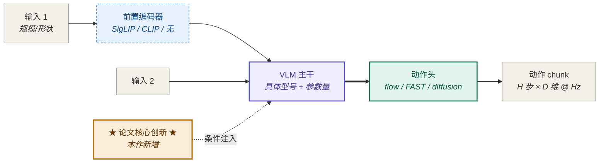
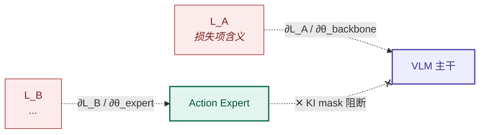

<!--
历史性模板说明 (2026-05-12 迁移到 lean 框架时保留)
- 本模板沿用自 HL 时代 Obsidian vault 版本,内文含 `[[moc-vla-papers]]` / `[[moc-models]]` / `wiki/...` 等
  Obsidian-vault 链接;lean 仓内**无 MOC 概念,这些链接全部不解析**。
- 在 kb/papers/<paper-id>.md 实例中填写时,把这些链接改为 lean 仓内路径(`kb/papers/<id>.md`、
  `kb/models/<id>.md` 等),或直接删除;不要原样保留 `[[moc-*]]`。
- 模板内部用作"概念坐标"的术语(MOC 反查 / wiki 内 X 老模板 / [[<已有笔记>]])保留为参考语境,
  实例化时按 lean 路径替换或删除。
- frontmatter 字段是 checklist 起点,可按论文实际可读性 / priority 砍掉。
-->
---
tags: [vla, paper, <子范式标签>]
aliases: [<论文简称>, <中文别名>]
paper_id: <arXiv:YYMM.NNNNN | 公司公告 | Tech Report>
venue: <arXiv | NeurIPS 2025 | ICLR 2026 | RSS | CoRL | Science Robotics | Blog | Other>
date_published: YYYY-MM-DD
date_added: YYYY-MM-DD
status: <reading | digested | reproduced | abandoned>

# 复现资源(代码/权重/数据/license 各自独立)
reproducibility:
  code:               <none | code-only | code+demo>
  weights_base:       <none | partial | full | gated>     # base / pretrain checkpoint
  weights_finetuned:  <none | partial | full | gated>     # downstream / RL-tuned ckpt
  data:               <none | description-only | partial-release | full-release>
  license:            <Apache-2.0 | MIT | Research-Only | Commercial-Restricted | Unknown>

# 工程透明度元数据(MOC 横向比对用)
transparency:        <high | medium | low>     # 超参/数据/代码三件套发布程度
ablation_density:    <thin | moderate | dense> # 消融完整度(管理读者期望)
appendix_pages:      <数字 | none>              # 辅助 §5.5 工作量评估

priority: <P0 核心主线 | P1 重点跟进 | P2 旁证 | P3 仅索引>

# 范式标签:决定后面启用哪些插件块。多选用列表。
# 取值: flow_diffusion | world_model | rl_post_training | cot_code | tokenizer_accel | data_centric | system_paper
#
# ★ v1.5 关键澄清:paradigm 是"特征清单"而非"主路线分类" ★
# 论文用到任何范式的核心元素就标该范式,不论该元素在论文中是主角还是配角。
# 例 1:π₀.₇ 主路线是 VLM+FM,但用了轻量 World Model 生成 visual subgoals,
#       必须标 `world_model`,不能因"主路线不是 WM"而排斥(π₀.₇ 案例驱动 v1.5)。
# 例 2:论文用 RL 优化 CoT 思维链 → 同时标 `cot_code` 和 `rl_post_training`。
# 例 3:Hi Robot 主架构是双层 hierarchical,但反向工程合成训练数据用了 SOTA VLM,
#       如果有 `synthetic_data` 标签也应标。
#
# 反例(常见错误):"π₀.₇ 不走 World Model 视频生成路线,所以不标 world_model" — 错!
# WM 是辅助生成器仍要标。范式标签触发 §2.3 / §3.4 等插件块,标全才能强制填上对应字段。
paradigm: [<flow_diffusion>, ...]

# v1.3 新增:本笔记是否已整合先验研究(see §-1)
prior_research_integrated: <yes | no | partial>

# v1.6 新增:本笔记的一手信息视觉可读性(决定 §2.1 / §5.5 准确度上限)
# pdf_visual:    本机 PDF 上传 / arXiv PDF 已下载,Agent 视觉读到完整图表
# html_text:     web_fetch arXiv HTML / 官方 blog 全文,只读到文字 + alt text(图表丢失)
# fragments:     web_search snippet / 第三方解读片段
# none:          仅靠系族先验和占位笔记
#
# ★ 关键约束 ★:
# - source_quality = pdf_visual 时,§2.1.A 架构图 + §5.5 附录提取 应做到事实级精确
# - source_quality = html_text 时,§2.1.A 标题加 "(基于文字描述,未对照原图)";§5.5 多数行填 "未公开"
# - source_quality = fragments 时,frontmatter 必须 `transparency: low`(不论作者透明度如何),且笔记主要价值在 §-1 整合先验,而非主体内容
# - 想升级 source_quality? 提醒用户上传 PDF
source_quality: <pdf_visual | html_text | fragments | none>
---

# <论文简称> · <论文全名>

> **一句话定位**:这篇论文在 VLA 谱系的位置、核心问题、相对前作的关键差异。

**索引**:[[moc-vla-papers]] · [[moc-models]] · 范式归属 → [[<flow-vla|world-model-vla|...>]]

---

## ★ 全局硬约束:三类证据等级标注(v1.7 新增,所有事实字段必须遵守)★

> **来源**:吸收自 wiki 内 2026-04-29 老模板的 ☑1/☑2/☑3 体系。v1.x 之前默认"事实就是事实",没强制证据来源,导致 Agent 倾向于把推测写成确定陈述(π₀.₇ v1.5 案例:"lightweight WM" 通篇 7+ 处文字推断,误读为事实)。v1.7 引入此约束彻底修正。

### 三类标注

| 等级 | 含义 | 必附内容 | 例 |
|---|---|---|---|
| **☑1** | 论文明确给出 | §节号 / Eq 编号 / Fig 编号 / line 号 | `Gemma 3 4B [☑1: §IV line 132]` |
| **☑2** | 推断 + 依据 | 推断来源:differences-list 修辞 / 沿用前作 / 同领域惯例 | `τ 偏向低 Beta 分布 [☑2: 沿用 π₀ §IV,本论文 differences-list 未列变更]` |
| **☑3** | 论文未给 | 查处指针:[N] model card / repo 路径 / 原作者询问 | `Optimizer 类型 [☑3: 查 openpi/scripts/train.py]` |

### 应用范围

- **必须标注**:§0 元信息 / §2 模型架构 / §3 方法细节 / §4 数据 / §5 实验 / §6.4 已知坑 / §10 sources_used 中所有事实陈述
- **豁免范围**:判断/评论性字段(§7 改进方向、§8 takeaway、§9.0 "不读会误解什么"、§-1.5 fact-check 等论证性段落)不需要 ☑ 标注
- **§-1.2 来源分级表已等价于 ☑1**(每行已经标了 primary/secondary 来源)

### Review 端硬性检查

- 任何事实字段缺 ☑ 标注 = 不合格,打回重填
- `grep '\[☑3\]'` 列出所有不确定字段 → 这是动手复现前必解决的清单
- ☑3 项数量 = §6.3 不确定性总集大小;两者必须一致

### 与 v1.6 §-1.5 反向 fact-check 的对接

- §-1.5 校验的是**先验声明**(其他笔记/wiki 中的判断)
- ☑1/☑2/☑3 校验的是**本笔记自己**写下的每条陈述
- 两者**正交互补**:§-1.5 防"沿袭别人的错",☑ 体系防"自己编却写得像事实"

---

## §-1. ★ 已有研究先验(必填,动笔之前必须执行)★

> **核心原则**:不重复已经做过的研究。在填本笔记其余段落之前,必须先做先验检查。
>
> **来源**:v1.2 的 π*₀.₆ 压力测试发现——填者(无论是 Claude 还是研究者本人)往往把已有的深度研究当成链接占位符,而不是当成可复用的内容来源。模板应当强制把这一步显式化。

### -1.0 ★ PDF 优先原则(v1.6 新增,动笔前必读)★

> **背景**:π₀.₇ 案例(2026.05.07)的对比实验证明——同一论文 + 同一 v1.5 模板,**纯文字源(web_fetch HTML / blog 全文)产出的笔记 vs PDF 上传产出的笔记**,在以下几方面差距巨大:
>
> | 信息类别 | web_fetch | PDF 视觉读 |
> |---|---|---|
> | 架构图组件连接(箭头/虚线/颜色) | ❌ 仅 alt text | ✅ 完整可读 |
> | 具体训练超参(dropout / CFG β / lr) | ❌ 几乎全无 | ✅ 全在附录表 |
> | 量化实验结果(成功率 % / 延迟 ms) | ❌ 几乎全无 | ✅ Fig 柱状图可读 |
> | 附录(Algorithm 块 / 完整消融) | ❌ 不在 web_fetch 范围 | ✅ 完整 |
> | 引用网络(References 段) | ⚠️ 转换易截断 | ✅ 完整 |
>
> **量化数据**:π₀.₇ 案例 web_fetch 版 91 处占位 / 14 处具体事实;PDF 版 5 处 ☑3 / 85 处具体事实——**PDF 让具体事实数量提升 6 倍,占位减少 18 倍**。

#### -1.0.1 操作规则

| 论文优先级 | 信息源要求 | 备注 |
|---|---|---|
| **P0**(系族核心 / 复现目标) | **必须 PDF 上传** | 没 PDF 时主动告诉用户:"这篇是 P0,建议上传 PDF" |
| **P1**(重点跟进) | 强烈建议 PDF;web_fetch 也接受但 frontmatter 必须 `source_quality: html_text` | 笔记完成后明示哪些字段需 PDF 二次校准 |
| **P2**(旁证 / 横向参考) | web_fetch / abstract 可接受 | 主要价值在系族横向定位,不是深度 |
| **P3**(仅索引) | snippet 可接受 | MOC 行级条目,不展开 |

#### -1.0.2 视觉信息丢失补救

如果**确实无法拿到 PDF**(P1/P2 论文 + 用户没上传):

1. frontmatter 标 `source_quality: html_text` 或 `fragments`
2. **§2.1.A 架构图**:Mermaid 标题加注 "(基于文字描述推断,未对照原图)"
3. **§5.5 附录关键信息**:大部分行直接填 "未公开(需 PDF 二次提取)" — 不允许编造
4. **§-1.5 反向 fact-check**:必须列入"WM 是否存在 / 架构图组件是否完整 / 量化数字是否准确"等架构层 fact-check 项,标 ☑3
5. **§10 sources_used**:`full_paper` 标 ☐(空),清楚表明未读 PDF

#### -1.0.3 Agent 应主动询问

无 PDF 但论文是 P0 时,**应在动笔前明确询问用户**:

> "这篇 [论文名] 看起来是 OpenPI 系族 P0 / WM 派 P0 / 等等,但当前没有 PDF。为获得最佳笔记质量(尤其 §2.1 架构图、§5.5 附录、量化数字),建议你上传 PDF。要现在补上 PDF 还是先用 html_text 完成笔记?"

不要在用户没明确决定的情况下"先做着",这会产生需要二次校准的低质量笔记(如 v1.4 时我犯的错误)。

### -1.0.6 ★ PDF 完整性检查(v1.7.2 新增,动笔前必做)★

> **背景**:π₀ v1.7 实战(2026-05-09)踩坑——Agent 第一次产出时把 PDF 误判为"8 页主文,无附录",frontmatter 自标 `appendix_pages: not_in_pdf`;用户审阅触发补读后发现 PDF 实为 17 pages 含 App. A-E 9 页,漏读关键事实(num_heads / Beta α/β/s / 推理 ms breakdown / π₀-small 6 项 deltas / mask 3-block 设计)。
> **教训**:动笔前必须用 `pdfinfo` 核实页数,不能"读到末尾就以为读完了"。
> **核心约束**:本节是**所有 v1.7.2 笔记动笔前必做检查**,整合型升级(基于祖先文档)也不豁免——祖先文档可能本身就漏读附录。

#### 5 步必做检查

| 步骤 | 命令 / 动作 | 检查目标 |
|---|---|---|
| 1 | `pdfinfo paper.pdf \| grep Pages` | 确认 PDF 总页数(防止 8 页主文误以为是全文) |
| 2 | 翻到 PDF 末页(`pdftoppm -f <last_page> -singlefile paper.pdf last`) | 看 References 后是否有 Appendix(防止用 §I-§VI 主文页数推断) |
| 3 | 检查论文 GitHub repo / project page 有无 `supplementary.pdf` 或 `appendix.pdf` | 防止论文站点把附录单独发布 |
| 4 | arXiv 页面查版本号(`arxiv.org/abs/<id>` 末尾标 `v1` / `v2` / `v3` / `v4`) | 防止 v1 / v4 不区分(论文可能在某版本修订事实) |
| 5 | 模型 model card / 官方 blog / 仓库 README | 防止论文未给的细节在其他渠道补充(如 Genesis Tech Report 在 blog 里给的) |

#### frontmatter 强制字段(v1.7.2 新增)

```yaml
# === PDF 完整性元信息(v1.7.2 必填)===
paper_version: arXiv-v4-2026-01-08      # arXiv 版本号 + 日期 / 或 conference paper / 或 internal
pdf_pages_total: 17                      # pdfinfo 实测总页数
pdf_pages_main: 8                        # 主文页数(§I-§VI)
pdf_pages_appendix: 9                    # 附录页数(App. A/B/C/D/E),论文真无附录则填 0(不要填 not_in_pdf)
pdf_completeness_verified: yes           # 5 步检查是否全部完成 / yes / no
pdf_supplementary_external:              # 论文外部 supplementary(如 GitHub README / blog)
  - https://www.physicalintelligence.company/blog/pi0
  - https://github.com/Physical-Intelligence/openpi
```

#### 检查失败的处理

- `pdf_completeness_verified: no` → **不允许**进入 §0 元信息卡片填写,必须先补完检查
- 如果论文确实没有附录(如 NeurIPS short paper / workshop paper),frontmatter 仍标 `pdf_pages_appendix: 0` + `pdf_completeness_verified: yes`(明确数字),而不是 `not_in_pdf`(语义模糊)
- arXiv 多版本时,优先视觉读最新版(v4),但要在 `paper_version` 字段中明示版本号 + 日期

### -1.0.7 ★ 整合型升级专用工作流(v1.7.2 新增)★

> **背景**:π₀ v1.7.1 整合版翻车(2026-05-08)——CC 基于祖先文档(paper-analysis 2026-03 + deep-research + 老 wiki/pi0)做"格式升级",frontmatter 标 `source_quality: pdf_visual` 但**实际本次产出没视觉读 PDF**。祖先文档可能本身就是 text_layer_only 产出(2026-03 时还没有 v1.6 的 source_quality 字段 + v1.6 §-1.5.1 视觉专项 fact-check),整合升级**继承祖先视觉盲区**而非修复。
> **教训**:"祖先视觉读过" ≠ "本次产出可以跳过视觉读"。视觉读不是工作量问题,是信息保真问题。
> **核心约束**:整合型升级**仍需**视觉读 PDF 关键页(架构图 / 实验主表 / Algorithm 块)做 cross-check,不能因祖先文档存在就豁免。

#### 触发条件(任意一项命中即为整合型升级)

- 祖先文档存在(`paper-analysis` / `deep-research` / 老 wiki 条目 / 老版本笔记)
- 当前任务是"格式升级 / 模板版本提升"而非首次读论文
- 论文 PDF 在仓库内但当前任务计划"不重新视觉读"
- 用户指令含"基于已有 X 升级到 vN" / "整合 Y 和 Z"

#### 必做规则(整合型升级特有)

1. **PDF 完整性检查(§-1.0.6)依然必做**——不豁免
2. **PDF 视觉 cross-check 至少 3 处关键事实**(对祖先文档的反向验证):
   - 架构图(Fig 1 / Fig 2 / Fig 3)的视觉信息(节点边数 / 标牌 / 数字)
   - 实验主表数字(Tab I / II 的精确数字,而非祖先转述)
   - Algorithm 块(if any)的具体步骤数 / 参数初始化 / 损失函数形式
3. **`source_quality` 标注规则(v1.7.2 细化为 6 态)**:

| 取值 | 含义 | 触发条件 |
|---|---|---|
| **`pdf_visual`** | 主文 + 附录全部视觉读 | `pdf_pages_total = pdf_pages_main + pdf_pages_appendix`,且本次产出视觉读全部 |
| **`pdf_visual_partial`** | 仅主文视觉读(附录缺失或未读)| 主文已读,附录因 PDF 缺失或未读 |
| **`pdf_visual_indirect`** | 祖先视觉读过但本次没读 + 本次仅文字 cross-check 祖先 | 整合型升级 + 未重新视觉读 PDF |
| **`html_text`** | 完全没视觉读 PDF,只读祖先文字 / blog / abstract | 论文 PDF 未在仓库内,只能用文字资料 |
| **`fragments`** | 只有零散片段(blog 几段 / 通稿)| tech-survey 阶段(论文未发布)|
| **`none`** | 无任何来源 | 极少使用 |

> **整合型升级硬约束**:`revision_type: integration` 时,source_quality **最高只能标 `pdf_visual_indirect`**,不能标 `pdf_visual`——因为本次产出没视觉读 PDF。

4. **§-1.5 反向 fact-check 必须含 ≥ 2 项硬目标**(软硬目标分级,v1.7.2 新增):

| 目标类型 | 检验对象 | 例 |
|---|---|---|
| **软目标** | 祖先文档 / 老 wiki 条目 / blog / abstract 的描述 | "wiki/pi0.md 说控制频率 50Hz" → PDF §II 末原文确认 |
| **硬目标** | PDF 原文具体位置 / ckpt 实测 / 数学校验 / 跨论文交叉 | "PDF App. B 写 num_heads=18" → 数学校验 18×256≠2048 → ckpt 实测 = 8 |

> **强制规则**:每篇 v1.7.2 笔记的 §-1.5 至少 2 项硬目标(整合型升级强制更高,至少 3 项)。**不允许全软目标**——实证(π₀ v1.7 第一次)显示 7 项 fact-check 全软目标 全 ✅,但漏了 num_heads 错误。

5. **frontmatter 加 `revision_type` 字段**(v1.7.2 新增):

```yaml
revision_type: first_read | integration | revised | appendix_补读
# first_read     = 首次读论文(默认)
# integration    = 整合型升级(基于祖先文档,本次未重新视觉读 / 部分视觉读)
# revised        = 基于用户审阅 / 反向 fact-check 的修订
# appendix_补读  = 因 §-1.0.6 PDF 完整性检查失败后补读附录的修订
```

6. **§-1.5.2 修订进度追踪表必填**(整合型升级强制):
   - 必须列出"祖先版本 vs 本笔记版本"的量化对比(☑1/☑2/☑3 数 / fact-check 项数 / 锚定到附录的事实数 / source_quality)
   - 这一表的设计意图:让"整合型升级"的工程价值可见,防止流于"格式刷新"

### -1.1 检查清单(三个来源,缺一不可)

- [ ] **`conversation_search`**:历史对话里是否已研究过本论文或其前作?(对 Claude 必须执行)
- [ ] **MOC 反查**:[[moc-vla-papers]] / [[moc-models]] 里是否已有关联条目?
- [ ] **本地 wiki / 复现笔记**:repo 里是否已有相关研究文档?

### -1.2 先验研究清单(若有,逐项填写)

> **v1.6 升级**:在 v1.5 来源类型分级基础上,**再细化为视觉可读性 + 数字可读性两个维度**——同样是 primary 来源,PDF 上传(视觉读 ✅)和 web_fetch(视觉读 ❌)的笔记质量上限差距巨大。

| 来源 | **来源类型** | **视觉读** | **数字读** | **附录读** | 内容摘要 | 链接 |
|---|---|---|---|---|---|---|
| **★ 一手论文 PDF(已上传)** | **primary** ⭐⭐ | ✅ 完整 | ✅ 完整 | ✅ 完整 | <核心创新一句话 + 关键数字> | <PDF 路径> |
| **★ arXiv HTML(web_fetch)** | **primary** ⭐ | ❌ 仅 alt text | ⚠️ 表格部分可读 | ⚠️ 部分截断 | <核心创新> | <arXiv URL> |
| **★ 官方 blog 全文(web_fetch)** | **primary** ⭐ | ❌ 仅 alt text | ⚠️ 部分量化 | ❌ 通常无附录 | <作者自己怎么说本作贡献> | <blog URL> |
| **★ 论文 abstract / 摘要片段** | **primary** | ❌ | ❌ | ❌ | <一段话> | <URL> |
| 第三方解读 | secondary | ❌ | ⚠️ 部分 | ❌ | <解读内容> | <URL> |
| 过往对话(系族 v1.x 笔记)| secondary | — | — | — | <例:π₀ 模板示范> | [[<chat-uri>]] |
| 已有 wiki | secondary | — | — | — | <例:[[pi05-reproduction]]> | [[<条目>]] |
| 复现 repo | secondary | — | — | — | <例:openpi/scripts> | <路径> |
| 紧凑历史笔记(batch-x-x) | secondary | — | — | — | <内容摘要> | <文件名> |

> **★ v1.6 硬约束(三层级)★**
>
> 1. **任何笔记**:本表必须至少包含 1 项 primary 类型来源——不允许仅由 secondary 构成
> 2. **P0 论文**:必须包含 1 项 ⭐⭐(PDF 上传)。无 PDF 时主动询问用户,见 §-1.0.3
> 3. **含 §2.1.A 架构图、§5.5 附录提取、具体训练超参** 的笔记部分,只在 ⭐⭐ 来源支持下做事实级声明;否则标 "(基于文字描述,需 PDF 校准)"
>
> **frontmatter `source_quality` 字段映射**:
> - 含 ⭐⭐ → `pdf_visual`
> - 仅含 ⭐(无 ⭐⭐) → `html_text`
> - 仅含 abstract / 第三方 → `fragments`
> - 仅 secondary → `none`(罕见,P3 级笔记)
>
> **背景案例**:
> - **π₀.₇ Tech Report**(2026.05.07):当先验全为 secondary 时,"轻量 World Model 生成 visual subgoals"被 Agent 直接漏判 — `world_model` paradigm 缺失;升级到 ⭐⭐(PDF)+ §-1.5 反向 fact-check 后,8 项判断全部修正,§5.5 附录提取从全空回填到 13 行
> - **量化对比**:同一 π₀.₇ + 同一 v1.5 模板,html_text 版 91 处占位 / 14 处具体事实;pdf_visual 版 5 处 ☑3 / 85 处具体事实

### -1.3 整合规则(必读)

> 若 §-1.2 表非空,以下段落**必须显式引用**先验研究,而不是用占位符链接:
>
> - **§9.0 核心理论基石**:每行的"用到的具体定理"和"不读会误解什么"应直接借鉴先验研究中的洞察,不允许只写文献名
> - **§9.1 直接前作**:每篇前作下面挂一行 "—— 见 [[已有深度笔记]] 的关键摘录",定位到具体段落
> - **§6 复现指南**:已知坑应包含先验研究里踩过的真坑,不只是论文表面坑
> - **§7 改进方向**:杂交方向的"具体实验"句应能引用先验研究的具体细节(参数名、代码路径、消融结果),不允许停在抽象层面

> 若 §-1.2 表为空(全新论文,无先验研究),则在 frontmatter 标 `prior_research_integrated: no`,正常进入 §0;此时 §9.0 须从 0 构建,工作量更大。

### -1.4 退化行为(无先验或部分先验时)

> v1.4 升级:基于批次 3 GigaBrain 跨范式压力测试,明示三种填写场景。

| 场景 | frontmatter 标记 | §-1.2 表内容 | §9.0 工作量 |
|---|---|---|---|
| **完整先验**(系族内论文) | `prior_research_integrated: yes` | ≥ 3 项,涵盖架构、训练、评测各维度 | 主要靠借力,1-2 行从零构建 |
| **部分先验**(跨范式但有对比基线) | `prior_research_integrated: partial` | 1-2 项,通常是范式外的对比基线 | 部分借力,3-5 行从零构建 |
| **无先验**(全新论文/全新范式) | `prior_research_integrated: no` | 空表 + "无先验研究,从零开始" | §9.0 全部从零构建,~2-3 倍时间 |

> **模板设计原则**:**有先验时利用、无先验时无成本、部分先验时清晰表达边界**。
> partial 场景在 GigaBrain 这类"跨范式但仍引用 OpenPI 系族 RECAP 作对比基线"的情况下特别常见——不要为了填字段把无关先验硬塞进 §-1.2,真实地标 partial 反而更清晰。

### -1.5 ★ 反向 fact-check(必填,v1.5 新增,防"先验继承错误")★

> **设计原则**:丰富的先验是双刃剑——可能让 Agent 跟着前人的错误判断走。本节强制对 §-1.2 表中**至少 2 项关键先验声明**做反向校验,以一手来源为准。
>
> **背景**:π₀.₇ 案例(Claude Code 把"轻量 World Model 生成 visual subgoals"误判为"不走 WM 路线")证明 §-1 段在先验密集时会自我强化错误,缺少校验回路。

| # | 先验声明(来自 §-1.2 哪一项) | 一手来源校验 | 结论 |
|---|---|---|---|
| 1 | <例:batch-2-3 笔记说"π₀.₇ 主架构是 VLM + FM"> | <例:PI 官方 blog 第 2 段确认 VLM+FM 但**同时**有 lightweight WM> | ⚠️ **部分对、需补充**:主架构对,但漏了 WM 模块 |
| 2 | <例:wiki 说"π₀.₇ paradigm = [flow_diffusion, system_paper]"> | <例:PI 官方明示 WM + Hi Robot hierarchy + RECAP distillation> | ❌ **修正**:应增加 `world_model` 和 `cot_code` |

> **强制要求**:
>
> 1. 必须 fact-check **至少 2 项** §-1.2 关键判断(架构 / paradigm / 训练范式 / 数据来源 等核心字段任选)
> 2. 找到**任何 ❌ 修正项**时,必须在 frontmatter 加注释 `# v1.5 §-1.5 已修正:<某项>`,并在 §0 元信息卡片"与前作关系"行明示哪些先验被推翻
> 3. 不允许全部三项标 ✅ 还往下填——这意味着没真做校验,自欺欺人
> 4. 校验来源**必须是 primary 类型**(对应 §-1.2 一手证据硬约束),不能用另一篇 secondary 笔记互证
>
> **典型错误模式提醒**(给 future Agent 自检):
> - **错误模式 1**:辅助模块被错误"路线化排斥"(WM 是辅助 → 排斥 world_model 标签)
> - **错误模式 2**:先验里没强调的关键事实被忽略(占位笔记一行带过 → Agent 跟着忽略)
> - **错误模式 3**:范式互斥的二元化(MOC 谱系划分诱导"一篇只属于一谱系")
> - **错误模式 4**:对"未公开"的反向硬化(从"未确认"硬化为"不是 X")
> - **错误模式 5**:仓库内部一致性 > 外部世界一致性(沿袭 wiki 中的旧错误)
> - **错误模式 6**(v1.6 新增):基于文字描述推断架构图,丢失原图拓扑信息(WM 路径 / 梯度方向 / 注入位置等只在视觉图里明示)
> - **错误模式 7**(v1.7.2 新增,π₀ 实战教训):**PDF 长度盲信**——视觉读 PDF 主文,误以为没有附录;或读到 References 就以为论文结束。根因:没用 `pdfinfo` 核实 PDF 总页数,凭"读到的内容"推断完整性。防护:遵守 §-1.0.6 的 5 步检查;frontmatter 强制 `pdf_completeness_verified: yes`。实证案例:π₀ v1.7 第一次产出标 `appendix_pages: not_in_pdf`(实际 PDF 含 9 页附录),漏读 num_heads / Beta α/β/s / 推理 ms breakdown 等关键事实;补读后 §-1.5 fact-check 从 7 项扩到 11 项,☑3 从 62 降到 45(锚定到附录的 17 项升级为 ☑1)
> - **错误模式 8**(v1.7.2 新增,π₀.v1.7.1 实战教训):**整合型升级豁免误用**——基于祖先文档做格式升级时,误以为"祖先视觉读过 = 本次可以跳过视觉读";frontmatter 标 `source_quality: pdf_visual` 但实际本次未视觉读;§-1.5 fact-check 全软目标(对祖先派生品的检验)而非硬目标(PDF 原文 / ckpt 实测)。根因:把"信息已存在于祖先" 误解为"本次产出可信任祖先";忽略祖先可能本身有视觉盲区。防护:遵守 §-1.0.7 必做规则;`revision_type: integration` 时 source_quality 最高 `pdf_visual_indirect`;§-1.5 fact-check 强制含 ≥ 2 项硬目标。实证案例:π₀ v1.7.1 整合版 source_quality 误标 + §-1.5 全 ✅(7 项均软目标 wiki/pi0.md),漏掉 num_heads=18 vs 8 修正
>
> 走这一步要花 5-10 分钟,但它**预防一类错误**而不仅是单次错误——值得。

#### -1.5.1 视觉信息专项 fact-check(v1.6 新增,`source_quality: html_text` 时强制触发)

> **背景**:π₀.₇ 案例显示,即使 web_fetch 抓到了官方 blog,**架构图里的关键关系**(WM 输出箭头、attention mask 路径、组件层级)只在视觉图里明示,文字描述里不一定 spell out。所以 `source_quality < pdf_visual` 时,必须特别校验视觉相关的 fact-check 项。

`source_quality: pdf_visual` → 跳过本小节(已视觉读)
`source_quality: html_text` 或更低 → **本小节必填,至少 3 项**

| # | 视觉 fact-check 项 | 当前推断(基于文字) | 校准状态 |
|---|---|---|---|
| 1 | 是否含 World Model / 视频生成 / 子目标生成模块? | <例:文字里提到 "world model" 一次> | ☑3 待 PDF 确认 |
| 2 | 总参数量与各组件参数量分配 | <例:文字提到 5B 但未拆分> | ☑3 |
| 3 | 训练时梯度流向(stop-gradient / KI mask 等) | <例:文字未明示> | ☑3 |
| 4 | 推理路径(同步 / 异步 / 多线程) | <...> | ☑3 |
| 5 | 注入位置(prompt 端 / cross-attn / token concat) | <...> | ☑3 |

> **目的**:让"基于文字描述的判断"被显式标记为待校准,而非以"已确认事实"形式进入下游笔记。这些项 PDF 上传后逐一回填即可。

#### -1.5.2 修订进度追踪(v1.6 新增,本笔记若是修订自前一版本时必填)

> **背景**:Claude Code v1.5 笔记发现的最佳实践——把 §-1.5 的工作量量化成"不确定性下降数",让 fact-check 的工程价值可见。

如果本笔记是修订前一版本(如从 v1.3 升级到 v1.5,或拿到 PDF 后重做),填:

| 维度 | 上一版本 | 本版本 | 进度 |
|---|---|---|---|
| paradigm 标签数 | <例:2 个> | <例:3 个,加 world_model> | +1 |
| §6.3 不确定性总集"☑3 待回填"项数 | <例:11 项> | <例:5 项> | -6(降级 6 项) |
| §5.5 附录提取已填行数 | <例:0 行(标"无附录")> | <例:13 行> | +13 |
| transparency 评级 | low | medium | ↑ |
| ablation_density 评级 | thin | moderate | ↑ |
| §9.0 基石数 | <例:7> | <例:10> | +3 |

> **若是首次填写笔记**:本小节填 N/A 即可,无需对比。
>
> **设计意图**:让 fact-check 的工程产出**可计量**,这能驱动下次笔记升级时优先看本表,有针对性地补足薄弱字段。

---

## §0. 元信息卡片

> **v1.7 修订**:每个事实字段后必须挂 ☑ 标注。本卡片是 ☑1/☑2/☑3 体系的入口。

| 字段 | 内容 | 证据位置 + ☑ 标注 |
|---|---|---|
| 论文标题 / 简称 | | 标题页 [☑1] |
| 发布机构 / 团队 | | 作者列表 [☑1] |
| 发布时间 / 版本 | | arXiv 元数据 / 官方 blog 日期 [☑1] |
| **论文定位**(单选) | □ 新模型架构 / □ 训练配方 / □ Tokenization / □ 推理时算法 / □ RL 后训练 / □ 数据/任务工程 / □ 系统集成 / □ 评估方法 | 摘要+引言 [☑1: 摘要 line ___] |
| 与前作的关系 | 继承自 [[<前作笔记>]],主要变更 ___ | 引言/相关工作 [☑1: §___] |
| 一句话核心贡献 | | 摘要末句 [☑1: abstract line ___] |
| 关键参数(总参数量) | ___ B(VLA 子模块 ___ + 辅助模块 ___) | Fig 标牌 / §___ [☑?: ___] |
| 关键超参(chunk 长度 / 控制频率 / 推理延迟) | H = ___; ___ Hz; ___ ms | §___ [☑?: ___] |

> **Review 提示**:
> - "论文定位"字段必须能从摘要前两句直接读出。Agent 把训练配方型论文(如 KI)归类为"新架构",说明没读懂真实贡献
> - "关键参数"行**必须** Fig 标牌 / §节号引用,不允许 [☑3] 留白—— P0 论文的总参数量是必读项,留白意味着没视觉读架构图(参考 π₀.₇ v1.5 案例:"5B 总参"实际是 VLA 子模块,完整推理栈 ~23B)

---

## §1. 背景与动机

### 1.1 待解决的痛点(必须能用反事实陈述表达)
- 痛点 1:若不解决会出现 X 现象;...
- 痛点 2:...

### 1.2 与前作的差异(必填,改进型工作的核心)
| 维度 | 前作 [[<前作>]] | 本作 | 差异性质 |
|---|---|---|---|
| 动作表征 | <离散 token / flow / ...> | <...> | <增量改进 / 范式切换> |
| 数据规模 | <小时数 / 任务数 / 体征数> | <...> | <扩展 / 持平 / 缩减> |
| 训练目标 | <BC / FM / RL / ...> | <...> | <...> |
| 推理时机 | <同步 / 异步 / 分块> | <...> | <...> |

### 1.3 硬约束(必填,绕不过去)
- 实时性约束(频率/延迟):___
- 数据约束(规模/多样性/质量):___
- 硬件约束(本体/传感器):___
- 泛化约束(分布外要求):___

> OpenPI 系列论文的硬约束都极具体——π₀ 50Hz、RTC 300ms+ 延迟下不抖、π₀.₅ "完全没见过的家庭"。
> 写不出量化硬约束的填写 = 把论文读成了"愿景陈述"。

### 0.5 系统论文专属:四线进展(仅 `system_paper` 标签触发)

| 维度 | 关键贡献 | 是否 SOTA | 对应章节 |
|---|---|---|---|
| Data | <数据规模/配比/新数据源> | <Y/N/-> | §4 |
| Model | <架构/参数量/新模块> | <Y/N/-> | §2 |
| Training | <新阶段/新目标/新配方> | <Y/N/-> | §3 |
| Evaluation | <新基准/新任务/新指标> | <Y/N/-> | §5 |

---

## §2. 模型架构

> **v1.4 升级**:§2.1 改为三层渐进式架构图标准。每层服务不同读者,前两层必填,§2.1.C 在训练动力学非平凡时必填。所有 Mermaid 代码块在 Obsidian / GitHub / VS Code 原生渲染。

### 2.1 三层架构图

#### 2.1.A 30 秒电梯图(必填,Mermaid flowchart)

> **设计约束**:
> - ≤ 8 个节点
> - 颜色编码 6 类标准 classDef:`input` / `frozen` / `backbone` / `head` / `output` / `novelty`
> - 数据流尽量左到右,创新点用虚线("条件"或"调制"等)接入
> - 节点 label 用 `<br/>` 换行,第一行黑体名称,第二行参数量/型号(用 `<i>` 包裹)
> - 不要把"次要连接"画进来,只画主数据流



> **视觉编码语言(全 v1.4 笔记统一)**:
> - 灰色 = 输入 / 输出端点
> - 蓝色虚线 = 辅助编码器(冻结或随主干训)
> - 紫色加粗 = 可训练主干 backbone
> - 青色加粗 = 可训练动作头
> - ★ 橙色加粗 ★ = 论文核心创新(只标真正新增的,不标继承前作的)
> - 红色 = 损失项(仅出现在 §2.1.C)

#### 2.1.B 工程师视图(必填,组件表 + 张量流向表)

##### 组件清单

| # | 组件 | 参数量 | 前作来源 | 可训练? | 主输入 | 主输出 |
|---|---|---|---|---|---|---|
| 1 | <component_name> | _M / _B | [[<前作笔记>]] | yes / no / partial | <张量名>:`[shape]` | <张量名>:`[shape]` |
| 2 | ... | | | | | |

> **填写规则**:
> - "可训练?"严格三态;`partial` 通常意味 LoRA / KI stop-gradient / 随主干训但非主目标
> - "前作来源"必须链接到具体笔记或论文 arXiv 编号,不允许只写名字
> - 输入输出列只写**主要信号**,完整规格放下面张量流向表

##### 张量流向表

| 阶段 | 张量名 | 形状 | dtype / 范围 | 语义 |
|---|---|---|---|---|
| 1. 输入 | `<name>` | `[B, T, ...]` | `<uint8/float, [0,1]/...>` | <语义说明> |
| 2. 中间 | ... | ... | ... | ... |
| n. 最终输出 | `action_chunk` | `[B, H, D_action]` | `float, 坐标系/单位` | **真正驱动机器人**(标注哪个张量是最终执行信号) |

> **张量流向表整合 v1.3 的 §2.3 内容**:v1.4 把"输入/输出张量规格"合并到此表,避免信息重复。

#### 2.1.C 训练动力学图(条件必填)

> **触发条件**(满足任一即填):
> - 论文有 KI 类 stop-gradient 设计
> - 多损失共训(≥ 3 个 loss term)
> - RL 梯度只流到部分组件
> - 跨阶段训练时梯度路径变化(如先训 backbone 再 RL 训 expert)
>
> 不触发时:留一句"训练动力学平凡(端到端单 loss),省略此段"即可。

> **设计约束**:画**梯度反向流**而非前向(用红色虚线 + 反向箭头表达 `∂L / ∂θ`),显式标注每条 loss 的来源和到达组件;阻断的梯度路径用 `-.x.->` 画 ✕ 标记。



**关键约束(配套文字说明,必填)**:
1. ___(机制层面:哪条梯度被谁阻断)
2. ___(后果层面:为什么这种阻断对训练动力学关键)
3. ___(复现陷阱:如果忽视会出现什么症状)

> 这一段的灵魂在于"为什么这种梯度路径设计是必要的而不是任意的"。如果填不出 3 条具体约束,§2.1.C 应当省略而非凑字数。

### 2.2 关键设计决策(每个非平凡决策一行)

> **备选必须是具体方法/论文,不接受抽象类目。**
> 反例:`备选 = [离散 token, 连续向量]`(无效)
> 正例:`备选 = [FAST(arXiv:2501.09747), OpenVLA action token, RDT-1B 离散化]`

- **动作表征**:选择 = ___;备选 = [<具体论文1>, <具体论文2>];理由 = ___(论文 §___)
- **VLM 是否冻结**:___;理由 = ___
- **动作 chunk 长度 H**:___;消融见 §___
- **图像分辨率 / token 数**:___ × ___;每帧 ___ tokens
- **历史窗口长度**:___ 帧
- **多体征处理**:<动作空间统一 / 各体征独立 head / cross-embodiment token>
- **<其他论文特有设计>**:...

### 2.3 World Model 接口(仅 `world_model` 标签触发)

> v1.4 注:v1.3 的 §2.3 张量规格已合并到 §2.1.B,此处编号顺延为 World Model 接口。

- `wm_role`:<data-augmentation | joint-training-target | rl-simulator | test-time-rollout | value-model | aux-supervision>
- `wm_action_coupling`:WM 是否条件于 action?
- `wm_horizon`:WM 预测多远的未来?
- `wm_representation`:<像素 / latent / token / JEPA-style embedding>
- `wm_training`:<与 policy 联合训练 / 先训 WM 再蒸馏 / 用现成 video gen>
- `policy_extraction`:从 WM 怎么拿到 policy?
- `test_time_rollout`:推理时是否用 WM rollout?延迟代价 = ___ ms

---

## §3. 方法细节

### 3.1 训练目标(写出公式)
- 损失函数:`L = ___`(对应论文 Eq. ___)
- 关键超参在损失中的位置:___
- 范式特定细节(Flow Matching / Diffusion / CoT)→ 见对应子段

### 3.1-RL RL 后训练专属字段(仅 `rl_post_training` 触发)

- **RL 算法**:<PPO | GRPO | DPO | SAC | 自研>;clip ratio / KL coeff / advantage 估计
- **Rollout 来源**:类型 / 频率 / 比例
- **Action chunk 与 RL 的兼容方式**:chunk-level / step-level / credit assignment
- **Base policy 处理**:冻结 / 共训 / LoRA / 全开;KL 约束目标 + 系数
- **Reward 设计**:来源 + 形式 `r = ___`
- **干预数据回流**(HIL 系列特有):触发 + 使用方式
- **安全 / 重置**:真机重置策略 + 不安全动作 cutoff

### 3.2 训练阶段划分(必填,含 transparency_note 列)
| 阶段 | 数据 | 目标 | 学习率 | 步数/Epochs | 冻结组件 | 输出 ckpt | transparency_note |
|---|---|---|---|---|---|---|---|
| Pre-train | <数据集+规模> | <BC/FM/...> | ___ | ___ | ___ | ckpt_pretrain | <主文 / 附录 / Model Card / 推测自前作 / 未明示> |
| (可选) Mid-train | ... | ... | ... | ... | ... | ckpt_mid | ... |
| Post-train / SFT | ... | ... | ... | ... | ... | ckpt_sft | ... |
| (可选) RL / 对齐 | ... | ... | ... | ... | ... | ckpt_final | ... |

### 3.3 推理流程
- **动作生成步数**:___
- **是否分块异步**:<是/否>;若是 → [[real-time-chunking]]
- **推理频率**:___ Hz(在 ___ 硬件上)
- **延迟分解**:VLM forward / 动作头 / I/O / 端到端
- **KV cache / 加速技巧**:___
- **与 baseline 速度对比表**(若是加速类论文):略

### 3.4 CoT / Code 字段(仅 `cot_code` 触发)
- **CoT/Code 格式**:<自然语言子目标 | 结构化 JSON | Python 代码>
- **插入位置**:<动作之前 | 动作之中交错 | 动作之后>
- **Inference-time 必须?**:<是/否>
- **CoT 监督来源**:<人工 | GT 程序合成 | VLM self-distill>
- **CoT 长度对延迟影响**:___ ms,占总延迟 ___%

---

## §4. 数据

### 4.1 数据组成
| 数据源 | 类型 | 体征 | 规模 | 采样权重 | 用途阶段 |
|---|---|---|---|---|---|
| ... | ... | ... | ... | ... | ... |

### 4.2 数据预处理
- **动作归一化**:<min-max / quantile / per-dim z-score>;统计量算法
- **图像增强**:<resize / crop / color jitter>;**是否破坏物理一致性**
- **时间对齐**:控制 / 观测频率,重采样方式
- **任务标签 / 语言指令**:<人工 | VLM 自动 | 模板>

### 4.3 数据规模与配比的消融(若有)
- 规模 vs 性能:见 §___,关键转折点 = ___
- 数据配比敏感性:___

### 4.4 数据为产品的论文专属(仅 `data_centric` 触发)
- **数据采集协议**:<硬件 / 标注流程 / 质控>
- **数据版权 / 隐私**:___
- **下游任务覆盖度**:___
- **可复用性**:___

---

## §5. 实验

### 5.1 评测设置
- **基准**:<LIBERO / SimplerEnv / RoboArena / 自建>
- **真机硬件**:___
- **Baselines**:[[<baseline>]]
- **指标**:___;每任务 ___ 次取均值

### 5.2 主表关键结果(挑选规则:优先 OOD / 跨体 / 长视野)

> 优先选 OOD、cross-embodiment、长视野任务;in-domain 仅保留 1 行作完整性。

| 任务 / 设置 | 本方法 | 最强 baseline | Δ | 分布性质 | 备注 |
|---|---|---|---|---|---|

### 5.3 消融实验
- 去掉 <设计 A> → ___ → 解释 = ___
- ...

### 5.4 失败模式与边界
- 论文承认的失败:___
- 复现/分析时发现的额外问题:___

### 5.5 ★ 附录关键信息提取 ★(必填,若论文有附录)

#### 5.5.1 超参完整表(回填 §3.2)
| 超参 | 主文是否给? | 附录位置 | 值 |
|---|---|---|---|
| Pre-train 学习率 | <Y/N> | App. <X> | ___ |
| Batch size | <Y/N> | App. <X> | ___ |
| Pre-train 总步数 | <Y/N> | App. <X> | ___ |
| Optimizer | <Y/N> | App. <X> | ___ |
| Warmup / Schedule | <Y/N> | App. <X> | ___ |
| 数据混合权重 | <Y/N> | App. <X> | ___ |
| <方法专属超参> | <Y/N> | App. <X> | ___ |

#### 5.5.2 完整消融
- 消融 X(主文未提):变量 = ___,值域 = ___,关键发现 = ___

#### 5.5.3 失败 case 与定性分析
- 失败 case 1:任务 = ___,触发条件 = ___,论文给的解释 = ___,我的解读 = ___

#### 5.5.4 数据 / 体征详情
- 数据集逐项规模 / 体征列表 / Sim-to-real gap

#### 5.5.5 数学推导 / 证明
- 主定理 / 关键 lemma / **假设条件**(改进型工作要特别注意原作假设是否被破坏)

---

## §6. 复现指南

### 6.1 官方资源
- 代码 repo:___
- 权重 / 数据:见 frontmatter
- 申请门槛:___

### 6.2 复现成本估算(分项)
| 资源 | 估算 | 备注 |
|---|---|---|
| GPU-hours | ___ × <H100/A100>,___ 小时 | |
| 真机小时 | ___ | |
| 数据采集人天 | ___ | |
| 标注人天 | ___ | |
| 仿真算力 | ___ | |
| 推理硬件最低 | ___ | |

### 6.3 复现路径建议(三选一)
- **路径 A(从零)**:适合 ___;关键风险 = ___
- **路径 B(基于 [[openpi]] 适配)**:适合 ___;改动点 = ___
- **路径 C(只验证推理 + 少量 SFT)**:最快 ___ 天可见效果

### 6.4 已知坑(强烈建议引用 §-1 先验研究中的真实踩坑)
- 坑 1:___ → 解决 = ___ → [[<复现笔记>]]

### 6.5 与 [[moc-models]] 中具体复现条目的链接
- ...

---

## §7. 改进 / 魔改方向

### 7.1 论文未做但显然可做(低垂果实)
- 方向 1:替换 §2.2 的 <选择> 为 <备选 X>(具体论文链接),预期收益 = ___
- 方向 2:扩展到 <新体征 / 新数据>,瓶颈 = ___

### 7.2 论文留下的开放问题
- 引用论文 §___ 的 limitations / future work

### 7.3 与隔壁谱系的杂交可能(★ 最多 3 条,每条必含具体实验设计句 ★)

> **格式要求(必填)**:每条 = "× [[<谱系代表>]]:杂交点 = ___;**具体实验** = <一句话能立项的实验设计,引用具体参数名 / 代码路径>;潜在冲突 = ___"
> 写不出"具体实验"句的杂交方向应该删掉,那是 LLM 套话。
> 若 §-1 有先验研究,具体实验句应当引用先验研究里的代码细节(如 `prefix_attention_schedule=EXP`、`max_guidance_weight=10.0` 等参数名)。

- × [[<另一范式代表作>]]:
  - 杂交点 = ___
  - **具体实验** = ___
  - 潜在冲突 = ___

### 7.4 评估方法本身的改进
- 现有评测的盲区:___
- 建议补充的任务/指标:___

---

## §8. 核心 takeaway

- **如果只能记 3 件事**:
  1. ___
  2. ___
  3. ___
- **`nuance_notes`(延迟填写,首读可空)**:这篇论文最容易被误读的点
- **引用本论文的标准说法**:___(避免每次重新造措辞)
- **`unverified_claims`**(怀疑论字段):
  - [ ] 论文声称 <X>,但我不信,理由 = ___,验证方式 = ___

---

## §9. 关联文献网络

### 9.0 ★ 核心理论基石分析(必填,5-10 篇深读)★

> **挑选规则:**
> - ✅ 选:论文方法直接依赖其定理/算法/loss 设计的文献
> - ✅ 选:作者在主文 ≥3 次引用或附录中专门讨论的文献
> - ❌ 不选:领域综述、广义背景、SOTA 列表
> - 数量:**5-10 篇,严格上限**
> - 若 §-1 有先验研究,本表"用到的具体定理"和"不读会误解什么"应直接借鉴先验研究的洞察

| # | 文献 | 在本作中的角色 | 用到的具体定理/算法/idea | 本作如何继承 / 修改 / 简化 | 不读这篇会误解什么 |
|---|---|---|---|---|---|
| 1 | [[<论文>]] · <一句话定位> | <method-core / theory-foundation / loss-design / architecture-base / conceptual-context> | <具体到 Eq./Theorem/Algorithm 编号> | <逐字继承 / 关键修改 / 简化为 X / ...> | <本作的 Y 看起来 magic 但读这篇就明白了> |

### 9.1 直接前作(method-level 继承)
> 若 §-1 有相关先验研究,在每篇前作下挂"—— 见 [[已有深度笔记]] §X"
- [[<论文 A>]]:继承了 ___;改进了 ___ —— 见 [[<已有笔记>]] §___

### 9.2 同期对比(默认 ±2 个月,密集发表期 ±1 个月 + 同范式)
- [[<论文 C>]] (___ vs ___ 月):核心差异 = ___

### 9.3 后续工作
- [[<论文 D>]]:在本作基础上 ___

### 9.4 跨范式参照 + MOC 反向链接
- 同范式横向:[[moc-vla-papers#3.X <子范式名>]]
- 跨范式互补:[[moc-vla-papers#按动作生成范式分类]]
- **MOC 抓取 hook**:`paradigm` / `2.2 动作表征` / `3.2 阶段数` / `5.2 OOD 表现` / `reproducibility` / `transparency`

---

## §10. 阅读元信息

- **首读日期**:YYYY-MM-DD · 用时 ___ 小时
- **重读日期**:YYYY-MM-DD(如有)
- **`sources_used`**(多选,标注笔记可信度边界):
  - [ ] **过往对话深度研究**(对应 §-1.2)— v1.3 新增
  - [ ] full_paper(读了完整 PDF 含附录)
  - [ ] paper_main(只读主文,跳附录)
  - [ ] abstract_only
  - [ ] model_card / technical_report
  - [ ] author_blog / official_release
  - [ ] third_party_blog
  - [ ] code_repo
  - [ ] author_talk / podcast
  - [ ] conversation_with_authors
- **如果未读完整 PDF**:必须明示哪些字段是从二手来源推断的
- **讨论记录**:[[<讨论笔记>]] / 无
- **存疑/未懂**(轻量,深度怀疑论见 §8):
  - [ ] 问题 1(论文 §___)

---

## §11. ★ 反向理解题(v1.7 新增,质量出口)★

> **来源**:吸收自 wiki 内 2026-04-29 老模板 §7。设计动机——前面 §0-§10 是 Agent 主动填写,无法验证 Agent **真懂还是假懂**。本段 5 道题是检验"是否真懂"的硬测试,**无法靠表面理解蒙混**。
>
> **使用方式**:必填段。Agent 答得磕巴 / 答错 / 跳过 → 回到 §2-§5 重读,前面填的内容质量值得怀疑。

### 题 1:替换检验

> 如果把 [本论文核心方法 X] 替换成 [常见替代 Y],方法的哪些部分会需要改?为什么作者选 X 不选 Y?

**X 的位置**:[填本论文最核心的方法选择,如"flow matching 动作头"或"KI attention mask"]

**替代 Y**:[一个真实存在的替代方案,引用具体论文,如"用 OpenVLA 的 256 bin discretization 替代 flow matching"]

**回答**(≥ 100 字,需展开影响传导链):

___

### 题 2:删除检验

> 如果丢掉 [某个看似次要的设计],模型会怎么坏?论文的哪个消融实验支持你的判断?

**待删除元素**:[选一个看似次要的——例如 π₀.₇ 的 metadata、KI 的 stop-gradient、RTC 的 inpainting]

**回答**(必须引用具体消融实验数字):

___

### 题 3:极端检验

> 这个方法在什么数据规模 / 任务复杂度 / 本体形态下会失效?为什么?

**3 个失效场景**(每场景 2-3 句解释):

1. ___
2. ___
3. ___

### 题 4:复现风险预测

> 如果你现在去复现这篇论文,最可能在哪三个地方踩坑?

**3 个具体踩坑点**(对应到 §6.4 已知坑表的具体行,或新增):

1. ___(对应 §6.4 坑 ___ / ☑3 项 ___)
2. ___
3. ___

### 题 5:与前作的边际差异

> 这篇论文的方法,如果只读 Abstract 和 Method 概览,有没有可能跟 [上一篇相关 OpenPI 论文] 看起来一样?具体差异在哪里?

**最相似的前作**:[[<前作笔记>]]

**表面相似的描述**(如果两篇都用一句话总结,会重叠的部分):

___

**实际边际贡献**(真正的差异,精确到具体字段 / 损失项 / 数据源等):

___

> **Review 提示**:
> - 题 5 尤其关键 —— OpenPI 系列论文之间方法描述的"表面相似度"很高(都说自己用 VLM + flow + co-training),真正的边际贡献需要细读才能区分。**这道题答不出 = Agent 没读出"差异"**
> - 题 4 应该可追溯到 §6.4 已知坑或 §-1.5 反向 fact-check 的具体行 —— 这是 ☑3 / 复现风险的最终交汇点
> - 5 道题答完后,本笔记才算合格 —— 否则前面 §0-§10 的产出可能是"看似填了实则没懂"

---

## §12. 研究备忘(★ 仅用户填,Agent 不动 ★)

> **来源**:吸收自 wiki 内 2026-04-29 老模板 §8。设计动机——明确人机分工边界,Agent 不应该编造用户的私人怀疑、复现优先级、信任边界。
>
> **使用方式**:Agent 在交付笔记时**必须保持本段空白**,只展示骨架。用户自己填,且填的内容下次重读时是 Agent 的"上下文输入"(经 §-1.1 conversation_search 召回)。

- **我对哪一节最不放心,需要亲自精读**:___
- **这篇论文的方法对我自己复现/优化目标的可借鉴点**:___
- **我决定哪些细节相信 Agent,哪些必须自己验**:
  - 信任 Agent:___
  - 必须自验:___
- **后续要追的引用文献**:___
- **影响我的下一步决策**:___(例:本笔记影响 [[<复现条目>]] 的优先级)

---

## 附录 A:模板使用工作流(v1.7 简化版,4 步)

1. **第一遍**:Agent 填 §0 / §-1 / §1 / §2.1.A 30 秒电梯图。用户 5 分钟内 review,确认论文定位 + paradigm 标签 + 一句话核心贡献无偏。**有偏立即纠正,不进入下一步**。
2. **第二遍**:Agent 填 §2.1.B-C / §2.2-2.3 / §3 / §4 / §5。用户 30-60 分钟仔细 review,关注:
   - §2.1.C 训练动力学图(梯度流是否对)
   - §3.2 训练阶段(超参完整度,☑3 项数)
   - §5.3 消融(具体数字是否回填,有无 [☑3])
3. **第三遍**:Agent 填 §6-§9 + §10 + **§11 反向题**。§11 是质量闸门 —— 答得磕巴说明前面填写不扎实,回炉。
4. **第四遍**(可选,只对你打算实际复现的论文做):用户填 **§12 研究备忘**,把 §6 复现清单转化为代码任务列表。

---

## 附录 B:OpenPI 论文家族速查(本模板的实证基础)

> **来源**:吸收自 wiki 内 2026-04-29 老模板附录 B。设计动机——让模板自包含,不依赖外部 MOC 也能让 Agent 知道系族每篇论文是什么。

| 论文 | 时间 | 核心贡献(模板会问出来的那一句话) |
|---|---|---|
| **π₀** | 2024.10 | 首个用 VLM + flow matching action expert 输出 50Hz 连续动作的 VLA;预训练-后训练两阶段配方 |
| **FAST** | 2025.01 | 用 DCT + BPE 把连续动作压缩成自回归 token,使 AR-VLA 能学高频灵巧任务,训练 5× 加速 |
| **OpenPI release** | 2025.02 | 开源 π₀ + π₀-FAST 权重与代码,工程产物而非新方法 |
| **Hi Robot** | 2025.02 | 在 π₀ 之上加高层 VLM 规划器,形成分层 system 1/2,提升复杂指令遵循约 40% |
| **π₀.₅** | 2025.04 | 异构任务 co-training(机器人数据 + 网络 VL 数据 + 高层语义预测 + 物体检测),实现"完全没见过的家庭"开放世界泛化 |
| **Knowledge Insulation (π₀.₅+KI)** | 2025.05 | 单阶段配方:VLM 主干用 FAST 离散 token 学表征,action expert 用 flow matching 学连续动作,**stop-gradient 阻断 expert→VLM**,保留 web 知识 |
| **RTC** | 2025.06 | 推理时算法,把 chunk 衔接转化为 inpainting 问题:freeze 已保证执行的动作,inpaint 剩余;无需重训,适用于任意 diffusion/flow VLA |
| **π*₀.₆ + RECAP** | 2025.11 | 用 advantage conditioning 做 offline RL 后训练,整合 demo + 自主 rollout + 专家干预,在难任务上 throughput 翻倍、失败率减半 |
| **Human-to-Robot Transfer** | 2025.12 | 探索从人类视频到机器人任务的迁移如何随规模涌现 |
| **Robot Olympics** | 2025.12 | 工程报告:微调 π₀.₆ 解决一系列高难度操作挑战 |
| **MEM** | 2026.03 | 多尺度具身记忆,使模型支持 >10 分钟的长程任务 |
| **RTC-T**(arXiv:2512.05964)| 2025.12 | RTC 后续:训练时 action conditioning,推理无 RTC 开销 |
| **π₀.₇** | 2026.04 | 可被语言"教练"引导的可调控基础模型;独立 BAGEL WM (14B) + HL Policy (4.4B) + π₀.₇ VLA (5B) ≈ 23B 整推理栈;展现 emergent 能力(如未训练过的 air fryer 任务) |

> **使用方式**:填本笔记 §-1.2 / §9.1 时,先 grep 本表确认前作位置 + 一句话核心贡献——避免 Agent 在系族内部混淆论文。

---

*模板版本 v1.7.2 · 变更见 [[moc-vla-papers]] 顶部说明*

**版本演化**:
- v1.0 → v1.1:加入 World Model / RL / CoT 三个范式插件块;强制具体方法/论文备选;张量 semantics 注释;复现成本分项;`unverified_claims` 怀疑论字段
- v1.1 → v1.2:§9.0 文献基石分析 + §5.5 附录提取段;frontmatter 工程透明度元数据(transparency / ablation_density / weights_base/finetuned 拆分 / sources_used);§7.3 杂交方向卡 3 条且必含具体实验设计句
- v1.2 → v1.3:**新增 §-1 已有研究先验**作为必填段(在 §0 之前),强制 conversation_search 作为第一步;§9.0 / §9.1 / §6.4 / §7.3 / §10 增加引用先验研究的强制规则
- v1.3 → v1.4:
  1. **§2 三层架构图标准**:§2.1 升级为三层 Mermaid 图(电梯图 / 工程师视图 / 训练动力学图),取代 v1.3 的 ASCII 文本图,Obsidian / GitHub / VS Code 原生渲染
  2. **6 类标准 classDef**:input / frozen / backbone / head / output / novelty 在所有 v1.4 笔记视觉语言统一
  3. **§2.3 内容合并到 §2.1.B**:输入/输出张量规格 + 组件清单 + 张量流向表整合,避免信息重复;原 §2.4 World Model 接口顺延为 §2.3
  4. **§2.1.C 训练动力学图条件必填**:KI / RECAP / 多 loss 共训等非平凡梯度路径必须画图,且配套 3 条"为什么这种设计是必要的"文字说明
  5. **§-1.4 退化行为升级**:`prior_research_integrated` 明示 yes/partial/no 三态,partial 场景由批次 3 GigaBrain 跨范式压力测试浮现
- v1.4 → v1.5(Claude Code π₀.₇ World Model 错判案例驱动):
  1. **§-1.2 一手证据硬约束**:来源类型分级(primary ⭐ vs secondary),必须至少 1 项 primary;无 primary 时强制标 `prior_research_integrated: partial`;Claude Code 内工作时显式标"无 primary 来源,paradigm 标签需后续校准"
  2. **paradigm 字段语义明示**:frontmatter 注释强调 paradigm 是"特征清单"而非"主路线分类",论文用到任何范式核心元素就标该范式,反例(π₀.₇ 不标 world_model)直接写在注释里
  3. **★ §-1.5 反向 fact-check 段(新增,必填)★**:强制对 §-1.2 至少 2 项关键先验声明做反向校验(以 primary 来源为准);找到 ❌ 修正项时必须在 frontmatter 注释 + §0 明示;附 5 个典型错误模式自检清单
  4. **整体设计原则**:从"§-1 整合先验"升级为"§-1 整合 + 校验先验",防止先验密集时的内部一致性 > 外部世界一致性失败模式
- v1.5 → v1.6(π₀.₇ web_fetch vs PDF 对比实验驱动):
  1. **frontmatter 新增 `source_quality` 字段**(pdf_visual / html_text / fragments / none):追踪一手信息的视觉可读性,决定 §2.1 / §5.5 准确度上限
  2. **§-1.0 PDF 优先原则段(新增,动笔前必读)**:量化数据证明 PDF vs web_fetch 的笔记质量差距(91 占位 vs 5 占位,14 事实 vs 85 事实);P0 论文必须 PDF;P1 论文 web_fetch 接受但需明示需校准;Agent 主动询问用户上传 PDF
  3. **§-1.2 来源分级再细化**:在 v1.5 的 primary/secondary 之上,加"视觉读 / 数字读 / 附录读"三维评估;PDF 上传 = ⭐⭐,web_fetch HTML/blog = ⭐;含 §2.1 架构图、§5.5 附录提取的字段只在 ⭐⭐ 来源支持下做事实级声明
  4. **§-1.5 加错误模式 6**(基于文字描述推断架构图,丢失原图拓扑信息);**新增 §-1.5.1 视觉信息专项 fact-check**(`source_quality < pdf_visual` 时强制触发,至少 3 项);**新增 §-1.5.2 修订进度追踪**(本笔记若是修订自前一版本时必填,量化 fact-check 工程产出)
  5. **整体设计原则升级**:从"§-1 整合 + 校验先验"升级为"§-1 整合 + 校验 + 视觉信息保真",防止"我画了漂亮的架构图"和"这张图准确反映论文"被混淆为同一件事
- **v1.6 → v1.7(本版本,wiki 内 2026-04-29 老模板精华吸收)**:
  1. **★ ☑1/☑2/☑3 三类证据等级标注(全局硬约束)★**:在 §-1 之前插入全局声明,所有事实字段必须挂证据等级——☑1 论文明确(附 §节号 / Eq / Fig / line)/ ☑2 推断+依据(附依据来源)/ ☑3 论文未给(附查处指针);Review 端 `grep '\[☑3\]'` 列出所有不确定字段;与 §-1.5 反向 fact-check 正交互补(§-1.5 防"沿袭别人的错",☑ 体系防"自己编却写得像事实")
  2. **§0 元信息卡片接入 ☑ 体系**:每行加 ☑ 标注;新增"关键参数(总参数量)" + "关键超参(chunk 长度 / 控制频率 / 推理延迟)"两行——P0 论文不允许这两行 [☑3] 留白(参考 π₀.₇ v1.5 案例:"5B 总参"实际是子模块,完整 ~23B)
  3. **★ §11 反向理解题段(新增,必填,质量出口)★**:5 道硬测试——替换检验 / 删除检验 / 极端检验 / 复现风险预测 / 与前作的边际差异。Agent 答得磕巴 = 前面填写不扎实,回炉。第 5 题尤其关键(系族内部论文表面相似度高,真正边际贡献需细读)
  4. **§12 研究备忘段(新增,Agent 不填)**:明示人机分工边界——用户的私人怀疑 / 复现优先级 / 信任边界 Agent 不应该编造;下次重读时是 Agent 的上下文输入
  5. **附录 A 工作流(简化为 4 步)**:第一遍 §0/§-1/§1/§2.1.A → 第二遍 §2.1.B-C/§2.2-2.3/§3-§5 → 第三遍 §6-§9/§10/**§11** → 第四遍(可选)用户填 §12
  6. **附录 B OpenPI 速查表内置**:13 篇系族论文每篇一句话核心贡献,让模板自包含,不依赖外部 MOC 也能让 Agent 知道系族每篇是什么
  7. **整体设计原则升级**:从"§-1 整合 + 校验 + 视觉保真"升级为"事实严格性 + 主动质量出口 + 主体边界明示";v1.7 是这套模板的成熟版本,可以暂停加新机制,专注实战使用
- ~~**v1.7 → v1.7.1**~~(已废弃,2026-05-09):
  - v1.7.1 引入 §-1.0.5 上下文管理段,试图解决"Agent 看不到 token 占用导致质量下降"问题
  - 但实证暴露设计错误:把"token 经济性"和"信息保真"混在一起讨论;§-1.0.5.5 暗示"上下文充足 = 可以一次性产出 = 可以省略视觉读"
  - 直接导致 π₀ v1.7.1 整合版翻车——CC 误以为"祖先视觉读过 = 本次可跳过视觉读",frontmatter 滥标 `source_quality: pdf_visual`,§-1.5 全 ✅(全软目标)却漏掉 num_heads 错误
  - **v1.7.2 决定丢弃 v1.7.1 整段 §-1.0.5,不打补丁**——上下文管理是"工作流元规则",不是论文模板的责任;若未来真需要,应独立成 `templates/CONTEXT-MANAGEMENT.md`,与 v1.7.x 论文模板解耦
- **v1.7 → v1.7.2(本版本,π₀ 实战双重翻车 + 修复教训驱动)**:
  1. **★ §-1.0.6 PDF 完整性检查段(新增,动笔前必做)★**:5 步必做检查(`pdfinfo` 核页数 / PDF 末页查附录 / GitHub supplementary / arXiv 版本 / model card);frontmatter 强制字段 `paper_version` + `pdf_pages_total` + `pdf_pages_main` + `pdf_pages_appendix` + `pdf_completeness_verified` + `pdf_supplementary_external`;`pdf_completeness_verified: no` 时禁止进入 §0 元信息;论文真无附录时填 `pdf_pages_appendix: 0`(禁止用 `not_in_pdf` 等模糊值)
  2. **★ §-1.0.7 整合型升级专用工作流(新增)★**:触发条件(祖先文档存在 / 格式升级 / 不重新视觉读)+ 必做规则(PDF 完整性检查不豁免 + 视觉 cross-check 至少 3 处 + source_quality 6 态分级 + fact-check 软硬目标分级 + revision_type 字段)
  3. **`source_quality` 字段细化为 6 态**:在原 4 态(`pdf_visual` / `html_text` / `fragments` / `none`)基础上新增 `pdf_visual_partial`(仅主文视觉读)和 `pdf_visual_indirect`(祖先视觉读过本次未读);整合型升级硬约束:`revision_type: integration` 时 source_quality 最高只能 `pdf_visual_indirect`
  4. **`revision_type` 字段(新增)**:4 态 `first_read` / `integration` / `revised` / `appendix_补读`,明示笔记产出类型,防止整合型升级误标 first_read
  5. **§-1.5 反向 fact-check 软硬目标分级(强化)**:每篇笔记必须含 ≥ 2 项硬目标(PDF 原文 §节号 / Eq / Fig + line / ckpt 实测 / 数学校验 / 跨论文交叉);整合型升级强制 ≥ 3 项;不允许全软目标(实证:π₀ v1.7 第一次 7 项 fact-check 全软目标,全 ✅ 但漏 num_heads 修正)
  6. **错误模式 6 类 → 8 类**:新增 7(PDF 长度盲信,π₀ 实战教训) + 8(整合型升级豁免误用,π₀.v1.7.1 实战教训),每条含表现 / 根因 / 防护 / 实证案例
  7. **整体设计原则升级**:从 v1.7 的"事实严格性 + 主动质量出口 + 主体边界明示"升级为"事实严格性 + PDF 完整性 + 整合型升级规范化";v1.7.2 是 v1.7 的精确手术(+85 行),不是结构性重组
  8. **明示丢弃 v1.7.1**:v1.7.1 §-1.0.5 是设计错误的中间产物,本版本不继承;模板演化路径变为 v1.7 → v1.7.2(跳过 v1.7.1)
